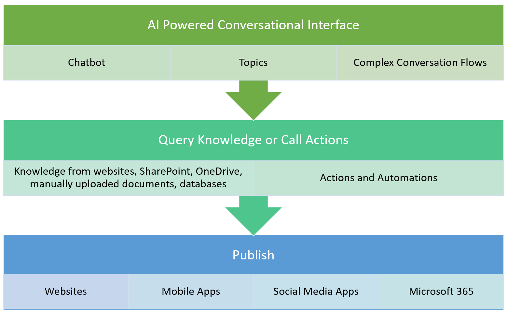
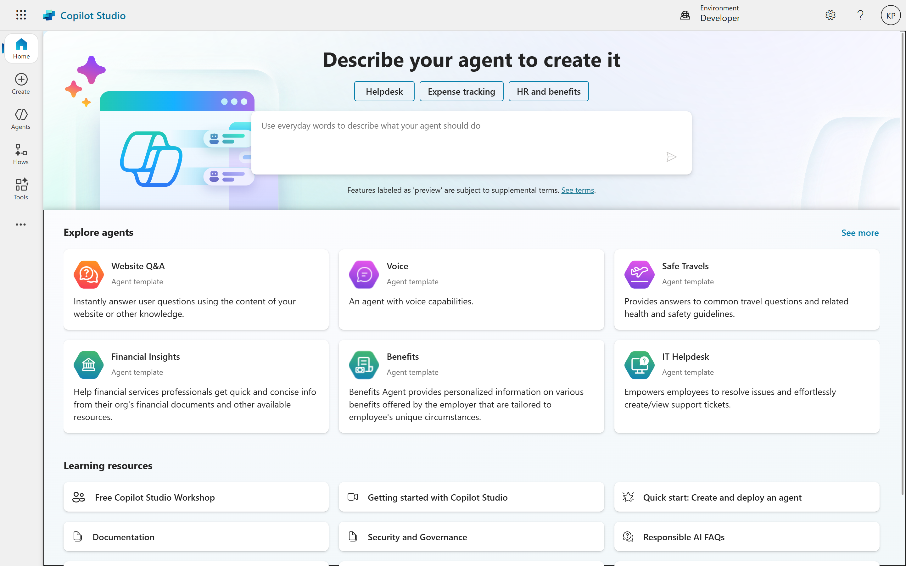

# 01. Introduction to Microsoft Copilot Studio
In today's fast-paced digital world, providing instant and intelligent support is paramount. Enter Microsoft Copilot Studio, a powerful platform that empowers individuals and organizations to build sophisticated AI-powered conversational interfaces – or "copilots" – with remarkable ease.

## What Exactly is a Copilot?
At its core, a copilot is an AI-powered chatbot designed to understand user intent and respond appropriately. Think of it as a smart assistant, capable of engaging in natural conversations and performing actions on your behalf. The magic behind a copilot largely lies in its ability to manage **topics**.

## Key Features and Capabilities
Copilot Studio is packed with features designed to simplify and accelerate your conversational AI journey:
- **Intuitive Low-Code Development:** Drag-and-drop interfaces, guided authoring, and pre-built templates make it incredibly easy to design conversation flows, define topics, and create rich interactions without writing a single line of code.
- **Generative AI Capabilities:** Leverage the power of large language models (LLMs) to automatically generate conversation topics, summarize interactions, and create more natural and dynamic responses, significantly reducing manual effort.
- **Seamless Integration with Microsoft 365 and Beyond:** Connect your copilots to existing data sources and systems within your Microsoft ecosystem (e.g., SharePoint, Dynamics 365, Teams) and beyond, enabling them to access information and trigger actions across your enterprise.
- **Extensibility for Developers:** While low-code is a cornerstone, Copilot Studio also provides robust extensibility options for professional developers. Integrate with Azure Cognitive Services, custom APIs, and other advanced functionalities to create highly tailored and sophisticated solutions.
- **Robust Analytics and Monitoring:** Gain deep insights into your copilot's performance with built-in analytics. Track key metrics like resolution rates, user satisfaction, and conversation patterns to continuously optimize your AI assistant.
- **Multi-Channel Deployment:** Deploy your copilots across various channels, including websites, Microsoft Teams, Facebook, and other popular platforms, reaching your users wherever they are.
- **Security and Compliance:** Built on Microsoft's trusted cloud infrastructure, Copilot Studio ensures enterprise-grade security and compliance, protecting your data and adhering to industry regulations.

## Who Can Benefit from Copilot Studio?
Copilot Studio is a versatile tool that can benefit a wide range of users and organizations:
- **Customer Service Teams:** Automate routine inquiries, provide instant support, and free up agents to handle more complex issues, leading to improved customer satisfaction.
- **HR Departments:** Answer employee FAQs, guide new hires through onboarding, and streamline internal processes.
- **IT Support:** Provide self-service solutions for common technical issues, reducing help desk workload.
- **Sales and Marketing:** Qualify leads, provide product information, and engage potential customers 24/7.
- **Business Analysts and Subject Matter Experts:** Directly build and manage copilots without relying on IT, accelerating time-to-value.
- **Professional Developers:** Extend the platform's capabilities with custom code and integrations for highly specialized use cases.

## Getting Started with Copilot Studio
Getting started with Microsoft Copilot Studio is straightforward. You can begin with a free trial, explore the intuitive interface, and leverage the wealth of documentation and community resources available.
#### The Future of Conversational AI is Here:
Microsoft Copilot Studio marks a significant leap forward in making sophisticated conversational AI accessible to everyone. By empowering individuals and organizations to build intelligent, responsive, and highly effective copilots, it's transforming how businesses interact with their customers and employees, paving the way for a more efficient and engaging digital future.

