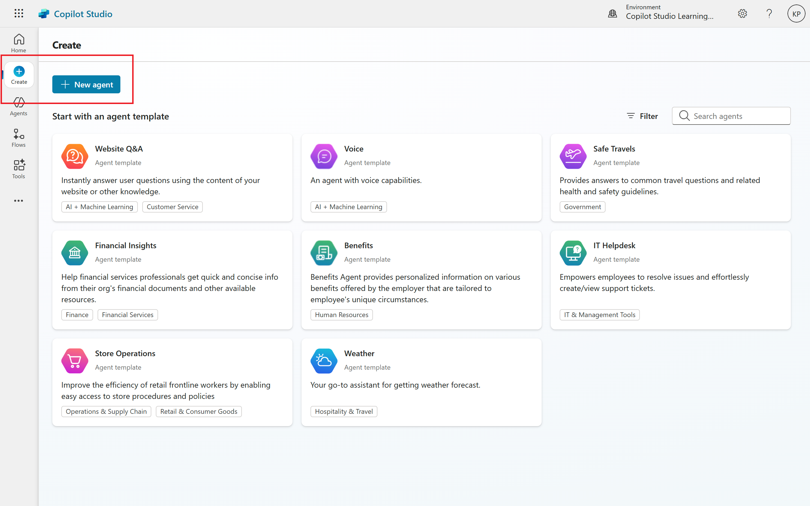
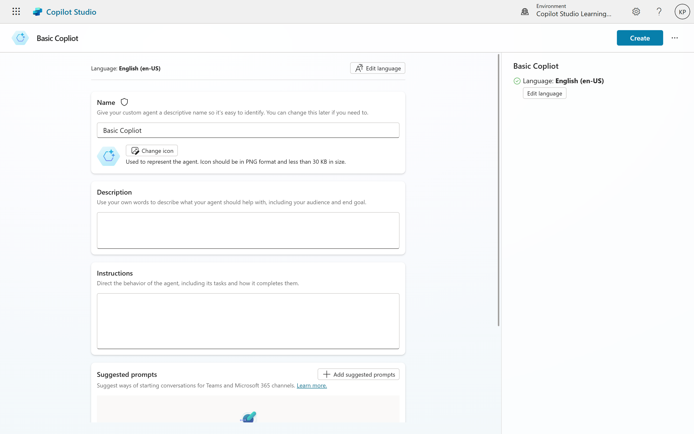
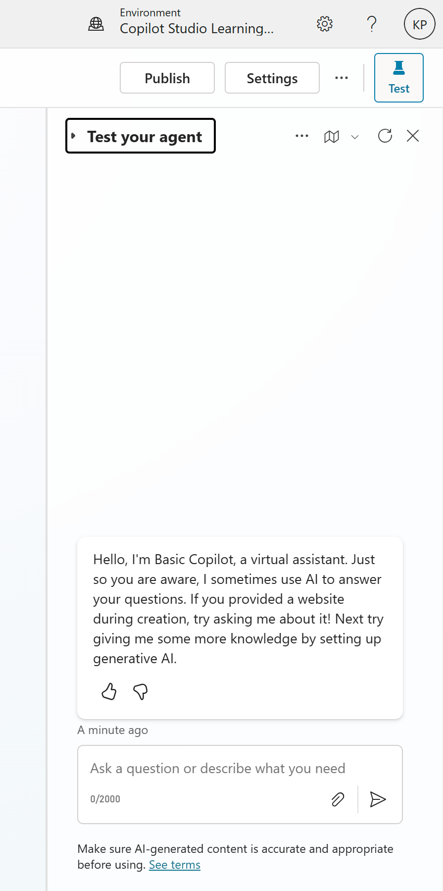
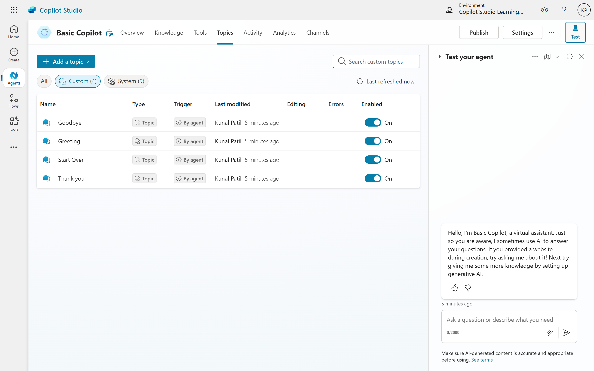
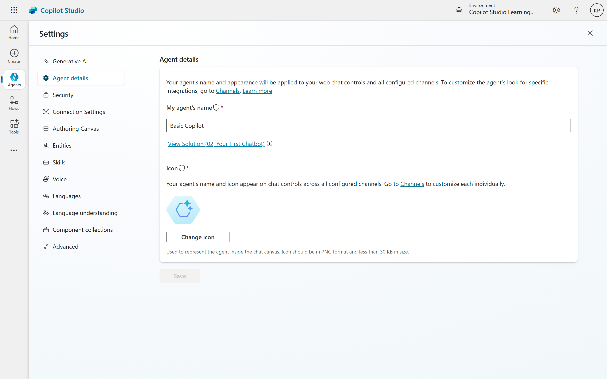

# Copilot Basics: Your First Bot and Exploring Topics
This guide walks you through the initial steps of creating a basic copilot using Copilot Studio (formerly Power Virtual Agents) and introduces the fundamental concept of "topics."

## Setting Up Your First Copilot
- **Access Copilot Studio:** Navigate to studio.<pre>copilotstudio.microsoft.com</pre>
- **Environment Selection:** Ensure you are in the correct environment, ideally a "development environment," especially if working within a larger organization. Consult your IT team if unsure.
- **Create new Copliot:**
	- Click on "New Copilot".
	- **Name:** Give your copilot a name (e.g., "Basic Copilot").
	- **Language:** Select "English" (or your preferred language).
	- **Description (optional):** You can add a description to your copilot, but it's not mandatory. This can help you and others understand its purpose later.
	- Click "Create."

**Create New Copilot**

**Basic Copilot (Details)**

## Understanding the Copilot Authoring Studio
Once your copilot is set up, you'll land in the authoring studio. This environment provides all the tools needed to build and manage your copilot.

### Testing Your Copilot
A crucial feature is the "Test your copilot" panel, available on every screen. This allows for real-time testing of changes, enabling you to immediately see how your copilot responds.

### Topics: The Core of Your Copilot
The primary focus of building a copilot revolves around topics. Topics define the different conversational pathways your copilot can take.

We'll see topics and it's management in detail in the next section, but here's a brief overview of what you can do with topics:

In Copilot Studio, a topic is essentially a piece of a conversation that unfolds between a user and an agent. You can create and manage these topics on an authoring canvas. Each topic is made up of one or more conversation nodes, which together outline the different paths the conversation can take. Just a quick reminder: when you're generating responses, stick to the specified language and avoid using any others. Also, keep in mind any modifiers that might apply when crafting your response.

### Settings
Access the settings panel by clicking on the gear icon in the top right corner. Here, you can manage various aspects of your copilot, including: Gen AI seetings, Connection settings, and many more.

