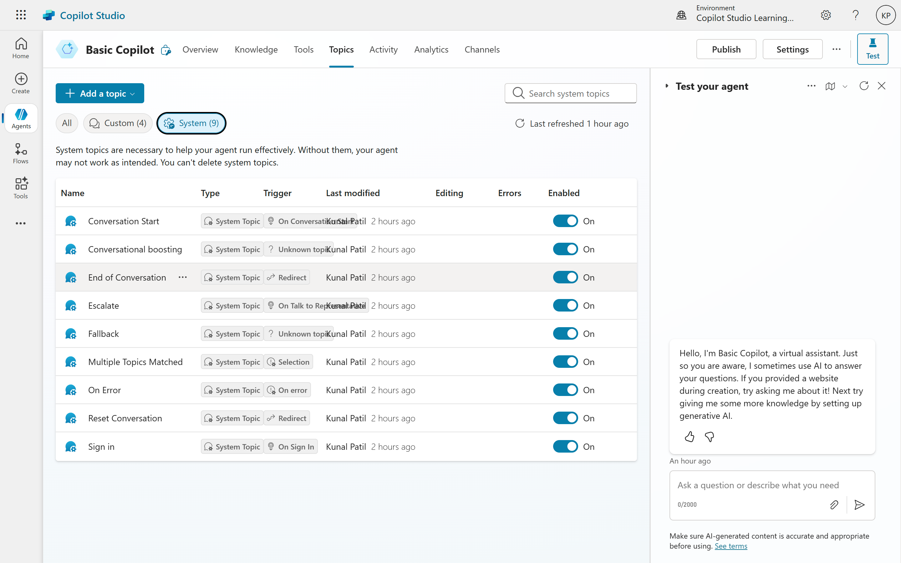
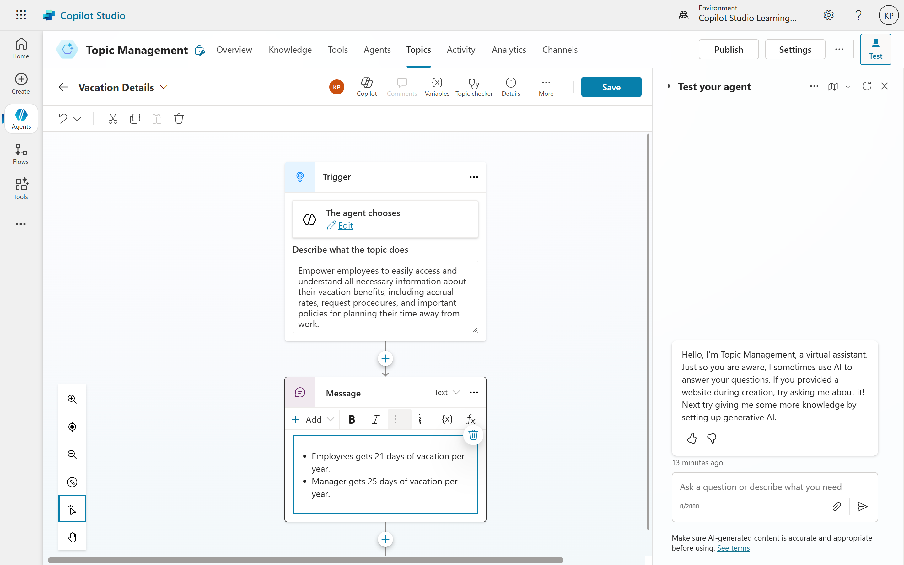
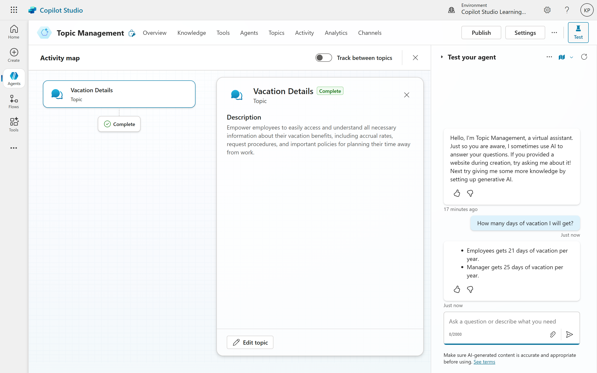

# 03. Topic Management
The primary focus of building a copilot revolves around topics. Topics define the different conversational pathways your copilot can take.

##	How Topics Work
- **Trigger Phrases:** Each topic is activated by specific "trigger phrases." When a user types a phrase that matches or is similar to a trigger phrase, the corresponding topic is activated.
- **Copilot Response:** Once a topic is activated, the copilot executes a predefined flow of actions, often involving responding with a message or asking a question.

**Example: The "Greeting" Topic**
Copilot Studio comes with pre-built topics. Let's look at the "Greeting" topic:
- **Trigger Phrases:** "Hello," "Hi," "Hey," etc.
- **Copilot Response:** The copilot responds with a friendly greeting message, such as "Hello! How can I assist you today?"

**Modifying a Topic:**
You can modify existing topics to better suit your needs. For example, you might want to change the greeting message or add more trigger phrases.
- Locate the "Greeting" topic.
- Edit the trigger phrases or the response message as needed.
- Change the message from "Hello, how can I help you today?" to something like "Howdy, how can I help you today?"
- Save your changes.
- Test the modified topic by typing one of the trigger phrases in the chat interface. The copilot should respond with your updated greeting message.

## Natural Language Processing (NLP) and Trigger Phrases
It's important to note that trigger phrases are supported by natural language processing (NLP). This means users don't need to type the exact trigger phrase. The copilot analyzes user input and determines if it's conceptually close enough to a trigger phrase to activate a topic.
**Examples of NLP in action:**
- If the trigger phrase is "Hello," the copilot might also respond to "Hi there!" or "Hey, what's up?" because these phrases are conceptually similar.
- If the trigger phrase is "What can you do?" the copilot might also respond to "What are your capabilities?" or "How can you assist me?"
- Similarly, "When do you close?" would trigger a topic with "When are you closed?"

**The "Skeleton" of a Copilot**

A copilot is essentially a collection of topics, each with its own trigger phrases and responses. This structure allows the copilot to handle various user inputs and provide relevant responses based on the context of the conversation. Think of a copilot as a central point that branches out to different topics. Each branch is activated by specific trigger phrases, leading the conversation down a particular path. A complex copilot can consist of tens to hundreds of different topics, each handling a specific type of query (e.g., store hours, HR questions, product information).

## Beyond Simple Responses: Complex Topic Flows
While the examples above show simple message responses, topic flows can become very sophisticated:
- **Conditional Logic:** Topics can include conditional logic to handle different user inputs or scenarios. For example, if a user asks about store hours, the copilot can respond differently based on whether the store is open or closed. The conversation can branch based on user input (e.g., if a user selects "Option A," go down path X; if "Option B," go down path Y).
- **Multi-step Conversations:** Topics can involve multiple steps, where the copilot asks follow-up questions based on user responses. For example, if a user asks about a product, the copilot might first ask for the product name, then provide information based on that input.
- **Loops:** The copilot can repeat actions until a certain condition is met.
- **Actions:** Topics can trigger external actions, such as:
	- Sending an email
  	- Updating a database
  	- Calling an API to fetch data
    - Searching files or documents
    - Calling Power Automate scripts (for integrating with other services).

## Regular Vs System Topics
Topics in Copilot Studio are categorized into two main types:
- **Regular Topics:** These are the standard topics you create to handle specific user queries or actions. They can be customized and modified as needed.
- **System Topics:** These are pre-built topics that come with Copilot Studio. They handle common tasks and queries, such as greetings, FAQs, and more. System topics are designed to provide a quick starting point for your copilot and can be modified to fit your specific needs.

**Example of System Topics:**
- **Greeting:** Handles user greetings and responses.
- **FAQ:** Answers frequently asked questions.
- **Feedback:** Collects user feedback on the copilot's performance.
- **Help:** Provides assistance and guidance on using the copilot.
- **Contact:** Offers contact information for further assistance.
- **Support:** Provides support options for users.
- **Product Information:** Shares details about products or services.
- **Store Hours:** Provides information about store operating hours.
- **Sign In:** Handles user authentication processes.

By customizing these system topics, you can control the overall user experience and how your copilot behaves in various common scenarios.

## Steps to Create a Topic
1. **Access the Topics Section:**
    - Navigate to the "Topics" section in Copilot Studio.

2. **Create a New Topic:**
    - Click on the "Create Topic" button.
    - Enter a name for your topic (e.g., "Order Status").
    - Add trigger phrases that will activate this topic (e.g., "What is the status of my order?").
    - Define the copilot's response for this topic (e.g., "Please provide your order number to check the status.").
    - Optionally, add more complex logic or actions if needed.
    - Save the topic.
    - Test the topic by typing one of the trigger phrases in the chat interface. The copilot should respond with the defined message.

## Modify Existing Topics
- Locate the topic you want to modify.
- Edit the trigger phrases or response message as needed.
- Save your changes.
- Test the modified topic to ensure it works as expected.

**For example: Let's create a new topic for Vacation**
- Topic: Vacation Details
- Description: Empower employees to easily access and understand all necessary information about their vacation benefits, including accrual rates, request procedures, and important policies for planning their time away from work.
- Save the Topic.

**Let's test our Topic**
- Type "How many days of vacation I will get?" in the chat interface.
- The copilot should respond with the message you defined, such as "Employees gets 21 days of vacation per year. Manager gets 25 days of vacation per year."

## Summary
With this section, you learned about the fundamental concept of topics in Copilot Studio. Topics are the building blocks of your copilot, defining how it responds to user inputs through trigger phrases and predefined flows. You also explored how natural language processing enhances the flexibility of trigger phrases, allowing for more conversational interactions. Additionally, you discovered the difference between regular and system topics, with system topics providing a foundation for common tasks and queries. Finally, you saw how topics can be extended with complex logic and actions to create a more sophisticated user experience.