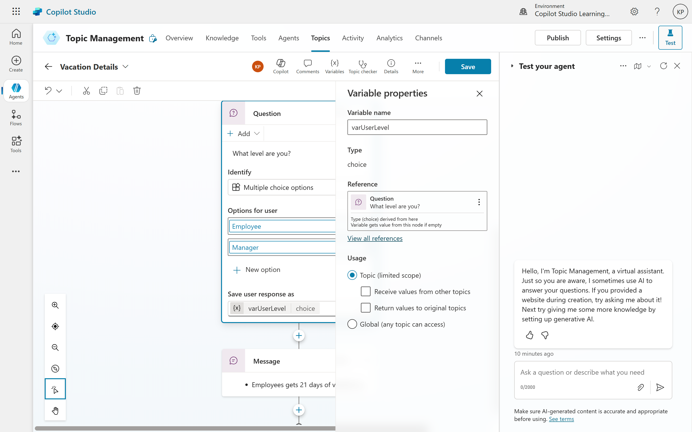
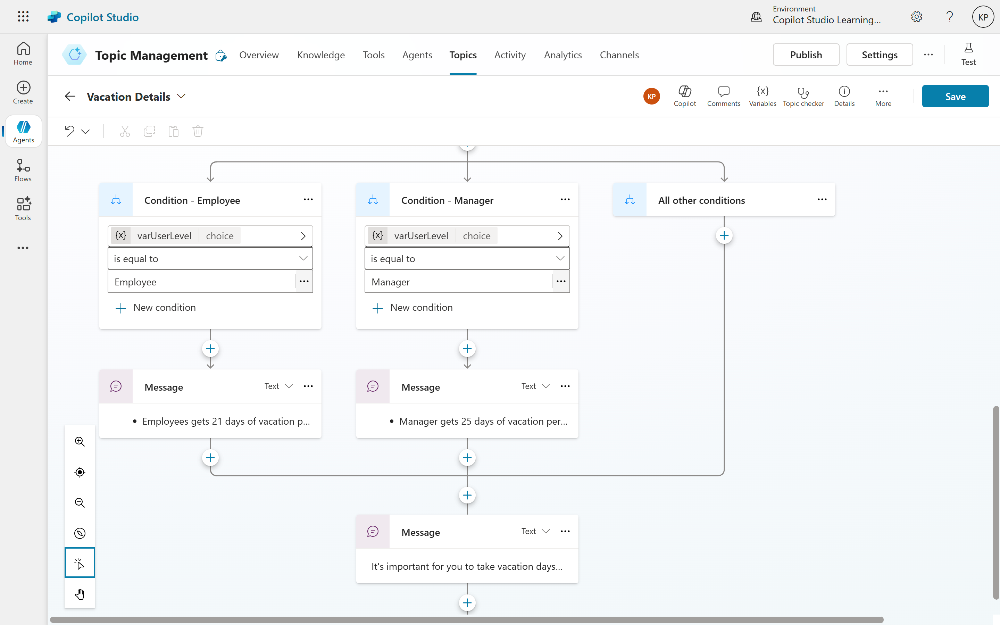
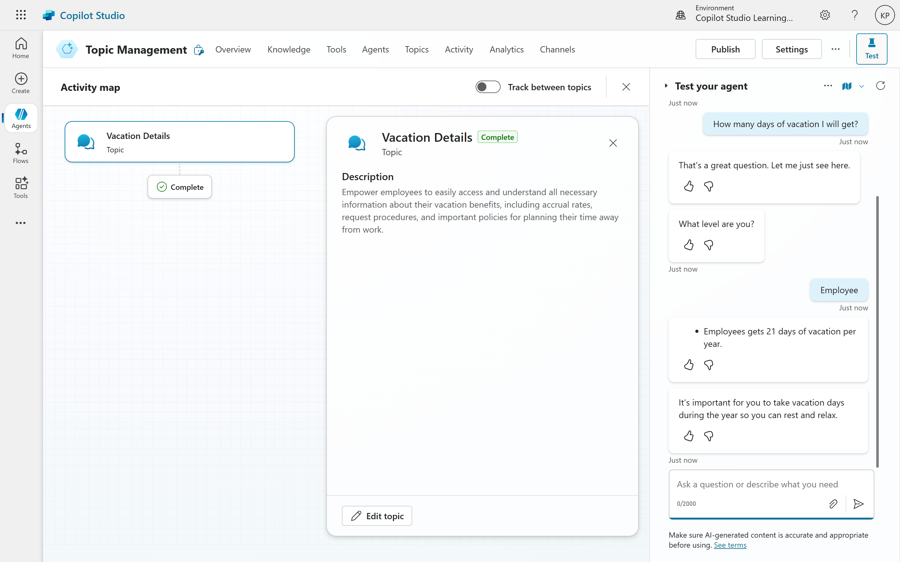

# 04. Interaction with User
User interaction is a cornerstone of effective conversational AI. The example provided illustrates how to build more dynamic and helpful interactions by implementing conditional logic within a Copilot topic.
Here's a breakdown of how the interaction works and the benefits it offers:
- **Initiating the Conversation with a Trigger Phrase:** The interaction begins when the user types a trigger phrase related to vacation days, such as "How many vacation days do I get?" or "What's my PTO?". This activates the "Vacation Days" topic in the Copilot.
- **Gathering Information with a Clarifying Question:** Instead of directly providing an answer, the Copilot first sends a message: "That's a great question. Let me just see here." This acknowledges the user's query and sets the stage for further interaction. Crucially, the Copilot then asks a follow-up question: "What level are you?" This is where conditional logic comes into play.
- **Implementing Conditional Logic with Multiple-Choice Options:** The Copilot provides the user with multiple-choice options to select their level, such as "Level 1," "Level 2," or "Level 3." This allows the user to specify their position, which is essential for determining the correct number of vacation days.
- **Branching the Conversation Based on User Input:** The user's selection (Manager or Employee) dictates the subsequent path of the conversation. This creates a "conditional logic tree":
  - **If the user selects "Manager":** The Copilot delivers the message: "Managers get 21 days of vacation."
  - **If the user selects "Employee":** The Copilot responds with: "Employees get 15 days of vacation."

This branching ensures that the user receives information directly relevant to their specific role.
- **Providing a Consistent Closing Message:** Regardless of the user's initial choice, the conversation concludes with a consistent, positive message: "It's important for you to take vacation days during the year so you can rest and relax." This adds a helpful and encouraging touch to the interaction.
- **Enhancing User Experience and Utility:** The example highlights several ways to further enhance the Copilot's utility:
	- **Linking to External Resources:** The ability to include a link like "Do you want to book your vacation?" that takes the user to their vacation portal significantly improves the Copilot's practical value. This demonstrates how conversational AI can act as a gateway to other internal systems.
	- **Internal vs. External Use Cases:** The example emphasizes that Copilots can serve both internal purposes (like an employee support bot) and external purposes (like a customer service bot), showcasing their versatility.

### Let's modify our Vacation Details Topic and make it more interactive**
- **Open the Copilot Studio** and navigate to the **Vacation Details** topic.
- **Add a Clarifying Question:** Include a message that acknowledges the user's question, such as "That's a great question. Let me just see here." Follow this with a clarifying question: "What level are you?".
- **Implement Multiple-Choice Options:** Create a multiple-choice question with options like "Employee" and "Manager". This will allow the user to specify their role.

<pre><b>Note:</b><ul><li>Store the result in variable and follow appropriate namin conventions.</li><li>Use the variable in the next message to provide a personalized response.</li><li>Ensure that the multiple-choice options are clear and relevant to the user's context.</li><li>Ensure you will set appropriate usage for variable: Topic(limited scope) or Global(any topic can access)</li></ul></pre>

- **Branch the Conversation:** Set up conditional logic so that if the user selects "Employee", the Copilot responds with "Employees get 21 days of vacation." If they select "Manager", it responds with "Managers get 15 days of vacation."
- **Add a Consistent Closing Message:** Regardless of the user's choice, conclude the conversation with a positive message like "It's important for you to take vacation days during the year so you can rest and relax."

- **Test the Interaction:** After implementing the changes, test the interaction by typing in the trigger phrase related to vacation days. Ensure that the Copilot responds appropriately based on the user's selection of "Employee" or "Manager".
- **Review and Refine:** If necessary, refine the questions, options, and responses to ensure clarity and effectiveness. Consider adding more roles or vacation policies if applicable.
- **Save and Publish:** Once satisfied with the interaction, save your changes and publish the updated Copilot topic.

## Let's test our Conditional Logic in Action
- Type "How many days of vacation I will get?" in the chat interface.
- The Copilot should respond with the message you defined, such as "That's a great question. Let me just see here. What level are you?".
- Select "Employee" or "Manager" from the multiple-choice options.
- The Copilot should respond with the appropriate message based on your selection, such as "Employees get 21 days of vacation." or "Managers get 25 days of vacation.".
- The conversation concludes with the message "It's important for you to take vacation days during the year so you can rest and relax.".

## Benefits of Conditional Logic in User Interaction:
- Personalization: Delivers tailored information based on specific user attributes or choices.
- Accuracy: Reduces the likelihood of misinterpretations by guiding user input
- Efficiency: Streamlines the conversation by asking relevant questions upfront.
- Improved User Experience: Makes the Copilot more intuitive and helpful.
- Scalability: Allows for the creation of complex decision trees to handle various scenarios.

By incorporating conditional logic, conversational AI systems can move beyond simple question-and-answer interactions to provide more intelligent, personalized, and ultimately more useful experiences for users. This foundational approach can be expanded upon with further complexities, such as routing to different topics or integrating with external workflows.

## Summary
This interaction demonstrates how to create a more engaging and personalized user experience by using conditional logic in Copilot topics. By asking clarifying questions and providing multiple-choice options, the Copilot can deliver tailored responses based on user input, enhancing the overall utility and effectiveness of the conversational AI system.