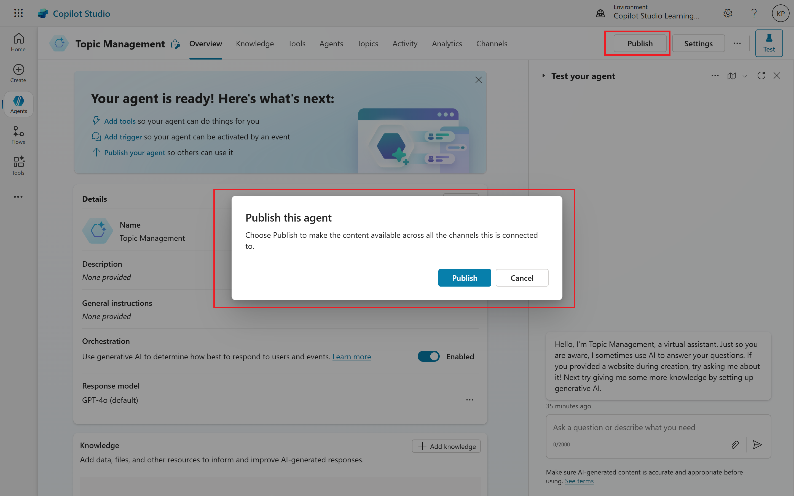
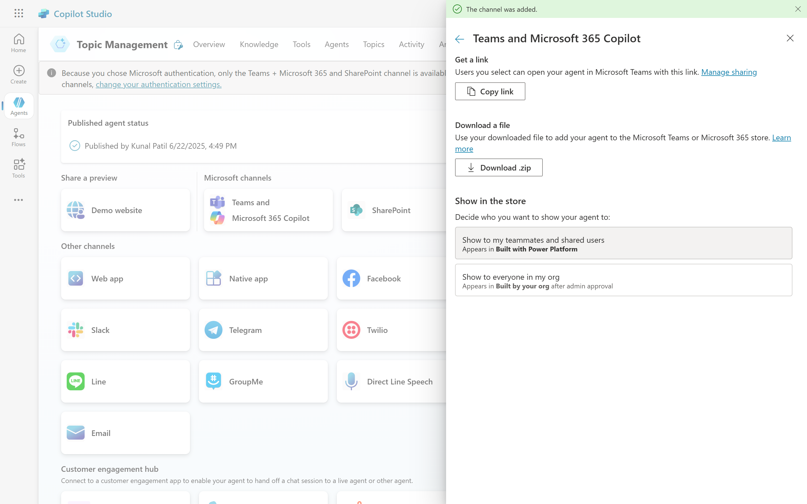

# 05. Publishing your Copilot (Bot)
## Bringing Your Copilot to Life: A Guide to Publishing on Microsoft Teams
You've built and refined your Copilot, and now it's time to share its capabilities with your organization. Publishing your Copilot to Microsoft Teams allows users to interact with it directly within their familiar communication platform, enhancing efficiency and providing instant access to information. This article will walk you through the straightforward process of publishing your Copilot to Microsoft Teams, from the initial publish to sharing it with your colleagues.
### Step 01: Initial Publication
The first crucial step is to formally publish your Copilot. This makes your Copilot live and accessible for integration with various platforms, including Microsoft Teams.
- **Navigate to Publish:** In your Copilot development environment, locate and click the "Publish" option in the left-hand side menu.
- **Initiate Publication:** Click "Publish" again to start the publishing process. During this step, you might be prompted for details like your name, developer information, and access permissions (e.g., access for everyone or specific users). These settings are crucial for how your Copilot will be discovered and used within your organization.
- **Confirmation:** Once published, you'll receive a confirmation that your Copilot is "Good to go!" and was published successfully.

### Step 2: Enabling the Microsoft Teams Channel
With your Copilot published, the next step is to enable the Microsoft Teams channel for it.
- **Access Channels:** If you don't immediately see a "Channels" link, go to "Settings" and then select "Channels."
- **Select Microsoft Teams:** From the list of available channels, choose "Microsoft Teams."
- **Turn on Teams:** Click "Turn on Teams" to activate the integration.

### Step 3: Customizing and Saving Details
After turning on the Teams channel, you'll have the opportunity to customize your Copilot's appearance and description within Teams.
- **Edit Details:** A "Edit Details" option will appear. Click on it to modify various settings.
- **Personalize your Copilot:**
	- **Logo/Icon:** Upload a distinctive logo or icon to represent your Copilot in Teams.
	- **Color:** Choose a custom color scheme.
	- **Description:** Provide a concise and a long description. The long description is particularly useful for giving users a comprehensive overview of your Copilot's functionalities before they add it to their Teams.
- **Save Changes:** Once you're satisfied with the details, click "Save."

### Step 4: Sharing Your Copilot with Your Organization
There are several ways to make your Copilot available to your team. The most straightforward method often involves sharing a direct link.
- **Availability Options:** Within the Teams channel settings, look for "Availability Options."
- **Copy Link:** Select "Copy Link." This generates a unique URL that directly adds your Copilot to a user's Teams. This is generally the easiest way to distribute your Copilot to specific individuals or groups.
- **Other Distribution Methods (Optional):**
	- **Show to everyone in my organization:**
	- **Download .zip file:** This creates a zip file containing the Copilot's manifest, which can be manually uploaded to Teams or distributed for others to upload.This makes your Copilot discoverable in the Microsoft Teams App Store within your organization. Users can then search for and install it directly.

### Step 5: Testing Your Copilot in Microsoft Teams
Once you have the link, it's time to test your Copilot in action.
- **Open the Link:** Paste the copied link into your web browser or directly send it to a Teams chat
- **Add the Copilot:** When the Teams interface opens, you'll see an overview of your Copilot (e.g., "Basic Copilot" if that's what you named it). Click "Add".
- **Interact with Your Copilot:** Your Copilot will now appear in your left-hand side menu in Teams. Initiate a conversation by asking it questions it's designed to answer. For example, if your Copilot handles vacation days, ask "How many vacation days do I have?"
- **Observe Adaptive Cards:** Notice how interactive elements, like adaptive cards for selecting your employment level (e.g., "Manager"), seamlessly transfer from your Copilot's original design to the Teams environment.

By following these steps, you can successfully publish your Copilot and empower your organization with an accessible and interactive AI assistant directly within Microsoft Teams. This integration streamlines workflows, provides instant information, and enhances overall productivity.

## Publishing Your Copilot: From Internal Tool to Public-Facing Assistant
Microsoft Copilot Studio offers incredible flexibility in how you deploy your intelligent assistants. While internal team use cases are common, sometimes you need to make your Copilot accessible to a wider audience, like customers or the general public. This article will guide you through the process of publishing your Copilot to a demo website or embedding it directly into your existing web pages.

### Step 1: Setting Up Authentication for Public Access
Before you can publish your Copilot to a public-facing website, you need to configure its authentication settings. This is a critical step to ensure your Copilot behaves as intended for its target audience.
- **Navigate to Security Settings:** In Copilot Studio, go to Settings > Security > Authentication.
- **Choose Your Authentication Option:**
	- **For Internal Colleagues (e.g., Company Employees):** If your Copilot is intended only for your internal company employees, you'll want to choose an option that authenticates users with **Entra ID (formerly Azure Active Directory)**. This ensures that only authenticated company personnel can access and interact with the Copilot.
	- **For Customer Service Bots (Public Access):** If you're creating a customer service bot or a Copilot meant for general public use on your website, select **"No authentication"**. This makes the Copilot available to anyone who visits your website without requiring a login.
- **Save Your Changes:** After selecting your preferred authentication method, click Save. You may receive warnings about the implications of public access, especially if your Copilot has access to sensitive data or internal systems.

<pre><b>Note:</b>It is crucial to only enable "No authentication" for public-facing Copilots that do not expose confidential information or internal resources.</pre>

### Step 2: Publishing Your Copilot
Once your authentication settings are configured, you can proceed with publishing your Copilot.
- **Go to Publish:** In the Copilot Studio interface, navigate back to the **Publish** section.
- **Click Publish:** Select the Publish button and allow the system to process the publication. You'll receive a confirmation once it's successfully published.

### Step 3: Configuring Your Demo Website
With your Copilot published, you can now make it available on a demo website provided by Microsoft.
- **Access Channels:** After publishing, go to Channels.
- **Select Demo Website:** Choose the Demo website option.
- **Customize (Optional):** You can add a welcome message and conversation starters (e.g., "Hello").
- **Copy the Website Link:** Copilot Studio will provide a unique URL for your demo website. Copy this link
- **Save:** Click Save to confirm your demo website settings.

Now, you can open this copied URL in a new browser tab (even an incognito window to simulate an unauthenticated user) to see your Copilot in action on its very own demo website!

## Beyond Websites: Other Publishing Channels
The flexibility of Copilot Studio extends beyond just websites. You can also publish your Copilot to various other channels to meet your users where they are:
- **Mobile App:** Integrate your Copilot into your native mobile applications.
- **Facebook:** Create a Facebook Chatbot to engage with customers on social media.
- **Skype & Slack:** Make your Copilot accessible within popular team communication platforms.
- **Twilio & Direct Line Speech:** Even transform your Copilot into a texting bot or a voice-enabled assistant, allowing users to interact via text messages or phone calls.

By leveraging these diverse publishing options, you can ensure your Copilot effectively serves its intended audience across multiple touchpoints.