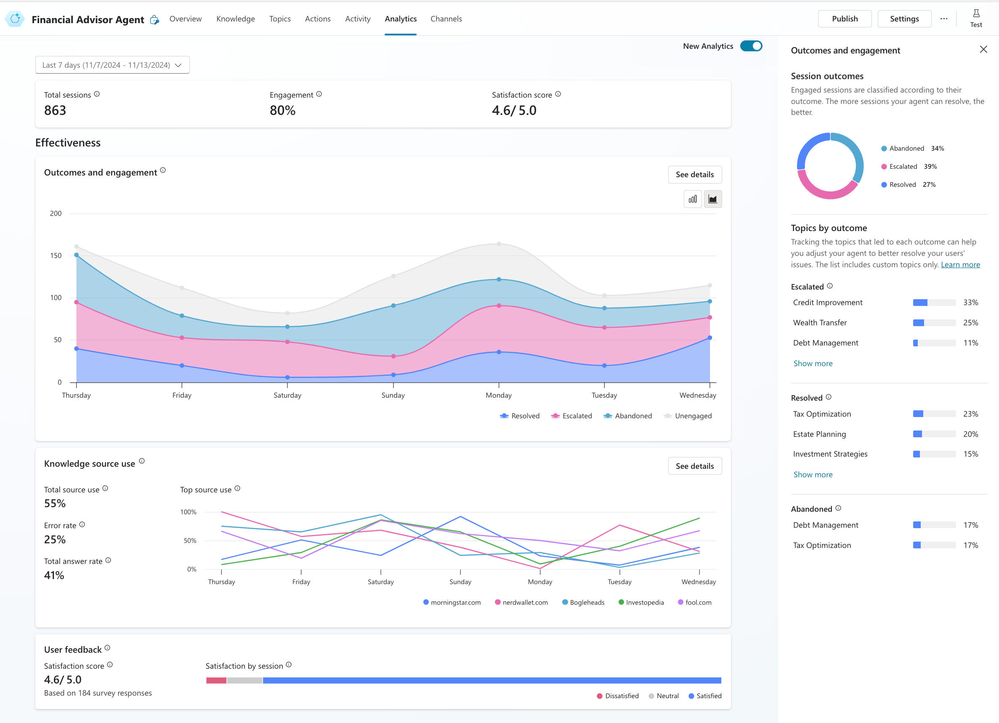

# 06. Analytics of Copilot
## Beyond Launch: Mastering Your Copilot with In-Depth Analytics
Launching a copilot is just the first step. To truly unlock its potential and ensure it's a valuable asset, an iterative process of refinement driven by robust analytics is crucial. A "very good copilot" isn't built in a day; it evolves by understanding user needs and continually adapting to meet them.
Imagine you've developed a copilot for internal vacation inquiries. Initially, it might only provide information on available vacation days. However, users might start asking:
- "How do I book a vacation through the company?"
- "How many vacation days do I personally have left this year?"
- "If I get sick during a vacation, is it still considered a vacation day?"

These are deeper, more nuanced questions that your initial copilot might not be equipped to answer. Without dedicated analytics, you, as the copilot author, would be unaware of these unmet needs. Users, frustrated by the copilot's limitations, might simply revert to traditional methods, defeating the very purpose of its creation.
To prevent this, Microsoft Copilot Studio provides a comprehensive analytics dashboard that tracks user interactions and identifies areas for improvement. This dashboard is your key to understanding how users engage with your copilot, what questions they ask, and where the copilot falls short.

## Unveiling User Behavior Through Analytics
The analytics dashboard is a powerful tool that provides insights into user behavior and copilot performance. It allows you to:
- **Number of sessions:** How many interactions is your copilot having?
- **Engagement rate:** How often are users interacting with the copilot after initiating a session?
- **Resolution rate:** How often does the copilot successfully answer a user's query without escalation?
- **Escalation rate:** How often does the copilot need to hand off a query to a live agent or human support?
- **Abandoned rate:** How often do users leave a conversation without a resolution?

These metrics provide a holistic view of your copilot's health. The escalation rate, abandoned rate, and resolution rate are particularly vital. A high escalation or abandoned rate, coupled with a low resolution rate, signals that your copilot is failing to meet user expectations.

**Consider this scenario:** A user asks, "How do I book vacation days?" Your copilot, designed only to provide the number of vacation days, responds with just that information. The user, dissatisfied, then types, "No, I know how much I get. I want to know how I actually book the time off." Since there's no relevant topic, the copilot enters a loop of "I'm sorry, I'm not sure how to help with that." This constitutes a "failed case" or "unresolved case," which will be clearly reflected in your analytics.

## The Power of Out-of-the-Box Analytics
Microsoft Copilot Studio's analytics dashboard is designed to be intuitive and user-friendly. It provides out-of-the-box insights that require no additional setup. You can easily access the dashboard from the left-hand side menu in Copilot Studio, where you'll find a dedicated "Analytics" section. You don't need to develop your own tracking systems or integrate complex tools. The data is available right out of the box, allowing you to quickly and efficiently:
- Identify gaps in your knowledge base.
- Prioritize new topic development.
- Refine existing topics based on user feedback.
- Monitor the overall health and effectiveness of your copilot.
- Make data-driven decisions to enhance user experience and satisfaction.
- Measure the ROI of your copilot.

In essence, copilot analytics empower you to move beyond simply building a functional copilot. They provide the necessary intelligence to continually optimize its performance, ensuring it remains a valuable, efficient, and user-centric tool that truly fulfills its purpose. By embracing this iterative, data-driven approach, you can transform your copilot from a basic assistant into an indispensable resource.
