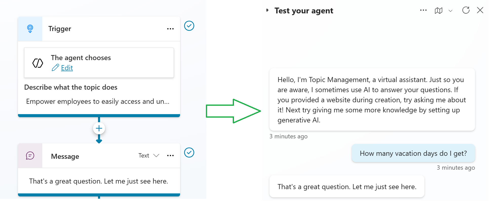
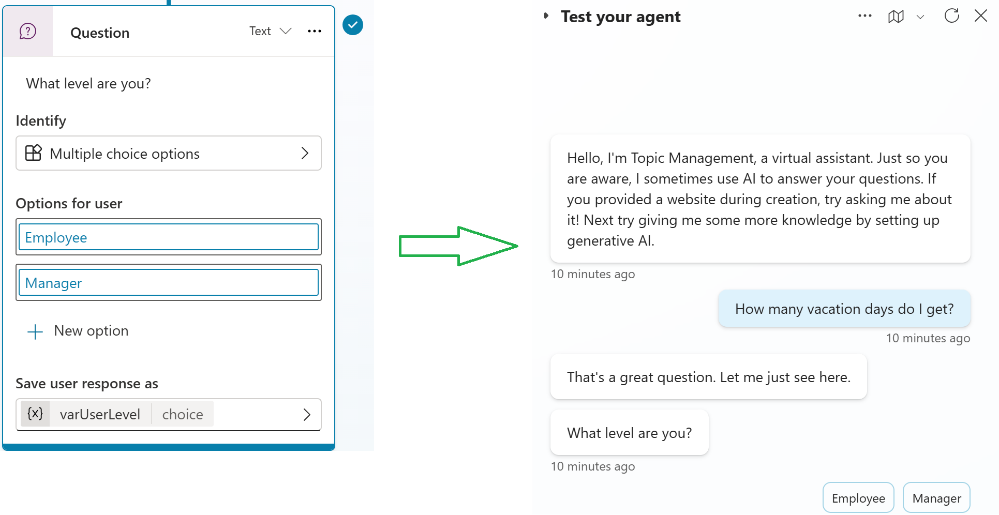
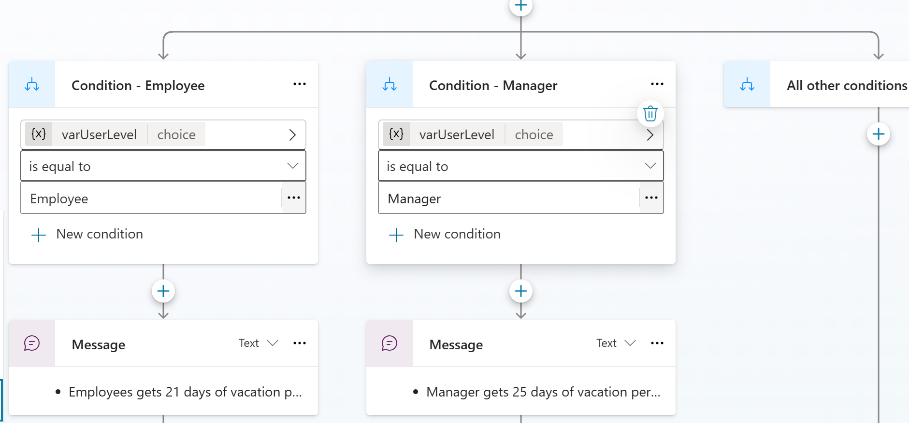
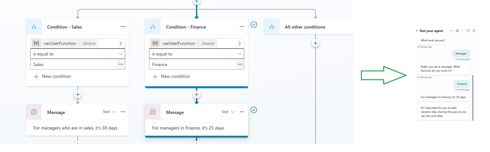

# 01. Conditions & Conditional Logics

In the realm of chatbot development, crafting intuitive and effective conversations is paramount. Copilot Studio empowers developers with remarkable flexibility in conversational design, allowing for dynamic and personalized user interactions. A cornerstone of this flexibility lies in the intelligent use of conditions and conditional logic.

## Foundation: Creating a New Topic and Triggering Conversations
To begin, every conversational flow starts with a topic. In Copilot Studio, you can create a new topic from scratch, defining the initial phrases that will trigger its activation. For instance, to address vacation policy inquiries, you might set a trigger phrase like "vacation policy" or "how many vacation days do I get?". While it's best practice to include multiple trigger phrases for robustness, even a single phrase is sufficient for demonstrating the core concepts of conversational design.

## First Step: Engaging the User with a Message
Once a topic is triggered, the chatbot can initiate the conversation. A simple yet effective first step is to send a welcoming message. For our vacation policy example, a message like "That's a great question. Let me just see here." sets the stage for gathering more information.

## Introducing Interaction: Asking Questions and Gathering User Input
The real power of conversational design emerges when you start asking questions and capturing user responses. Copilot Studio allows you to pose questions to the user and present them with various input options. A common and highly effective method is to provide multiple-choice options.

Consider our vacation policy scenario: after the initial message, the chatbot can ask, "What level are you?" and offer choices such as "Manager" or "Employee."

## The Heart of Logic: Implementing Conditions
This is where conditional logic comes into play. Copilot Studio allows you to create conditions based on the user's answer to a question. Each answer can lead to a distinct branch in the conversational flow.
When a user selects "Manager," the conversation can follow one path, while a selection of "Employee" leads to an entirely different trajectory. Copilot Studio simplifies this by automatically saving the user's response to a variable (e.g., varUserLevel), which can then be used to define these conditions.

## Branching Out: Creating Complex Conversational Flows
The beauty of conditional logic is its ability to create increasingly complex and nuanced conversational designs. A simple initial branch can further subdivide based on subsequent user inputs.
For instance, if the user identifies as a "Manager," the chatbot can then ask another question to refine the information, such as "Right, you are a manager. What function do you work in?" This question can again offer multiple-choice options like "Sales" or "Finance." Each of these selections then leads to yet another set of conditions and tailored responses.

**Example of a Multi-Layered Branch:**
- User asks about **Vacation Policy**
- **Bot:** "Great question! Vacation policy depends on what level you are."
- **Bot:** "What level are you?" (Options: Manager, Employee)
- **If User selects "Employee":** 
	- Bot: "You get 21 vacation days per year."
- **If User selects "Manager":**
- **Bot:** "Right, you are a manager. What function do you work in?" (Options: Sales, Finance)
	- **If User selects "Sales":**
		- **Bot:** "You get 30 vacation days per year."
	- **If User selects "Finance":**
		- **Bot:** "You get 25 vacation days per year."

This demonstrates how a seemingly simple initial question can fan out into multiple pathways, each providing a specific and relevant answer.

### The Power of Granularity
The ability to continuously apply conditions based on user responses allows for highly granular and personalized chatbot interactions. Each question and its subsequent conditional branches contribute to a sophisticated conversational design that caters to various user profiles and needs.

## Beyond Multiple Choice: Expanding Conditional Logic
While multiple-choice questions are a powerful tool, Copilot Studio's conditional logic capabilities extend far beyond this. Developers can implement conditions based on any user input, whether it's a text response, a selection from a dropdown, or even more complex interactions. Multiple-choice options are an excellent starting point for implementing conditions, Copilot Studio offers even more advanced possibilities. You can leverage:
- **Entities:** Extract specific pieces of information from a user's free-form response (e.g., a city name, a date) and use that information to drive conditions.
- **Options from a List Variable:** Dynamically present choices based on data stored in a variable.
- **Entire User's Response:** Analyze the complete user input for keywords or patterns to trigger specific.

These advanced techniques, which build upon the foundational understanding of conditions and questions, open up a vast array of possibilities for creating truly intelligent and adaptable chatbots.

## Conclusion
Conditions and conditional logic are indispensable tools in Copilot Studio for crafting effective and engaging conversational designs. By strategically asking questions, capturing user input, and defining branches based on those inputs, you can create chatbots that navigate complex inquiries, provide personalized information, and deliver a seamless user experience. As you delve deeper into Copilot Studio, mastering these fundamental concepts will unlock the full potential of your chatbot's conversational capabilities.
