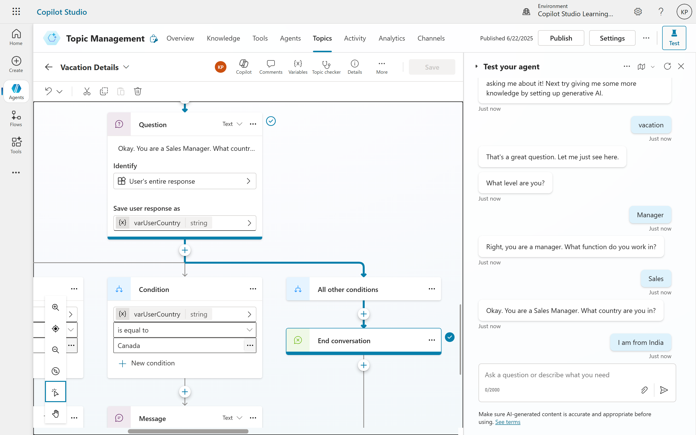
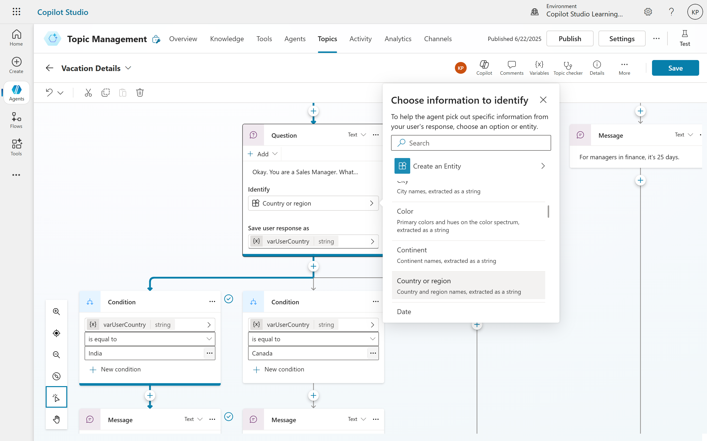
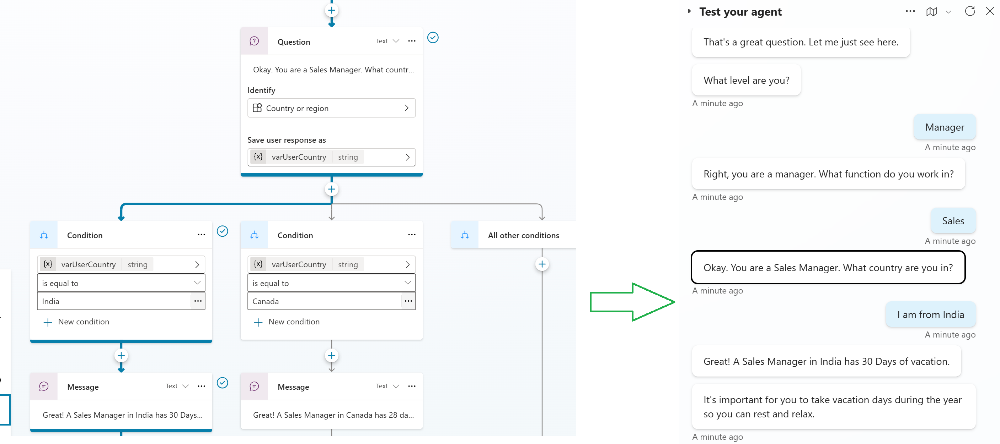

# 02. Working with Entities
When building robust and user-friendly chatbots in Copilot Studio, a key concept to grasp is the use of "entities." Entities are pre-built or custom-defined "option sets" or "fields" that allow your bot to intelligently extract specific, relevant information from a user's natural language input. This is crucial for creating intuitive conversational experiences and avoiding the pitfalls of rigid keyword matching.

### The Problem with "User's Entire Response"
Imagine you're building a chatbot to help users understand their vacation policy, and part of the policy depends on their country of residence. You might ask, "What country are you from?"

If you simply capture the "user's entire response," you run into problems.
- **Too many options:** You wouldn't want to present a list of 200+ countries for the user to select from.
- **"Noisy" input:** A user might say, "My office is in Canada," or "I am currently located in Mexico." In these cases, simply matching "Canada" or "Mexico" against the entire response would fail, as the response contains additional words or "noise." This leads to the chatbot not understanding the user's intent and potentially freezing or providing no response.

 

## The Solution: Using Entities
### The Power of Entities: Smart Information Extraction
This is where entities come in. Instead of trying to parse the entire user's response, you can instruct Copilot Studio to use a pre-defined entity like "Country or Region."
This entity is designed to recognize and extract relevant information from the user's input, regardless of how they phrase their response. For example:

### How it works:
When a user responds, Copilot Studio's powerful natural language processing (NLP) engine, powered by entities, analyzes the input and extracts only the relevant piece of information that matches the specified entity.

#### Consider the example
If the bot asks, "What country are you in?" and the user responds with "I'm in Canada," the "Country or Region" entity will intelligently identify and extract "Canada" as the country, ignoring the "I'm in" part. This extracted value can then be stored in a variable (e.g., var3) and used in conditions to determine the appropriate vacation policy.

## Common Pre-Built Entities
Copilot Studio provides a wide range of pre-built entities that cover common data types, simplifying the development process. These include:
- **Age:** Extracts age information from user input.
- **Country or Region:** Identifies countries or regions mentioned in the user's response.
- **Email:** Captures email addresses from user input.
- **Phone Number:** Extracts phone numbers from user responses.
- **Number:** Identifies numerical values in user input.
- **URL:** Captures URLs from user input.
- **Date:** Extracts dates, days of the week, and months relative to a point in time extracted as a string from user input.
- **Boolean:** Captures positive/negative response and extracted as true/false values from user input.
- **Person name:** Extracts names of people from user input.
- **Organization:** Identifies names of organizations or companies mentioned in user responses.

By leveraging these pre-built entities, you can significantly enhance your chatbot's ability to understand and respond to user input accurately, even when the phrasing is not exact.

## Creating and Editing Custom Entities
While pre-built entities are incredibly useful, your chatbot will often require the ability to recognize domain-specific information that isn't covered by the defaults. This is where custom entities become indispensable.

### Steps to Create a Custom Entity
1. **Navigate to the Entities Section:**
   - In Copilot Studio, go to the Entities tab (usually found under Settings or directly in the left-hand navigation pane, depending on your Copilot Studio version).
2. **Create a New Entity:**
	- Click on the "Add an entity" button.
	- **New entity:**
		- **Closed List Entity:**
			- This type of entity allows you to define a fixed set of options that users can choose from. For example, if you're building a bot for a restaurant, you might create a "Menu Item" entity with options like "Pizza," "Burger," and "Salad."
			- **Name:** Give your entity a clear, descriptive name (e.g., "ProductCategory," "ServiceType," "HomeworkResponses").
			- **List Items:** Enter the specific values you want the entity to recognize. For example, for "ProductCategory," you might list "Electronics," "Apparel," "Books."
			- **Smart Matching (Optional):** Turning on "Smart matching" uses fuzzy logic and semantic understanding to interpret user input, even with misspellings or broader semantic matches (e.g., "softball" matching "baseball").
			- **Upload/Download Values:** For large lists, you can upload a text file with values and their synonyms (one value per line, with | as a delimiter for synonyms, e.g., hiking|trekking|mountaineering). You can also download existing lists.
			- Example: 
				1. **Entity Name:** Menu Item
					- **Options:** Pizza, Burger, Salad
				2. **Entity Name:** Vacation Type
					- **Options:** Beach, Mountain, City
				3. **Entity Name:** Preferred Contact Method
					- **Options:** Email, Phone, Chat
				4. **Entity Name:** Feedback Rating
					- **Options:** Excellent, Good, Fair, Poor
		- **Regular Expression (Regex) Entity:**
			- This is used for extracting information that follows a specific pattern, like product IDs, order numbers, or postal codes.
			- **Name:** Provide a name for your regex entity.
			- **Pattern:** Enter the regular expression pattern that should be used to match and extract entity items from the input. Copilot Studio uses .NET regular expression syntax. For example, \d{10} would match exactly 10 digits for an order number. You can make patterns case-insensitive using (?i).
	- Save Your Entity: Once you've defined your entity and its values/patterns, click Save.

### Editing an Existing Entity
- **Access the Entities List:** Go to the Entities tab.
- **Select the Entity:** Click on the entity you wish to edit from the list.
- **Make Changes:** The details panel for the entity will open, allowing you to modify its name, description, list items, synonyms, smart matching settings, or regex pattern.
- **Save Changes:** Remember to click Save after making any modifications.

## Implementing Entities in Conversations
Once you've created or chosen an entity, integrating it into your conversation flow is straightforward:
- **Select a Question Node:** In your topic, locate the "Ask a question" node where you want to capture specific information.
- **Choose the Entity:** Under the "Identify" setting for the question node, instead of "User's entire response," select the pre-built or custom entity you want to use (e.g., "Country or Region extracted as string," or your custom "ProductCategory").

- **Save to Variable:** Assign the extracted entity value to a variable (e.g., var3).
- **Use in Conditions:** You can then use this variable in subsequent condition nodes to guide the conversation based on the extracted information.

## Conclusion
By incorporating entities into your Copilot Studio bots, you move beyond basic keyword matching and empower your chatbots with a more sophisticated understanding of user intent, leading to more effective and engaging conversational experiences. The ability to create custom entities further extends this power, allowing you to tailor your bot's understanding to the precise needs of your domain.

