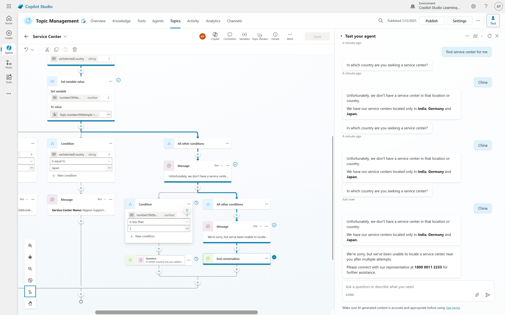

# 04. Looped and Redirected Conversations

## Conversational Flow: Looped Conversations and Redirects
In the world of conversational design, creating seamless and helpful interactions is paramount. Often, a key challenge is ensuring users provide the correct information, even if it takes a few tries. This is where the powerful combination of looped conversations and redirects comes into play, allowing you to guide users effectively until a satisfactory response is received.

Let's explore how to implement this concept to build more robust and user-friendly conversational agents.

## The Problem: When Answers Go Off-Script
Imagine a scenario where your conversational agent needs to know the user's country to provide relevant Service Center. You've set up multiple-choice options, perhaps using a "Country or Region" entity to guide the input.
However, what if the user provides an answer that isn't one of your valid options (e.g., your company only operates in Canada and Mexico, but the user says "United States" or "Brazil")?
Without a proper handling mechanism, you might:
- **Provide a generic "Not a valid country" message and stop.** This leaves the user stranded.
- **Repeatedly ask the same question in a linear fashion.** This is inefficient and quickly makes the conversation clunky and frustrating for the user.

The goal is to gracefully handle incorrect input by giving the user another chance to provide a valid answer, without creating an endless, frustrating loop.

## The Solution: Looped Conversations with Redirects
The core idea is to redirect the conversation back to the original question if an invalid answer is provided. This creates a "loop" where the user is prompted again until they give a satisfactory response.

Here's a step-by-step breakdown of how to implement this, incorporating best practices to prevent infinite loops:

1. **Initial Setup: Trigger and Question:** Start by defining your topic and trigger phrase (e.g., "Service Center"). The first step in your conversation flow will be to ask the crucial question:
	- **Ask the Question:**  "In which country are you seeking a service center??"
	- **Options:** Provide multiple-choice options (e.g., leveraging a "Country or Region" entity to capture the user's input into a variable, let's say varSelectedCountry)

2. **Conditional Logic - Validating Input:** Next, introduce conditions based on the user's answer stored in varUserCountry:
	- **Valid Response:** If the response matches one of your predefined options (e.g., "Germany" or "India" or "Japan"), proceed with the conversation.
	- **Invalid Response:** If the response does not match any valid options, redirect the conversation back to the original question.

3. **Redirecting the Conversation:** Use a redirect to loop back to the question. For "All other conditions" (invalid input):
	- **Message:** "Not a valid country. Only Canada and India are valid countries."
	- **Redirect to the Question:** "What country are you in?" This will prompt the user again, allowing them to provide a valid answer.
	- **Redirect:** Crucially, instead of ending the conversation or asking the question linearly again, use the "Go to Step" feature. Select the original "What country are you in?" question as the destination step. This effectively sends the user back to try again.

## Preventing Infinite Loops: Introducing a Counter and Fallback
While the redirect creates a loop, an unmanaged loop can become an "infinite loop," endlessly asking the user the same question. To prevent this and provide a better user experience, we introduce a counter and a fallback mechanism.

1. **Initialize an Attempt Counter:** At the very beginning of your topic, before asking any questions, initialize a new variable to track the number of attempts:
	- **Set a Variable Value:** Select number_of_attempts.
	- **Set Value To (Formula):** Topic.number_of_attempts + 1 (This Power Fx formula takes the current value of the variable and adds 1 to it)

2. **Conditional Logic for Attempts:** Now, modify your "All other conditions" branch (where the invalid input is handled). Before redirecting, add another condition:
	- **Check the Number of Attempts:** If number_of_attempts is less than 3, proceed with the redirect.
		- **Message:** "Not a valid country. Only Canada and Mexico are valid countries."
		- **Redirect:** Go to the original "What country are you in?" question. This keeps the loop going for a limited number of attempts.
	- **If Attempts Exceed Limit:** If number_of_attempts is 3 or more, provide a fallback message(i.e., three or more attempts have been made):
		- **Message:** "You have incorrectly answered the question three times. Sorry that this is taking so long. Please go talk to a live agent." (Provide a link or contact information, e.g., google.com as a placeholder).
		- **End Conversation:** Use the "End the conversation" action.

### The Final Flow
Your sophisticated conversational flow will now look something like this:

1. **Start Topic (Trigger Phrase: "Service Center")**
2. **Set Variable:** number_of_attempts = 0
3. **Ask Question:** "What country are you in?" (User input stored in var_one)
4. **Set Variable (Increment):** number_of_attempts = number_of_attempts + 1
5. **Condition (Based on var_one):**
	- **If varUserCountry = "Canada":** "Great! Proceeding to Canada Service Center." (Continue conversation)
	- **If varUserCountry = "India":** "Great! Proceeding to India Service Center." (Continue conversation)
	- **Else (Invalid Country):**
		- **Condition (Based on number_of_attempts):**
			- **If number_of_attempts < 3:** "Not a valid country..." (Redirect to "Ask Question" step)
			- **Else (number_of_attempts >= 3):** "You have incorrectly answered... Please talk to a live agent." (End conversation)

## Benefits of Looped Conversations with Redirects
- **User-Friendly:** Users can correct their input without feeling stuck or frustrated.
- **Efficient:** Reduces the need for multiple separate questions and keeps the conversation focused.
- **Controlled:** The use of a counter prevents infinite loops, ensuring the conversation remains manageable.
- **Scalable:** This pattern can be applied to various scenarios where user input needs validation, making it a versatile tool in your conversational design toolkit.
- **Improved User Experience:** Users are given multiple opportunities to correct their input, reducing frustration.
- **Robust Error Handling:** Gracefully manages unexpected or invalid user responses.
- **Escalation Path:** Provides a clear path for users to get help if they cannot provide a valid response after several attempts.
- **Polite and Professional:** Maintains a polite tone, even when redirecting or escalating the conversation.

## Conclusion
By mastering the concepts of variables, conditions, and redirects, we can create dynamic, intelligent, and truly helpful conversational agents that guide users effectively through complex interactions. This allows your bot to be persistent, yet polite, ensuring users reach their desired outcome or are escalated to the appropriate support channel when needed.

