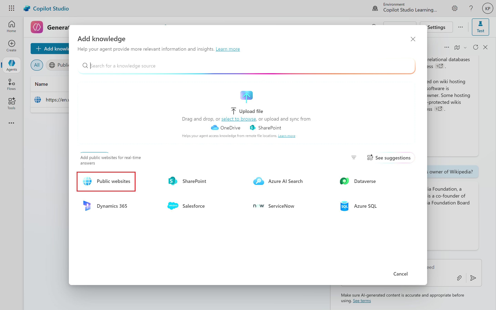
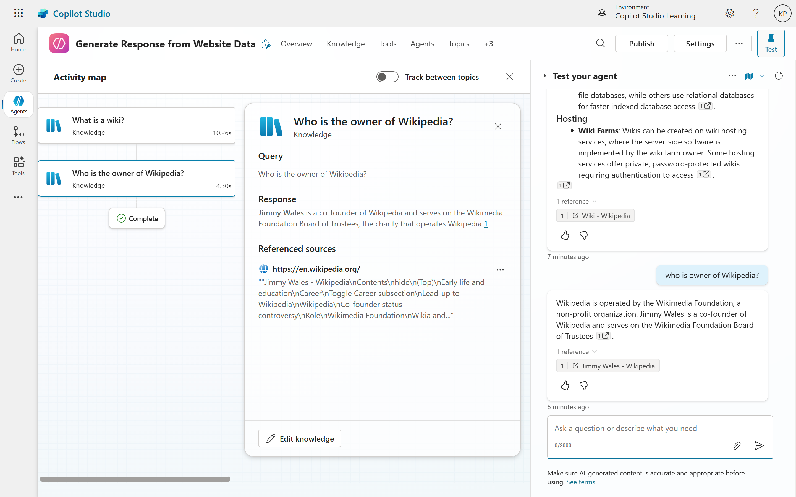
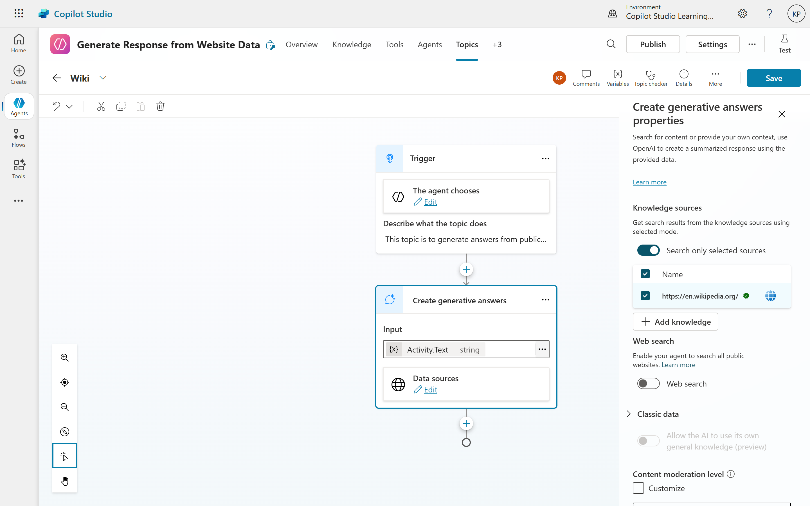

# 02.Harnessing Website Data for Generative Answers
Creating an intelligent customer service chatbot no longer requires extensive manual configuration or coding expertise. With advancements in AI-powered platforms like Microsoft Copilot, you can now build a highly effective chatbot by simply pointing it to a website URL. This revolutionary approach leverages generative AI to automatically parse and understand the content, enabling your chatbot to provide accurate and contextually relevant responses to user queries.

## The Power of Generative AI in Chatbot Creation
The core of this simplified chatbot creation lies in the "Create generative answers" node, a pivotal feature that transforms how chatbots interact with information. Instead of defining rigid "if-then" rules for every possible user query, this node allows the chatbot to generate dynamic answers based on the provided data source.
When you create a new copilot and input a website URL, the platform automatically performs the following:
- **Data Extraction**: It scrapes the website content, extracting relevant text, images, and other media.
- **Content Understanding**: The generative AI model analyzes the extracted data to understand the context, structure, and key information.
- **Generative Answers Node Creation:** A "conversational boosting" system topic is automatically generated, containing a "Create generative answers" node. This node is pre-configured to use the provided website as a data source.
- **Website Parsing:** It scans and ingests the content of the specified website, including not just the main page but also all indexed sub-pages.
- **Dynamic Response Generation:** When a user asks a question, their prompt (activity.text) is fed into this node. The chatbot then uses the website's content to formulate a natural language response, effectively acting as a highly informed customer service agent.

## How it Works: Prioritizing Intent and Leveraging Data
The generative answers node operates on a simple yet powerful principle: it prioritizes the user's intent over rigid data structures. When a user submits a question, the system does not rely on predefined answers. Instead, it analyzes the intent behind the question and searches the ingested website content for relevant information.
It's crucial to understand the chatbot's priority system. When a user interacts with the copilot, it first attempts to match the user's request with predefined topics and their associated trigger phrases. This ensures that specific, pre-authored conversational flows are prioritized.
However, if the chatbot cannot find a direct match (an "unknown intent"), it then falls back to the "conversational boosting" topic. This is where the "Create generative answers" node takes over. The magic here is that the chatbot isn't simply searching for keywords on the front page. It's performing an intelligent search across all indexed pages of the provided domain, much like a sophisticated search engine. This allows it to extract information from various sections of the website to answer even highly specific questions.
For example, if the website is https://www.google.com/search?q=en.wikipedia.org and you ask "Who is owner of Wikipedia?", the chatbot won't just look at the homepage. It will search the entire https://en.wikipedia.org/ domain, potentially finding a dedicated sub-page (e.g., "https://www.google.com/search?q=en.wikipedia.org/wiki/Wikipedia:About") that contains all the relevant information about Wikipedia, and then uses that detailed content to formulate its answer.

##### Add Public Facing Website as Knowledge

##### Generate Resposnes directly from Website

##### Generate Resposnes by using Website as Knowledge through Custom Topics

#### Example Use Case
Imagine a company that wants to create a customer service chatbot for its website. Instead of manually inputting FAQs or writing complex scripts, they simply provide the URL of their site. The generative AI system automatically extracts all relevant information, including product details, support articles, and company policies.
When a user asks, "What is your return policy?" the chatbot doesn't just pull a canned response. Instead, it intelligently searches through the entire website content, finds the most relevant information about the return policy, and crafts a personalized response that addresses the user's query in context.

## Key Benefits of Using Generative AI for Chatbots
- **Ease of Use**: No coding or manual configuration is required. Simply provide a website URL, and the system handles the rest.
- **Effortless Knowledge Base Creation:** No need for extensive manual data input or rule-based programming. The website itself becomes the chatbot's knowledge base.
- **Dynamic and Contextual Responses:** Generative AI enables the chatbot to provide nuanced and relevant answers, even to complex or unforeseen questions, by synthesizing information from across the website.
- **Comprehensive Information Retrieval:** The chatbot can access and utilize information from all indexed sub-pages, offering a deeper and more complete understanding of the website's content.
- **Rapid Deployment:** This method significantly accelerates the chatbot development process, allowing businesses to deploy intelligent assistants quickly.

## Beyond the Basic
While the initial setup is remarkably simple, further customization is possible. You can:
- **Refine Topics:** Delete or modify the automatically generated topics and create new ones to fine-tune the chatbot's behavior and conversational flows.
- **Integrate Multiple Data Sources:** For more complex scenarios, you can even configure the chatbot to draw information from multiple websites or other structured data sources.

By leveraging the power of generative AI and website integration, businesses can now create highly effective customer service chatbots with unprecedented ease, transforming how they engage with their users and provide support.

## Conclusion
The advent of generative AI has revolutionized the way we build and deploy chatbots. By simply pointing to a website URL, businesses can now create intelligent customer service agents that understand and respond to user queries with remarkable accuracy and context. This approach not only simplifies the chatbot creation process but also enhances the user experience by providing dynamic, relevant, and comprehensive answers. As AI technology continues to evolve, the potential for even more sophisticated and capable chatbots is limitless, paving the way for a new era in customer service automation.