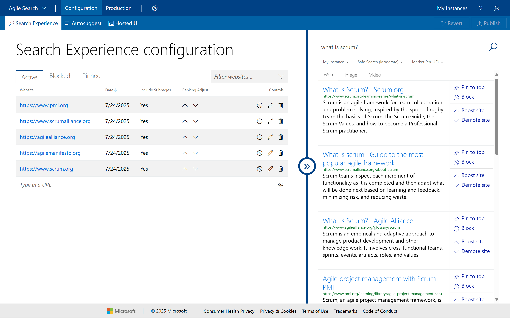
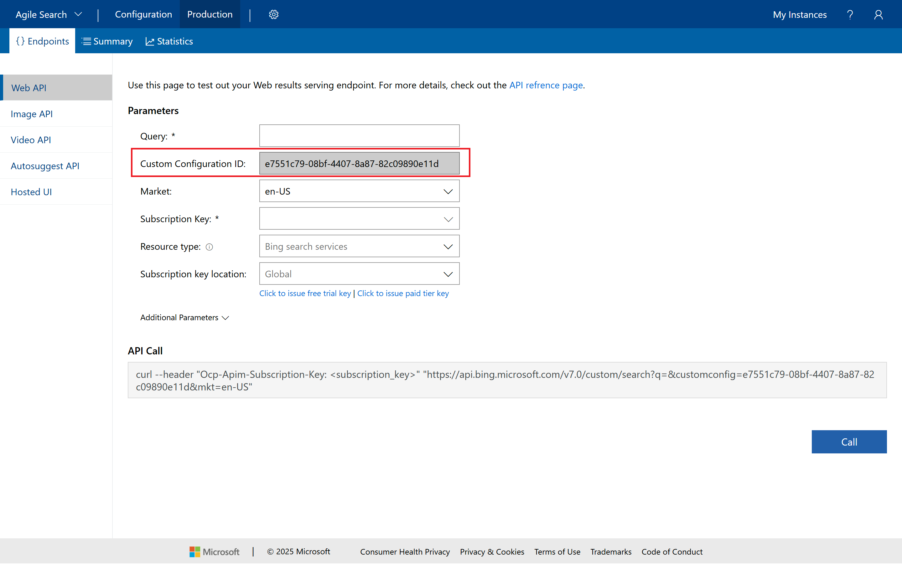
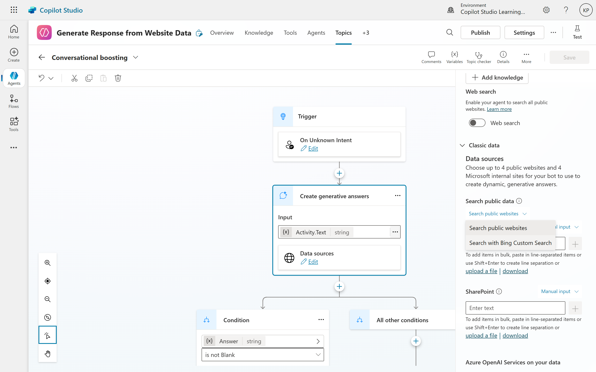
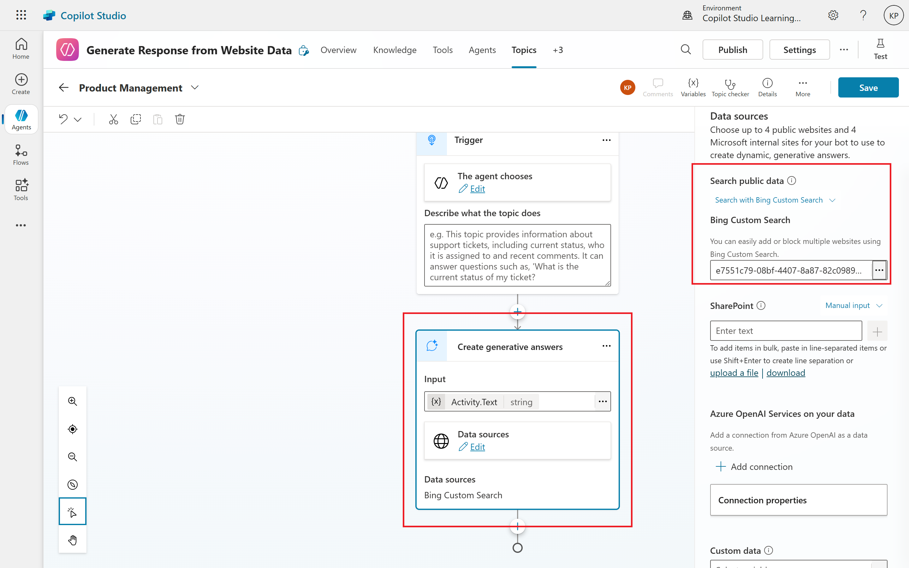
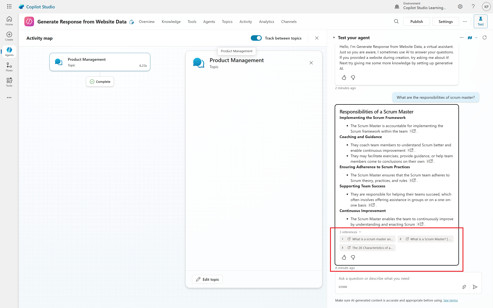

# 03. Access Information from Endless Websites with Bing Custom Search
Are you building a Copilot but find yourself limited by the four-website restriction for data sources? Imagine a Copilot that can access all the information from a vast array of websites, perfectly tailored to your needs. This is where Bing Custom Search comes in, transforming your Copilot into an information powerhouse.

Traditional Copilot configurations often hit a wall with a maximum of four allowed websites. While sufficient for many, this limitation becomes a significant hurdle when you need your Copilot to draw insights from a much broader digital landscape. Think of an organization like Apache, which oversees numerous open-source projects, each with its own dedicated website. How do you empower a Copilot to synthesize information across all these distinct, yet related, sources? The answer lies in Bing Custom Search.

## What is Bing Custom Search?
Bing Custom Search, as its name suggests, is a personalized search experience. It's an API that allows you to define a specific subset of the internet for your search queries, rather than searching the entire web. This makes it an incredibly powerful tool for creating highly specialized search services. Instead of a broad, Google-like search, you can curate a search index that only includes websites relevant to your specific content or business needs. This tailored approach ensures that your Copilot focuses on the most pertinent information, delivering more accurate and relevant responses.

## Overcoming the Multiple Website Barrier with Bing Custom Search
The core problem Bing Custom Search solves for Copilot users is the website limitation. By leveraging Bing Custom Search, you can create a single, custom search service that encompasses as many websites as you need – whether it's five, fifty, or even thousands. This service then acts as a single data source for your Copilot, effectively bypassing the previous restriction.

## A Step-by-Step Guide to Integration
Here's how to integrate Bing Custom Search with your Microsoft Copilot:
1. **Create a New Copilot:** Begin by creating a new Copilot in your Copilot environment. Give it a descriptive name.
2. **Set Up Bing Custom Search Instance:**
	- Navigate to the Bing Custom Search portal [customsearch.ai](https://www.customsearch.ai/).
	- Sign in with your Microsoft account. Note that a free tier is available, but be mindful of pricing for higher usage or more websites/queries.
	- Click "New Instance" and name it (e.g., "Agile Search")
	- Start adding the URLs of the websites you want your Copilot to access. For instance, https://www.pmi.org/ would be a starting point. You can add as many as needed, going beyond the traditional four-website limit.
	
	- Test your custom search by typing a query in the preview pane. Observe that the results are confined to the websites you've added.
	- Once satisfied with your website selection, click "Publish."
	- **Crucially, obtain your Custom Configuration ID.** This unique ID is the key to linking your Copilot to this custom search service.
	
3. **Configure Your Copilot:**
	- Go back to your newly created Copilot.
	- Navigate to Settings > Generative AI.
	- Enable by selecting "Yes - Responses will be dynamic, using available tools and knowledge as appropriate" for "Use generative AI orchestration for your agent's responses?" in **Orchestration** section and save your changes.
	- Go to Topics > Conversational boosting (Or create a new topic if needed, in our use case I have created a new topic called "Product Management").
	
	- Modify this node and for "Data sources," select "Search with Bing Custom Search."
	- Paste your previously copied Custom Configuration ID into the provided field.
	
	- Save your changes.

### Testing Your Copilot
Now that your Copilot is configured with Bing Custom Search, it's time to test it:
- **Start a Conversation:** Open your Copilot and initiate a conversation.
- **Ask a Question:** Pose a question that you know should yield results from the websites you've added. For example, "What are the responsibilities of Scrum Master?"
- **Evaluate the Response:** Check if the Copilot provides a relevant answer based on the information from your custom search. If it does, congratulations! You've successfully integrated Bing Custom Search into your Copilot.
- **Refine as Needed:** If the response isn't quite what you expected, consider adjusting the websites in your Bing Custom Search instance or refining your Copilot's configuration.

### The Power of Expanded Knowledge
By integrating Bing Custom Search, your Copilot can now access a virtually limitless pool of information, far exceeding the traditional website constraint. This capability is particularly beneficial for organizations with extensive digital resources or those that require comprehensive data synthesis across multiple domains.

## Beyond the Basics: Considerations
- **Scalability:** Bing Custom Search handles the underlying search infrastructure, allowing you to scale your Copilot's knowledge without worrying about complex data indexing or management.
- **Targeted Information:** By defining your search scope, you ensure your Copilot provides highly relevant answers, avoiding noise from irrelevant parts of the internet.
- **Cost:** While a free tier exists, be aware of the pricing models for Bing Custom Search as your usage and the number of websites increase.

By embracing Bing Custom Search, you unlock a new level of capability for your Copilots, transforming them into intelligent assistants capable of navigating and extracting insights from a truly comprehensive array of online information.

## Conclusion
Bing Custom Search is a game-changer for Copilot users, allowing you to overcome the limitations of traditional website restrictions. By creating a custom search service that encompasses multiple websites, you can empower your Copilot to deliver more accurate and relevant information tailored to your specific needs. Whether you're managing a large organization or simply want a more powerful Copilot, integrating Bing Custom Search is a step towards unlocking the full potential of generative AI in your workflows.