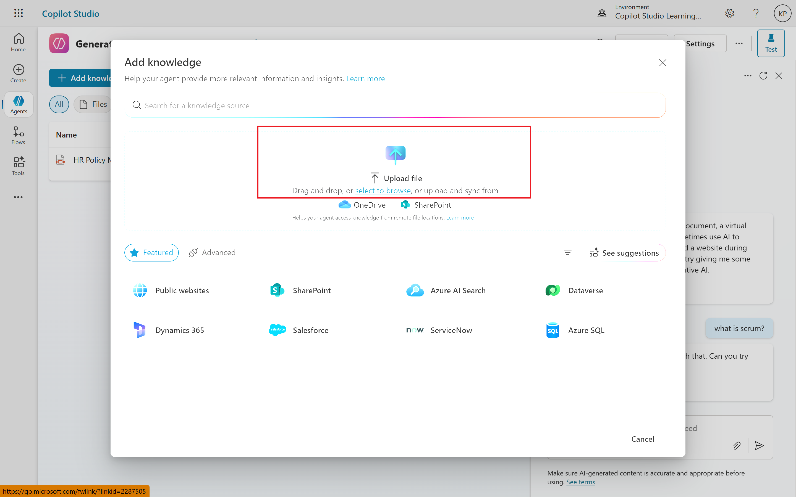
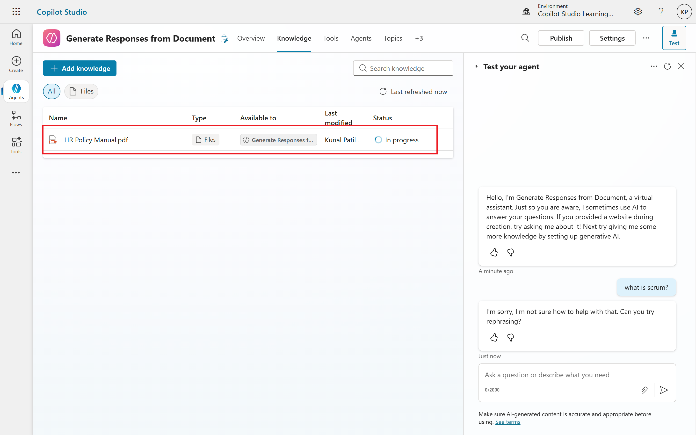
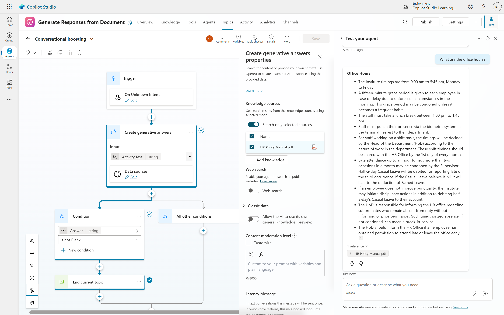

# 04. Empower Your Copilot: Uploading Documents for Intelligent Answers

Creating a Copilot that can answer questions based on your specific information is a powerful tool, whether for internal employee support or external customer service. This article will guide you through the process of uploading static files like PDFs, Word documents, and PowerPoints to your Copilot to serve as its knowledge base.

## The Power of Document-Driven Copilots
Imagine a chatbot that instantly provides detailed answers about your company's vacation policy, product specifications, or service instructions. By uploading relevant documents, you can empower your Copilot to do just that. While users can always open documents directly, integrating the information into a Copilot offers several advantages:
- **Accessibility:** Users can access information directly within platforms like Microsoft Teams, streamlining their workflow
- **Efficiency:** Get quick, summarized answers without sifting through entire documents
- **Scalability:** Create a central knowledge hub for a wide range of inquiries.
- **Customer Service:** Build intelligent chatbots that can answer customer questions based on your product manuals, FAQs, and pricing information.

## Step-by-Step Guide to Uploading Documents
Let's walk through the process of setting up your Copilot to leverage uploaded documents.
1. **Create Your Copilot:** First, you'll need a Copilot. If you don't have one already, create a new Copilot from scratch. Give it a descriptive name, such as "HR Bot Documents" or "Product Support Chatbot."
2. **Enable Generative AI Capabilities:** Once your Copilot is created, navigate to its Settings. Look for Generative AI (its location might vary slightly depending on your version). Crucially, ensure that the option "Boost conversational coverage with generative answers" is turned on. Don't forget to save your changes.
3. **Upload your document(s):**
	1. This is where you feed your Copilot the information it needs. In the Generative AI settings, you'll find an option to upload documents. Microsoft Copilot supports a variety of file types, including: PDF (.pdf), Microsoft Word (.doc, .docx), Microsoft Excel (.xls, .xlsx), Microsoft PowerPoint (.ppt, .pptx), Text files (.txt), HTML files (.html)
	2. Simply drag and drop your desired file(s) into the upload area. If you encounter an error during upload, ensure the file isn't open on your system and try refreshing the page.

4. **Document Indexing**: After uploading, your Copilot will begin "indexing" the file. This process involves the Copilot reading the content, breaking it down into manageable chunks, and creating internal references (like vector embeddings and categorizations). This indexing allows the Copilot to quickly retrieve relevant information when a user asks a question. Indexing time can vary depending on the file size, but it typically takes a few minutes.
5. **Content Moderation Settings (Optional):** You can adjust the content moderation level for your Copilot, typically set to "high" or "low." This setting determines how confident the model needs to be before providing an answer. A "high" setting means it will only provide answers it's very confident about, while "low" allows for more answers, even if the confidence is lower. This is a trade-off between answer availability and accuracy.
6. **Test Your Copilot:** Once indexing is complete, it's time to test! Ask your Copilot questions related to the content of your uploaded documents. For example, if you uploaded a vacation policy, ask "How many vacation days do I get?" or "How do I plan and approve my vacation?"
7. **Manage Your Documents:** If you need to update or replace a document, you can delete the old file and upload a new one in the Copilot settings. This ensures your Copilot always has the most current information.

##### Test you Copilot:
The Copilot should provide relevant answers, often with citations to the source document once it's indexing status is ready.

## Important Considerations
While uploading static documents is a straightforward way to build a knowledge base, keep these points in mind:
- **Citations:** Currently, citations for uploaded documents might not be as user-friendly as desired, making it difficult for users to directly access the source file
- **Updates:** If your source information changes (e.g., your vacation policy is updated), you'll need to manually delete the old file and upload the new one within the Copilot settings. This can become cumbersome with frequent updates.
- **Storage Limits:** The number of documents you can upload is limited by the available file storage in your Dataverse environment. For large-scale applications with thousands of documents, ensure your Dataverse is adequately provisioned.

### Moving Beyond Static Files: SharePoint and OneDrive
For dynamic content and easier management, especially if your documents are frequently updated, consider using SharePoint or OneDrive as your Copilot's information source. This approach offers better version control and easier updates, as the Copilot can directly access the latest versions of files. However, it also introduces complexities related to authentication and permissions, which will be covered in future discussions.
By following these steps, you can effectively leverage static documents to create intelligent and helpful Copilots that provide instant answers to your users.

## Conclusion
Leveraging static documents to power your Copilot is a fantastic way to quickly create an intelligent assistant that provides instant, accurate answers. By simply uploading your PDFs, Word files, or other supported formats, you transform raw information into an accessible knowledge base. While this method offers incredible ease of use for initial setup, remember the potential for manual updates and the limitations of citations. For dynamic content that changes frequently, exploring options like SharePoint or OneDrive for your Copilot's knowledge source will offer greater flexibility and manageability, though they introduce their own set of considerations regarding permissions and authentication. Regardless of your approach, empowering your Copilot with relevant data is a significant step towards boosting efficiency and enhancing user experience.

