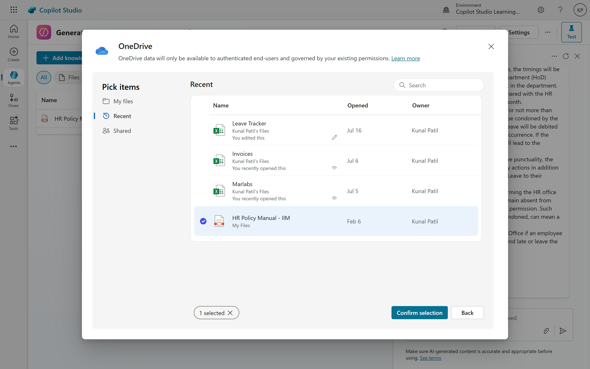

# 05. Beyond Static: Empowering Copilot with OneDrive and SharePoint for Dynamic Answers

In our previous discussion, we explored how to quickly build a Copilot's knowledge base by uploading static files. While effective for stable content, real-world information often lives in dynamic environments. This article delves into the next level of Copilot intelligence: leveraging documents stored in OneDrive or SharePoint to generate responses. This approach offers enhanced flexibility, version control, and seamless updates, making it ideal for organizations where information is constantly evolving.

## The Challenge of Static Documents
Static documents, while easy to upload, present challenges in dynamic environments. When information changes—like updates to policies, product specifications, or service instructions—manually replacing files can be cumbersome. Users may also struggle with citations, as the Copilot's responses might not link directly to the source document, making it hard to verify or access the original content.

## The Power of OneDrive and SharePoint
OneDrive and SharePoint are designed for dynamic content management. They allow for real-time collaboration, version control, and easy updates. By integrating these platforms with your Copilot, you can create a more responsive and intelligent assistant that always has access to the latest information.
Integrating OneDrive and SharePoint as your Copilot's information source offers significant benefits over static file uploads:
- **Dynamic Content Access:** The Copilot can access the most current versions of documents, ensuring users always receive up-to-date information.
- **Version Control:** SharePoint, in particular, excels at version control, allowing your Copilot to reference and potentially even explain changes over time (though advanced configuration might be needed for this specific feature).
- **Centralized Management:** Documents are managed in their native environment, which your employees likely already use for collaboration and document storage. This streamlines your information governance.
- **Scalability:** For large organizations with extensive documentation, storing and linking to files in SharePoint or OneDrive is far more manageable than individual uploads, respecting Dataverse storage limits more efficiently
- **Referencing:** Users can easily access the original source documents directly from the Copilot's answers, improving transparency and trust in the information provided.
- **Collaboration:** Teams can collaborate on documents in real-time, ensuring that the Copilot always has access to the latest content without manual intervention.
- **Security and Permissions:** SharePoint and OneDrive offer robust security features, allowing you to control who can access and edit documents, ensuring sensitive information is protected.
- **Searchability:** Both platforms provide powerful search capabilities, enabling the Copilot to quickly find relevant information across multiple documents.

## Setting Up Your Copilot with OneDrive or SharePoint
If you're building a custom AI agent using Microsoft Copilot Studio, you can explicitly connect it to SharePoint sites and lists as knowledge sources. This gives your custom copilot a specific dataset to draw from for its responses.
Here's the general process for adding SharePoint as a knowledge source in Copilot Studio:
- **Open your Copilot Agent:** In Microsoft Copilot Studio, open the agent you are working on.
- **Add Knowledge Source:**
	- Go to the "Knowledge" section of your agent.
	- Select "Add knowledge".
- **Select SharePoint:** In the "Featured" section, choose "SharePoint".
- **Provide SharePoint URLs:** 
	- Enter the URL of the SharePoint site(s) you want to use (e.g., https://contoso.sharepoint.com/sites/policies).
	- You can also select specific SharePoint lists by Browse or entering their URLs.
- **Authentication:** By default, Copilot Studio preconfigures agents to authenticate users using Microsoft authentication for SharePoint sources when connected through Microsoft Teams, Power Apps, or Microsoft 365 Copilot. If you need to configure manual authentication for advanced scenarios, you'll need to set up a Microsoft Entra ID application registration with the necessary scopes (e.g., Sites.Read.All and Files.Read.All).
- **Save and Test:** Save your changes and test your agent with questions related to the content in your linked SharePoint sites/lists.

 
## What Copilot Can Do with SharePoint and OneDrive Data?
- **Summarize Documents:** Quickly get overviews of long documents, presentations, spreadsheets, and other files.
- **Answer Questions:** Ask questions about specific files or across multiple files and get concise answers.
- **Compare Files:** Analyze up to 5 selected files simultaneously to identify differences and similarities.
- **Generate Insights:** Extract key information and generate insights from your content (e.g., outline a sales pitch from selected documents).
- **Content Creation Assistance:** Help draft content, refine writing, and provide suggestions based on your existing documents.
- **File Organization:** Assist with tagging, categorizing, and managing documents (especially within SharePoint).

## Key Considerations
- **Permissions are Key:** For both Microsoft 365 Copilot and custom Copilot Studio agents, the AI will only access information that the user interacting with it has permission to see. This ensures data security and compliance.
- **Data Quality:** The effectiveness of Copilot heavily relies on the quality and organization of your data in SharePoint and OneDrive. Well-structured documents, consistent tagging, and removal of redundant data will lead to better Copilot responses.
- **File Types:** Copilot in OneDrive typically supports common file types like DOC, DOCX, PPT, PPTX, XLSX, PDF, TXT, RTF, HTML, and OpenDocument formats. Support for images and videos might be limited or evolving.
- **Admin Control:** Administrators have control over enabling/disabling Copilot features, managing licenses, and configuring data loss prevention (DLP) policies to govern Copilot usage.

By leveraging SharePoint and OneDrive as central repositories for your organizational knowledge, Copilot can significantly enhance productivity, information retrieval, and content creation for your users.

## Conclusion
Integrating OneDrive and SharePoint with your Copilot transforms it from a static assistant into a dynamic knowledge powerhouse. This approach not only simplifies content management but also ensures that your Copilot always has access to the latest information, enhancing its ability to provide accurate and relevant answers. As organizations continue to evolve, empowering your Copilot with these tools will be crucial for maintaining an agile and responsive digital workforce. Whether you're building a custom AI agent or using Microsoft 365 Copilot, the integration of OneDrive and SharePoint is a significant step towards creating intelligent, context-aware assistants that can truly enhance productivity and collaboration.

