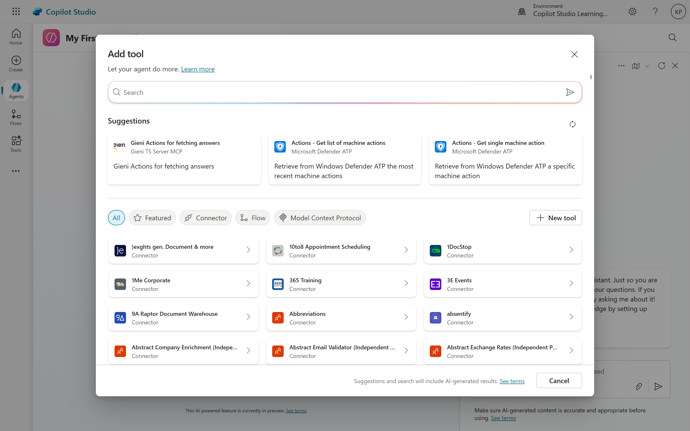

# 01. Introduction to Tools
In Copilot Studio, tools are the building blocks that allow your copilot to interact with external systems and perform actions. 🛠️ They expand the copilot's functionality beyond simply providing information, enabling it to automate tasks and streamline business processes. These tools are powered by various connectors, REST APIs, or Power Automate flows, and they're what transform a copilot into a more autonomous and capable agent.
- **Actions**: This is where you create and manage the actions your copilot can perform. Actions are built using Power Automate flows.
- **Tools**: This section allows you to configure how your copilot interacts with users, including defining input and output parameters for actions.
- **Generative AI Model**: This is the underlying AI that interprets user requests and determines which action to execute based on the context of the conversation.
- **Testing Environment**: Copilot Studio provides a testing environment where you can interact with your copilot and test the actions you've created.
- **Publishing Options**: Once your actions are ready, you can publish them to make them available for use in your copilot.

## How Tools Work in Copilot Studio
The copilot's generative AI plays a key role in how tools are used. When a user makes a request, the AI analyzes the intent and conversation context to determine if a tool is needed. It then extracts the necessary information, such as names or dates, and passes it as inputs to the selected tool.

When creating a tool, you provide a clear name and a descriptive purpose. The copilot uses this information to decide whether to run the tool, even if the user's request isn't phrased in a precise way. For example, if you have a tool to "send a Teams message," the copilot will recognize that a user saying "Can you message the team about the meeting?" should trigger this tool. You can also configure a tool to ask the user for confirmation before it runs, which is helpful for sensitive or important actions.

In Copilot Studio, tools are the building blocks that enable your copilot to perform actions. Each tool represents a specific capability or function that your copilot can execute. When you create a new copilot, you can add various tools to it, each serving a different purpose. These tools can be categorized into two main types:
1. **Built-in Tools**: These are pre-defined tools provided by Copilot Studio, such as sending emails, creating tasks, or interacting with Microsoft Teams. They are ready to use and can be configured to suit your needs.
2. **Custom Tools**: These are tools that you create to perform specific actions tailored to your copilot's requirements. Custom tools can be built using Power Automate flows, allowing you to automate processes and integrate with various services.
When a user interacts with your copilot, the generative AI model analyzes the user's request and determines which tool to invoke based on the context of the conversation. The AI uses the descriptions and input parameters defined for each tool to understand what action to take.
3. **Tool Invocation**: When the AI identifies a relevant tool, it invokes that tool with the necessary inputs extracted from the user's message. This allows the copilot to perform actions such as sending messages, creating tasks, or retrieving information.
4. **Response Generation**: After the tool has executed its action, it can return a response to the user. This response can be a confirmation message, the result of the action, or any other relevant information. The AI then generates a natural language response based on the tool's output, providing a seamless user experience.
5. **Tool Configuration**: Each tool can be configured with specific parameters, such as input fields, output formats, and descriptions. This configuration is crucial for the AI to understand how to use the tool effectively. When creating a custom tool, you will define these parameters in the Power Automate flow associated with the tool.
6. **Testing and Iteration**: Copilot Studio provides a testing environment where you can interact with your copilot and test the tools you've created. This allows you to refine the tool's behavior, adjust input parameters, and ensure that the AI correctly interprets user requests.

## Types of Actions
Copilot Studio offers a diverse range of tools to suit different needs, from simple automations to complex integrations. These include:
1. **Prompts:** Customizable templates that let you control how your copilot responds and generates content, giving you an easy way to define its personality or style.
2. **Agent Flows:** These are Power Automate flows designed specifically to be called by an agent. They can be configured to perform a series of actions, such as sending emails, updating a SharePoint list, or creating a new record in a database.
3. **Connectors:** You can use prebuilt connectors for popular services like SharePoint, Outlook, or Teams to perform actions without writing any code. For more specific needs, you can also create custom connectors to integrate with your own REST or SOAP APIs.
4. **Computer Use Actions (CUA):** This powerful feature allows your copilot to automate tasks in desktop applications and websites by interacting with the user interface, similar to a human. This is great for tasks like data entry or retrieving information from systems that don't have APIs
5. **Model Context Protocol (MCP):** This allows you to connect your copilot to existing knowledge servers and data sources, giving it access to resources, tools, and predefined prompts that are managed externally.

## Summary
In summary, tools in Copilot Studio are essential for enabling your copilot to perform actions and automate tasks. They allow your copilot to interact with external systems, execute commands, and provide a more dynamic and responsive user experience. By leveraging the power of tools, you can create a copilot that not only answers questions but also takes meaningful actions based on user requests.