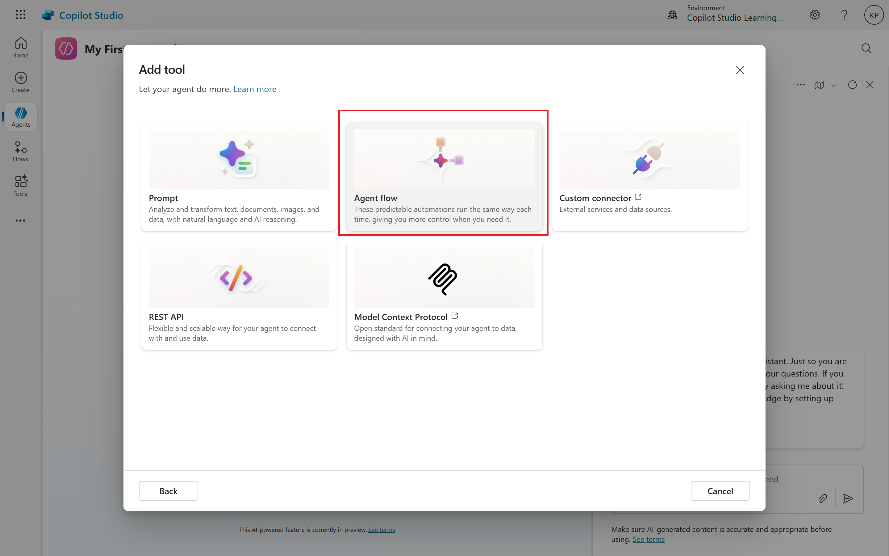
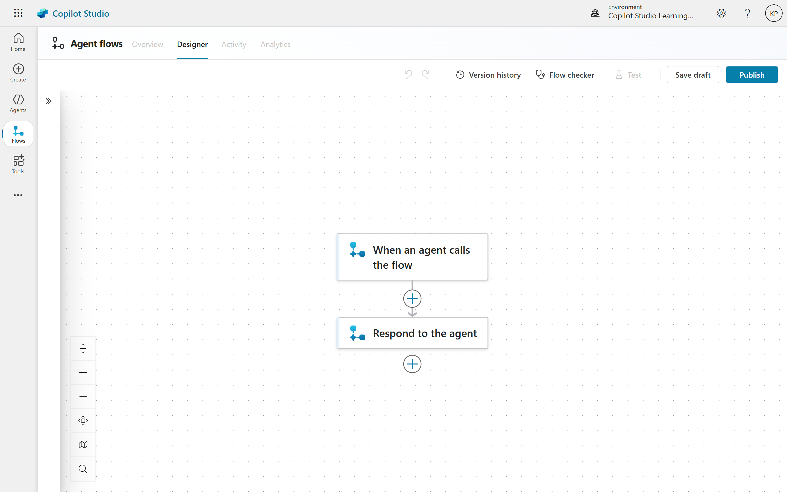
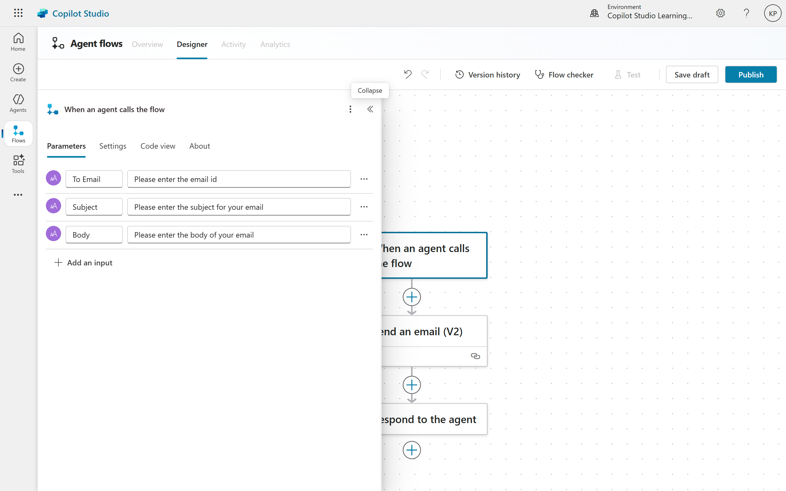
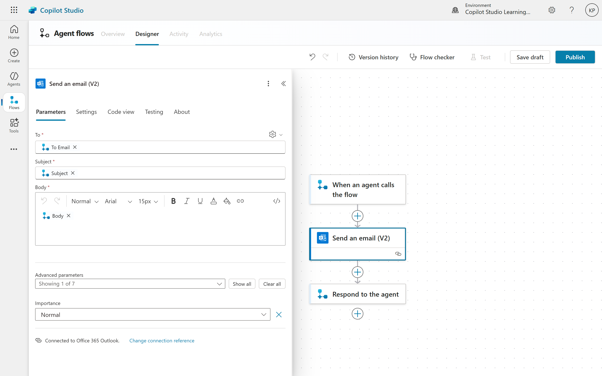
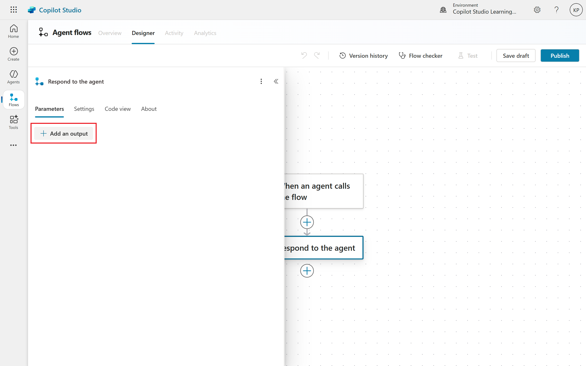
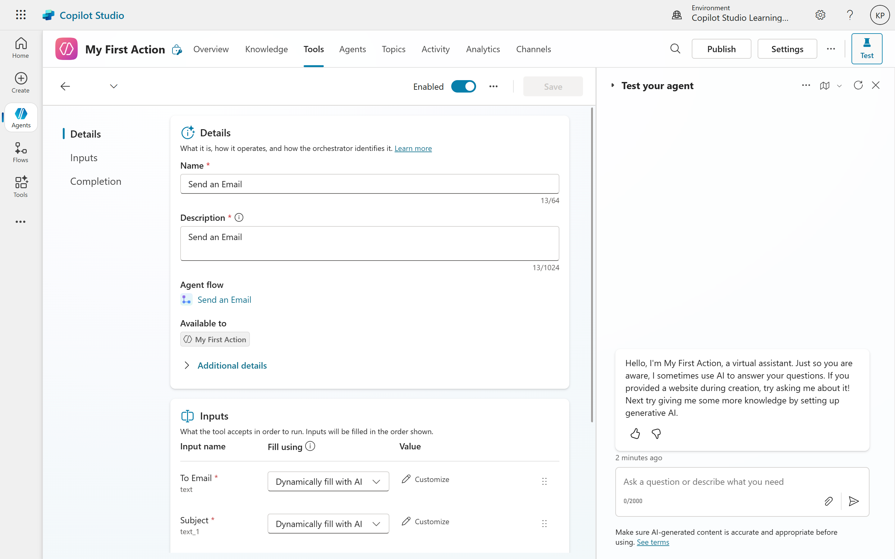
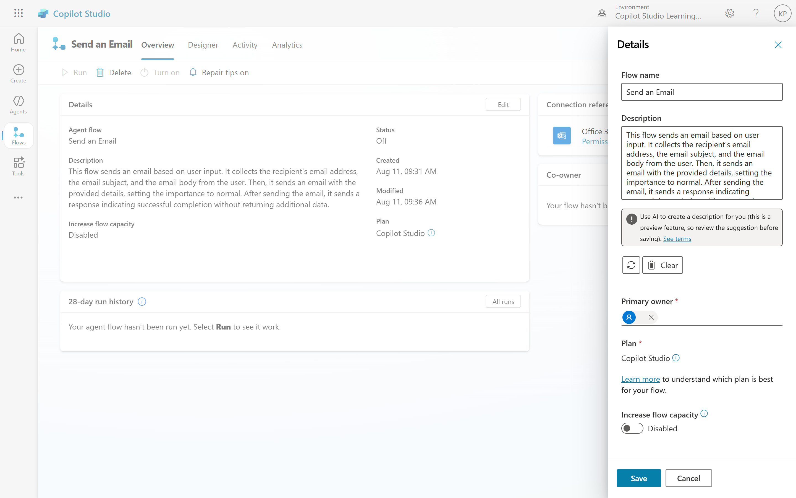
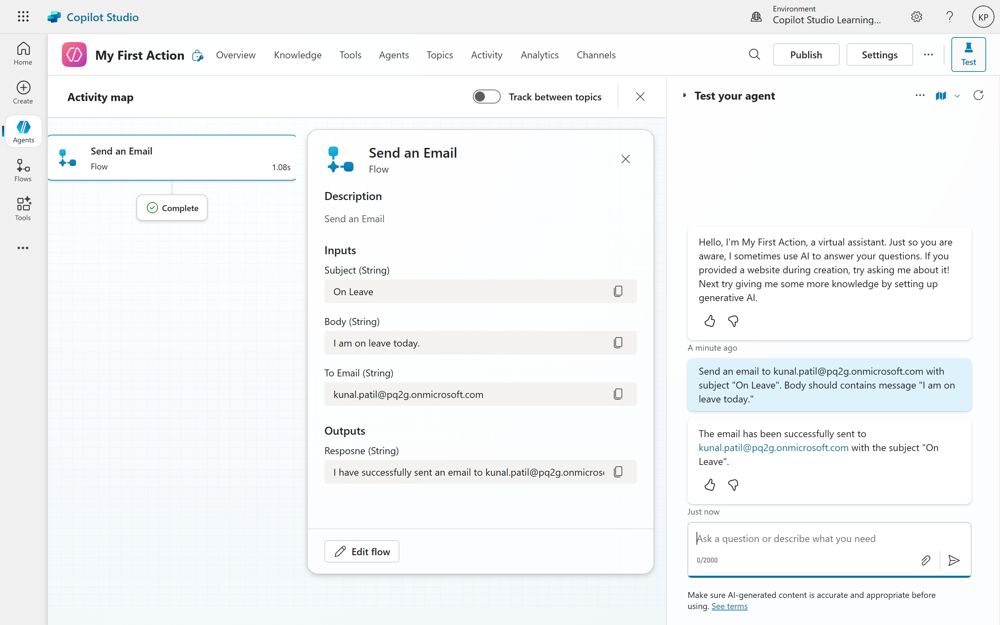
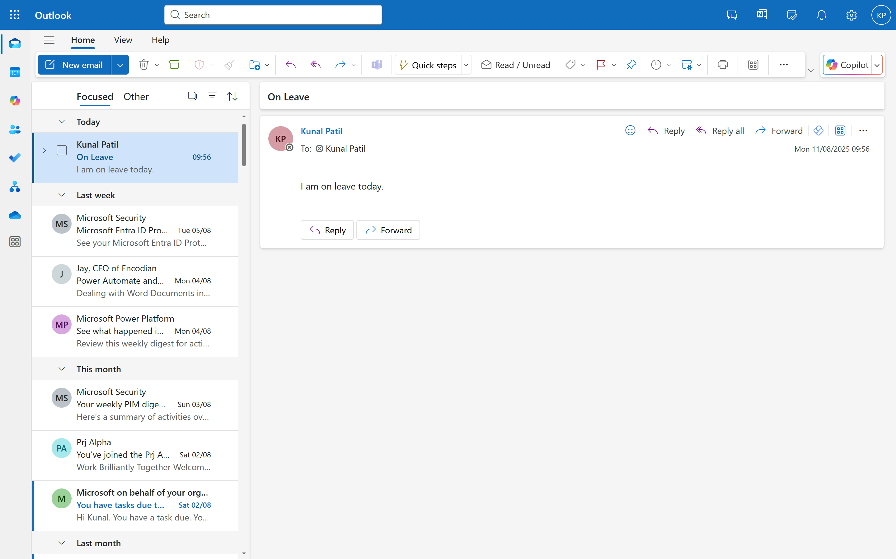

# 02. Creating Actions in Copilot Studio (Agent)
Copilot Studio allows you to extend the capabilities of your copilot beyond just providing information by enabling it to perform actions. These actions are powered by Power Automate flows, which give you the ability to automate a wide range of tasks, such as sending emails, modifying SharePoint lists, or interacting with third-party services via HTTP requests. This integration turns your copilot into a powerful AI agent that can actively work for users.

## Prerequisites
- **Copilot Studio**: Ensure you have access to Copilot Studio.
- **Basic Understanding of Power Automate**: Since Power Automate flows are the most common way to create actions, a foundational understanding of how to build and configure flows is essential. This includes knowing how to add actions, use dynamic content, and handle inputs and outputs.
- **Logic and Workflow Design:** You should be able to think through the steps of an automated process. Understanding the user's journey and how your copilot should respond at each step will lead to a more effective and user-friendly tool
- **Clear and Descriptive Language:** The success of a tool's integration relies heavily on how you describe it to the copilot's AI. Being able to write clear, action-oriented names and descriptions for your tools and their inputs is a crucial skill
- **Basic Understanding of Generative AI**: Knowing how generative AI works will help you design effective actions that can interpret user requests.

### Understanding Actions in Copilot Studio
Actions in Copilot Studio are designed to allow your copilot to perform tasks on behalf of users. The key components of an action include:
- **Inputs**: These are the parameters that your copilot will use to execute the action. Inputs can be defined in the Power Automate flow and should be descriptive to help the generative AI understand what information is needed.
- **Outputs**: After executing an action, your copilot can return a response to the user. This response can be defined in the Power Automate flow and should provide clear feedback on the action's success or failure.
- **Triggering Actions**: Actions can be triggered in two main ways:
  1. **Dynamic Calling**: The copilot's generative AI determines when to call the action based on the context of the conversation.
  2. **Trigger Phrases**: You can define specific phrases that, when detected, will explicitly call the action.

## Building a Simple Action with Power Automate
The most common and powerful way to do this is by using a **Power Automate flow**.

### Phase 1: Create a Power Automate Flow (The "Action" Itself)
This is where you build the actual logic that your copilot will execute.
1. **Navigate to the Tools Section:** In Copilot Studio, go to the Tools section. This is your central hub for creating and managing all your tools.

1. **Start a New Agent Flow:** Select **New tool** and choose Agent flows. This option is specifically designed for creating Power Automate flows that can be triggered by your copilot.

1. **Define the Trigger:** A new Power Automate flow canvas will open. The trigger, **When an agent calls the flow**, is already set up for you.

1. **Add Inputs:** This is a crucial step for making your action smart.
	1. Click on the trigger and define the inputs your flow needs. For a "send an email" action, you would add inputs like recipient, subject, and body.
	1. **Provide descriptive names and descriptions for each input.** The copilot's AI uses this information to figure out which part of the user's message corresponds to which input. For example, for the recipient input, you'd add a description like "The email address of the person to whom the email should be sent."

1. **Build the Logic:** Add the necessary actions to your flow. 
	1. For an email, you'd add the Send an email (V2) action from the Outlook connector.
	1. Use the dynamic content from your inputs to populate the fields of the email action. This ensures the email is sent with the information the user provides to the copilot.

1. **Add a Response:** Add the Respond to copilot action at the end of your flow. This is the message your copilot will use to confirm the action was successful. You can use dynamic content here as well. For example, "I have successfully sent an email to [recipient] with the [subject]."

1. **Save and Publish:** Give your flow a meaningful name and save it. Then, publish the flow to make it available for use in your copilot.

### Phase 2: Configuring the Tool in Copilot Studio
Now that you have a functioning flow, you need to tell your copilot how to use it.
1. **Add the Tool to Your Agent:** Go to the Tools section in Copilot Studio and select the published Power Automate flow from the list.

2. **Configure Tool Details:** The tool's configuration panel will appear		.
	1. **Name and Description:** Provide a clear name and description for the tool. This is crucial for the copilot's AI to understand when to use this tool. For example, you might name it "Send Email" and describe it as "Sends an email to a specified recipient with a subject and body."
		a. **Name:** "Send an Email"
		b. **Description:** "This flow sends an email based on user input. It collects the recipient's email address, the email subject, and the email body from the user. Then, it sends an email with the provided details, setting the importance to normal. After sending the email, it sends a response indicating successful completion without returning additional data."

3. **Input Parameters:** Review the inputs you defined in Power Automate.
	1. You'll need to provide a description for each input, explaining what kind of information the copilot should look for in the user's request to populate that variable.
	2. You can also specify if an input is optional or required.
4. **Choose Behavior:** This is where you fine-tune the user experience.
	1. **Allow agent to decide dynamically when to use the tool:** This is the default and most powerful option. The copilot's AI will use the tool's name and description to intelligently decide when it's the right time to use it.
	2. **Ask the end user before running:** Check this box for sensitive or critical actions. The copilot will explicitly ask the user for confirmation before executing the action, preventing accidental data changes or unintended emails.
5. **Test and Refine:** Once configured, you can test the action directly within the Copilot Studio test canvas. Try various natural language prompts, such as "Can you send an email to John with the subject 'Project Update' and the body 'The project is on track?'" The copilot should recognize your intent, gather the inputs, and run the Power Automate flow. If it doesn't, you may need to refine the tool's description or the input parameter descriptions to make them more clear for the AI.

## Configuring the Action in Copilot Studio
After creating your flow, you need to configure it within Copilot Studio:
1. **Select the Action:** In the **Tools** section of your copilot, you will now see your newly created actions listed. Select it and click Next.
2. **Add a Description:** The most critical step is to provide a clear and descriptive name and description for the action. Copilot Studio uses this information, along with the generative AI model, to determine if a user's request is a good match for this action.
3. **Define Input Descriptions:** You will also need to provide descriptions for each input variable you defined in Power Automate. These descriptions help the copilot understand what information to extract from the user's message to populate the inputs. For the Teams message example, you would describe the "message" input as "The message that the user wants to send" and the "user" input as "The name of the person the user wants to send it to."
4. **Save and Test:** After configuring the action, save your changes. You can then test the action by interacting with your copilot and providing a message that matches the input descriptions you defined.
5. **Finish:** After saving the configuration, the action is ready to be used by your copilot. At this point, you have two primary choices for how the action is triggered:
	1. **Dynamic Calling:** You can let the copilot's generative AI determine when to call the action based on the context of the conversation
	2. **Trigger Phrases:** You can configure specific trigger phrases that will explicitly call the action.

The system also offers choices for how inputs are handled. You can have the copilot automatically extract inputs from the conversation or ask the user for specific information before running the action. This level of control allows you to tailor the copilot's behavior to create a seamless and intuitive user experience.

## Testing your Action
Once your action is configured, it's essential to test it to ensure it works as expected. Copilot Studio provides a testing environment where you can interact with your copilot and see how it responds to various inputs.

When your action is executed, it can return outputs to the user. These outputs can be defined in the Power Automate flow and should be descriptive enough for the copilot to generate a meaningful response. For example, if your action sends an email, the output could be a confirmation message like "The email has been successfully sent to kunal.patil@pq2g.onmicrosoft.com with the subject "On Leave"."

### Output (Email)

## Conclusion
Creating actions in Copilot Studio transforms your copilot from a passive information provider into an active agent capable of performing tasks on behalf of users. By leveraging Power Automate flows, you can automate various processes and enhance the functionality of your copilot. The key to success lies in clearly defining inputs, outputs, and descriptions, allowing the generative AI to effectively interpret user requests and execute actions seamlessly. With these capabilities, your copilot can significantly improve productivity and user experience.