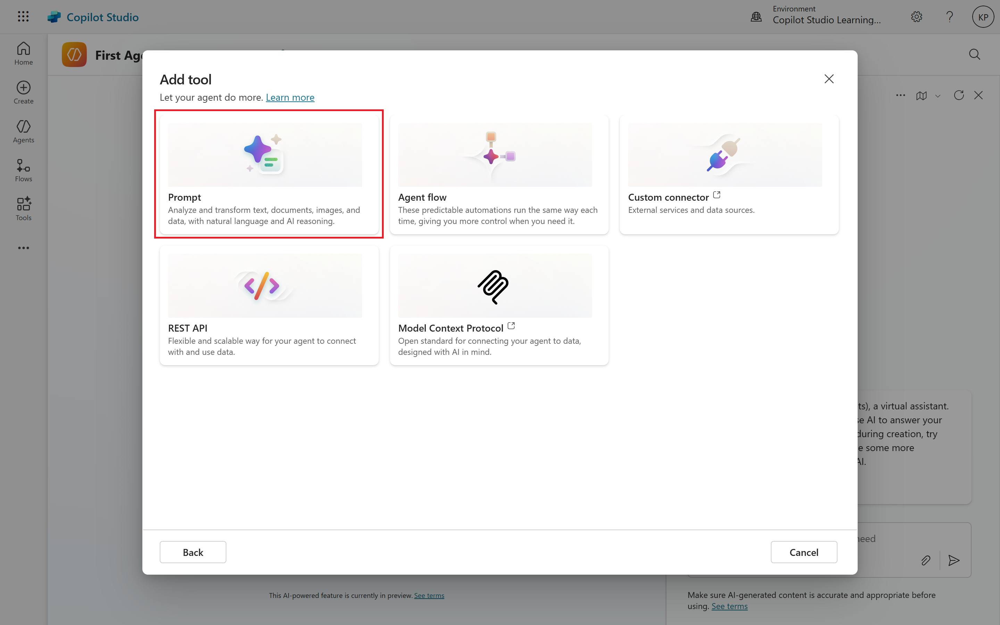
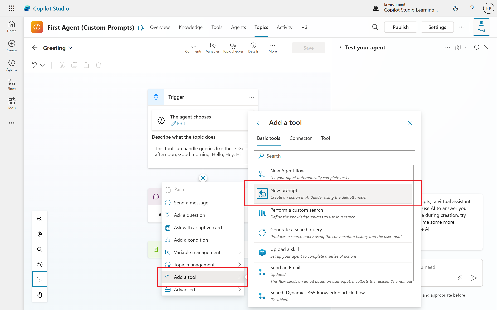
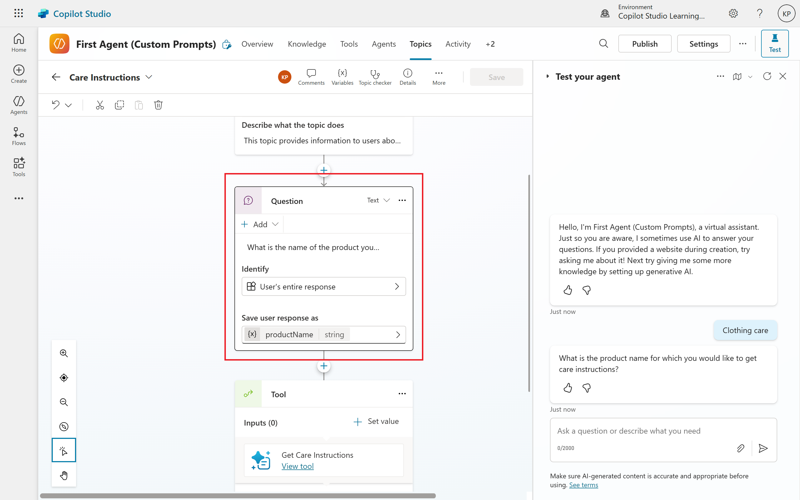
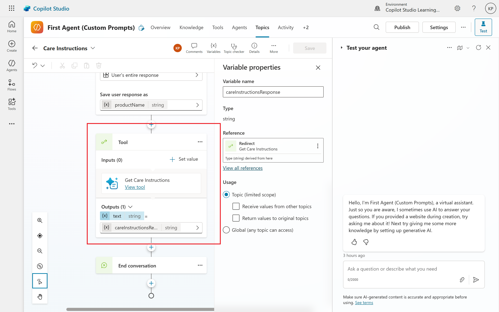
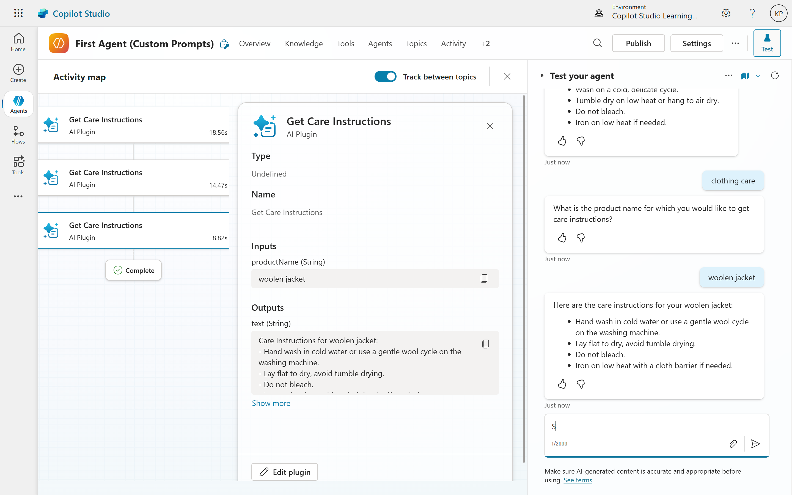

# 03. Building and Configuring a Custom Prompt in Copilot Studio

In the first article, we explored the "why" behind custom prompts in Copilot Studio. Now, we'll shift our focus to the "how." This article will provide a practical, step-by-step guide on building and configuring a custom prompt, from the initial setup in the prompt editor to the crucial steps of testing and integrating it into your copilot's conversation flow.

A custom prompt isn't just a static piece of text; it's a dynamic tool that adapts to user input, making your copilot smarter and more capable.

## Getting Started: The Prompt Editor
The prompt editor in Copilot Studio is your workspace for creating and refining prompts. You can access it in a couple of ways, depending on your workflow:

- **As a standalone tool:** You can create a prompt from the Tools section. This is great for building reusable prompts that can be called across multiple topics in your copilot.

- **Within a Topic:** You can also add a new prompt directly from a topic by selecting "Add a node" and then "Call an action."

Regardless of how you access it, the editor provides a canvas for you to write your instructions and define the variables that will make your prompt dynamic.

## Define Task, Variables and Instructions
The core of your custom prompt is the instruction that tells the AI what to do. This is where you bring the principles of prompt engineering to life.
1. **Write the Core Instruction:** Start by clearly stating the task. Be specific about the desired output, tone, and any constraints.
	- Example: "Summarize the key takeaways from the following text in a concise, friendly tone."
	- Example: "Act as a technical support agent and provide a step-by-step solution to the user's issue based on the provided troubleshooting guide."
2. **Add Input Variables:** To make your prompt dynamic, you need to add input variables. These are placeholders that will be replaced with real data at runtime, based on the user's conversation or data retrieved from an external source	.

	You can add variables directly into your prompt text by typing a slash (/) or by using the "Add content" button in the editor.

	- Example with a variable: "Summarize the key takeaways from the following text: `/{user_input}`"
	- Explanation: When a user asks a question, their message will be stored in the `user_input` variable, and this text will be passed to the prompt to be summarized.

3. **Use External Data Sources:** One of the most powerful features is the ability to ground your prompts with data from external sources, like Dataverse tables or other plugins. This ensures your copilot provides answers that are relevant to your specific business data	.

	For example, a prompt could pull information from a product catalog to answer a user's question about product specifications.

## Testing and Iteration
Once you've written your prompt, testing is a crucial step to ensure it works as intended. The prompt editor includes a built-in test panel for this purpose.
- **Provide Sample Data:** In the test panel, you can enter sample values for your input variables. This simulates how the prompt will behave with real user data.
- **Run and Analyze:** Select "Test" to run the prompt and see the generated response.
- **Refine the Prompt:** The response will appear in the output field. Analyze the result and make adjustments to your prompt as needed. This is an iterative process. You may need to refine the instructions, add more constraints, or adjust the variables until the output is consistently accurate and aligns with your expectations.

## Connecting Prompts to Topics
A custom prompt is an "action" that must be called from a topic to be used in a conversation.
1. **Create or Edit a Topic:** Navigate to the topic where you want to use the prompt.
1. **Add an Action Node:** Select "Add a node" at the desired point in the conversation flow.
1. **Call the Prompt:** Choose "Call an action" and then select the custom prompt you created.
1. **Map Variables:** In the prompt node, you will need to map your **input variables** to the variables from your topic. This ensures the correct data is passed to the prompt when the topic is triggered. For example, the `user_input`` prompt variable might be mapped to a topic variable that stores the user's last message.
1. **Handle the Output:** The prompt's generated response will be saved to an **output variable**. You can then use this variable in a "Send a message" node to display the AI's response to the user.

By following these steps, you can successfully build, test, and deploy custom prompts, transforming your Copilot Studio agent into a powerful, context-aware conversational tool.

## Example Walkthrough
Let's imagine a customer support copilot for a clothing store. A user wants to know the care instructions for a specific item they've purchased. Instead of having a long, complex topic with a separate node for every single product, we can create a single, dynamic custom prompt that provides the correct care instructions based on the product name.

### Step 1: Design the Custom Prompt
We will create a prompt that takes the product name as an input and provides the corresponding care instructions.

**Prompt Name:** `Get Care Instructions`

**Prompt Instruction:**
<pre>
Act as a helpful clothing expert. Based on the provided product name, find and provide the care instructions. Do not include any other information. If the product is not found, state that you do not have care instructions for that item.

Product Name: /{productName}

Care Instructions:
- Wash on a cold, delicate cycle.
- Tumble dry on low heat or hang to air dry.
- Do not bleach.
- Iron on low heat if needed.
</pre>

#### Breakdown of the Prompt Text:
- **Instruction:** "Act as a helpful clothing expert..." This gives the AI a persona. "Based on the provided product name, find and provide the care instructions." This is the core task.
- **Constraints:** "Do not include any other information." This keeps the response concise. "If the product is not found, state that you do not have care instructions for that item." This handles the "not found" scenario gracefully.
- **Variable:** `/{productName}`. This is the placeholder. When the prompt is called, this will be replaced by the actual product name the user asks about (e.g., "denim jacket").
- **Fictional Data:** In this simple example, the care instructions are directly within the prompt text. In a real-world scenario, you would have a more complex setup where the prompt would pull this information from a dynamic data source like a Dataverse table or a SharePoint list, but for this simple example, we'll keep it static for clarity.

### Step 2: Create the Topic and Call the Prompt
Now, let's create a topic in Copilot Studio that will call this custom prompt.

**Topic Name:** `Care Instructions`

**Conversational Flow:**
- **Trigger Phrases:** The topic is triggered when the user asks a question about care instructions.
	- `how do i wash my shirt`
	- `what are the care instructions for my jeans`
	- `tell me how to care for my jacket`

- **Get User Input:** After the topic is triggered, add a "Question" node to ask the user for the product name.
	- **Question:** "What is the name of the product you need care instructions for?"
	- **Identify:** "Entire response" (This will capture the user's full response, like "denim jacket" or "wool sweater").
	- **Save Response to Variable:** topic.productName (This variable will hold the user's input).

- **Call the Custom Prompt:** Add an "Action" node to call the custom prompt we just created.
	- **Action:** `Get Care Instructions`
	- **Set inputs:** Map the prompt's input variable to the topic's variable:
		- `productName` (from the prompt) = `topic.productName` (from the topic)
	- **Set outputs:** The prompt's output will be stored in a new variable.
		- `generated_text` (from the prompt) = `topic.careInstructionsResponse` (a new topic variable)

- **Display the Output:** Add a "Message" node to display the result to the user.
	- **Message:** `topic.careInstructionsResponse}`

### How it Works at Runtime?
- A user types: "How do I wash my wool sweater?"
- The `Care Instructions` topic is triggered.
- The copilot asks: "What is the name of the product you need care instructions for?"
- The user responds: "wool sweater"
- The `topic.productName` variable is set to "wool sweater."
- The `Get Care Instructions` prompt is called. The prompt's variable `/{productName}` is replaced with "wool sweater."
- The AI receives the following instruction: "Act as a helpful clothing expert... Product Name: wool sweater."
- The AI generates a response based on the provided instructions.
- The generated response (the care instructions) is saved in the `topic.careInstructionsResponse` variable.
- The copilot displays the content of that variable to the user.

## Conclusion
Building and configuring custom prompts in **Copilot Studio** is a transformative process that enhances your copilot's capabilities. By leveraging dynamic variables and grounding prompts with external data, you can create highly personalized and contextually relevant interactions. The iterative testing process ensures that your prompts deliver accurate and useful responses, ultimately leading to a more engaging user experience. In the next article, we'll explore best practices for prompt engineering to help you craft even more effective prompts.

