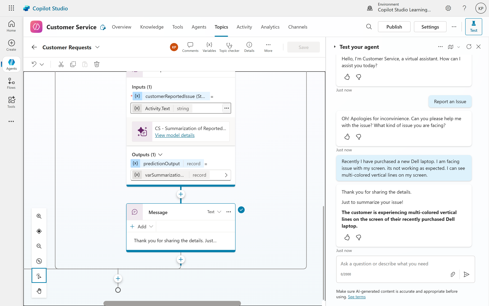
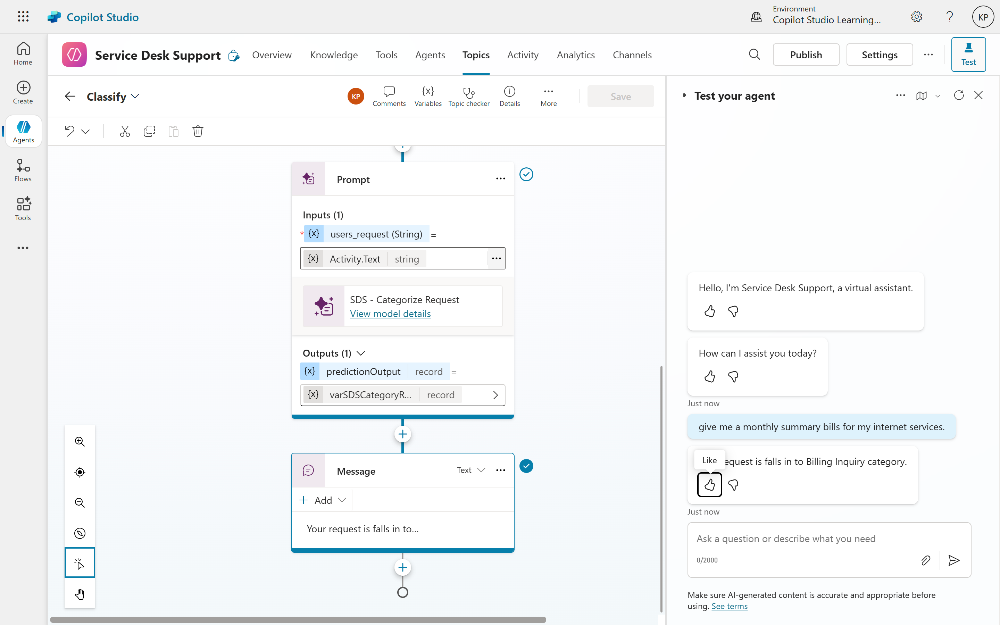

# 05. Practical Use Cases and Examples
In this section, we will explore practical use cases and examples of how custom prompts can be effectively utilized in agents. By tailoring prompts to specific tasks and domains, we can enhance the performance and relevance of AI-driven solutions.

## Use Case 1: Customer Service Automation
A common and impactful use of custom prompts is in customer service. A well-designed prompt can help a copilot handle common inquiries more intelligently, freeing up human agents for more complex issues.

### Scenario: Summarizing a Customer's Request
- **Problem:** A customer writes a long, rambling message detailing a problem. The agent needs to quickly understand the core issue.
- **Prompt:**
	<pre>Act as a customer service agent. Your goal is to summarize the following customer inquiry into a single, concise sentence. Focus on the core problem and the product or service mentioned. The summary should be neutral in tone.</pre>
- **Input Variable:** `/customer_enquiry` (This would be the full text of the customer's message.)
- **Example Output:**
	<pre>Customer is reporting an issue with a recent order of a Dell laptop, stating the screen is not working.</pre>

## Use Case 2: Data Extraction and Analysis
Custom prompts can also be used to extract specific information from unstructured data, making it easier to analyze and utilize.

### Scenario: Classifying Support Tickets
- **Problem:** A company receives numerous support tickets daily and needs to categorize them for efficient handling.
- **Prompt:**
	<pre>Act as a support ticket classifier. Your task is to categorize the following support ticket into one of the predefined categories: "Billing Issue", "Technical Support", "Account Management", or "General Inquiry". Provide only the category name in your response.</pre>
- **Input Variable:** `/support_ticket` (This would be the text of the support ticket.)
- **Example Output:**
	<pre>Technical Support</pre>

## Conclusion
These examples demonstrate how custom prompts can move a copilot from a simple, rule-based chatbot to an intelligent agent capable of understanding context and executing specific, valuable tasks. The key to success is to clearly define the problem and then design a prompt with precise instructions and the right data to solve it.

By leveraging custom prompts, agents can be tailored to meet specific needs across various domains. Whether it's summarizing customer inquiries or classifying support tickets, the ability to create and refine prompts allows for more effective and efficient AI-driven solutions. As you continue to explore and implement custom prompts, consider the unique requirements of your use case to maximize the benefits of this powerful tool.