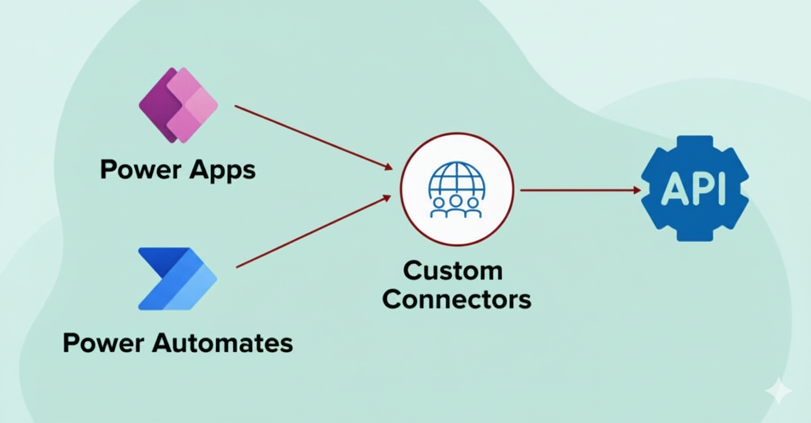

# 01. What are Custom Connectors and Why they matter
Custom Connectors are a powerful feature that allows you to extend the capabilities of your applications by integrating with external services and APIs. They act as a bridge between your application and third-party services, enabling seamless communication and data exchange.

## What are Custom Connectors?
Custom Connectors are essentially wrappers around RESTful APIs that define how to connect to a specific service. They provide a standardized way to interact with these services, making it easier to integrate them into your applications. Custom Connectors can be created for a wide range of services, including databases, cloud storage, social media platforms, and more.

#### Examples of What you can connect to:
- Weather APIs for real-time forecasts
- CRM systems like Salesforce or HubSpot
- Payment gateways like Stripe
- Internal databases or legacy systems
- AI services like OpenAI or Azure Cognitive Services

## Why Custom Connectors Matter in Agents
In the context of agents, Custom Connectors are particularly important because they enable agents to access and utilize external data and services to perform tasks more effectively. Here are some reasons why Custom Connectors matter in agents:
1. **Enhanced Functionality**: By integrating with external services, agents can perform a wider range of tasks, such as fetching real-time data, processing payments, or sending notifications. This means your Agent isn't just conversational - it's also action-oriented and operational.
1. **Enable Real-Time, Contextual Responses**: Custom Connectors allow agents to access up-to-date information from external sources, enabling them to provide more accurate and relevant responses based on the latest data. For example, an agent integrated with a travel service API can check flight status or hotel availability instantly.
1. **Integrate with Enterprise Systems**: Many organizations rely on various enterprise systems for their operations. Custom Connectors enable agents to interact with these systems, allowing them to perform tasks such as retrieving customer information, updating records, or processing orders directly from the agent interface.
1. **Modular and Reusable**: Custom Connectors can be designed to be modular and reusable across different agents and applications. This means that once a connector is created for a specific service, it can be easily reused in multiple agents, saving development time and effort.

## How Custom Connectors Work?
Custom Connectors work by defining a set of actions that can be performed on an external service. Each action corresponds to a specific API endpoint and includes details such as the HTTP method (GET, POST, etc.), request parameters, and response handling. When an agent needs to perform an action, it invokes the corresponding Custom Connector, which sends a request to the external service and processes the response.

## How Custom Connectors fits into the Agent Ecosystem
In Copilot Studio, Custom Connectors play a crucial role in enhancing the capabilities of agents. They allow agents to interact with a wide range of external services, making them more versatile and powerful. Here's how Custom Connectors fit into the agent ecosystem:
1. **User Input** -> The user interacts with the agent, providing input or asking questions.
1. **Agent Action** -> The agent processes the input and determines if it needs to access external data or services to fulfill the request.
1. **Custom Connector Invocation** -> If external data is needed, the agent invokes the appropriate Custom Connector to communicate with the external service.
1. **Data Retrieval/Action** -> The Custom Connector sends a request to the external service, retrieves the necessary data, or performs the required action (e.g., updating a record, processing a payment).
1. **Response Handling** -> The Custom Connector receives the response from the external service and passes it back to the agent.
1. **User Response** -> The agent processes the response and provides the user with the requested information or confirmation of the action taken.

This flows allows you to build agents that are not only conversational but also capable of performing complex tasks by leveraging the power of external services through Custom Connectors.

## Real-World Use Case
Imagine you are building Forex Assistant, with custom connector. Your Agent can:
- Fetch real-time currency exchange rates from a financial API.
- Provide users with up-to-date information on currency conversions.
- Assist users in making informed decisions based on the latest market data.
- Convert amounts between different currencies using real-time rates.

All of these happens seamlessly within the agent interface, thanks to the integration with a Custom Connector that connects to a financial API.

## Security and Compliance
When using Custom Connectors, it's essential to consider security and compliance aspects. Ensure that sensitive data is handled securely, and that you comply with any relevant regulations or standards when integrating with external services. This may include using secure authentication methods, encrypting data in transit, and adhering to data privacy laws.

## What's Next?
Now that you understand what Custom Connectors are and why they matter, the next step is to learn how to create and configure them in Copilot Studio. In the following sections, we will guide you through the process of building your own Custom Connectors, integrating them with agents, and exploring best practices for their use.