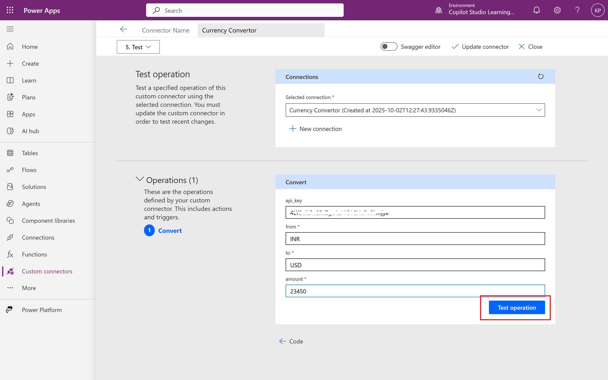
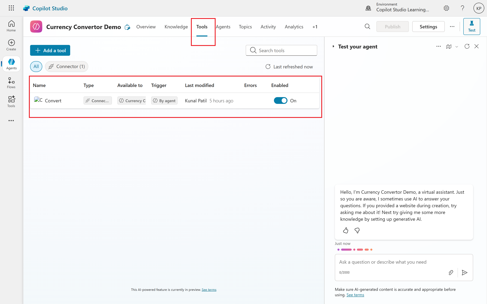

# 02. Design Your First Custom Connector
In the previous article, we explored what Custom Connectors are and why they’re essential for building powerful, integrated agents in Copilot Studio. Now it’s time to roll up our sleeves and build one. Whether you're connecting to a public API or an internal enterprise service, this guide will walk you through the process step-by-step.

We’ll use CurrencyBeacon, a reliable and developer-friendly API that provides exchange rates and conversion services. By the end of this tutorial, you’ll have a working Custom Connector that your agent can use to answer queries like:

## How to get API Key for CurrencyBeacon
CurrencyBeacon is an independent service outside of the Power Platform. It provides an API with foreign exchange rates and other financial information.

To use the CurrencyBeacon API obtain an API key by creating a free account. API keys have a dual purpose: they act as both a unique identifier to track your usage of an API and as password to prevent unauthorized users from consuming an API.

Go to [CurrencyBeacon](https://currencybeacon.com/) and sign up for a free account. After signing up, navigate to the API section in your account dashboard to find your API key.

## Step 1: Understand the API
CurrencyBeccon's **Convert Endpoint** is:

<pre>https://api.currencybeacon.com/v1/convert</pre>

#### Required Parameters:
- `amount`: the amount to convert
- `from`: Base currency code (e.g. INR)
- `to`: target currency code (e.g. USD)
- `api_key`: Your API Key (used for authentication)

#### Sample Request
<pre>https://api.currencybeacon.com/v1/convert?amount=1000&from=INR&to=USD&api_key=YOUR_API_KEY</pre>

## Step 2: Create Custom Connector
- Go to **Power Platform ➡️ Custom Connectors**

- Click **New Custom Connector ➡️ Create from blank**

- Name your connector (e.g., `Currency Converter`) and click **Continue**.

- In the **General** tab, provide a description and an icon for your connector.

#### General Settings:
- **Name**: Currency Converter
- **Description**: A connector to convert currency using CurrencyBeacon API.
- **Icon**: (Upload a relevant icon)
- **Scheme**: HTTPS
- **Host**: `api.currencybeacon.com`
- **Base URL**: `/`

## Step 3: Define Security
- Navigate to the **Security** tab.
- Select **API Key** as the authentication type.
- Set the parameter label to `api_key` and the parameter name to `api_key`.
- Set the location to `Query`.
- Click **Update Connector**.

## Step 4: Define the API Operation
- Go to the **Definition** tab.
- Click **New Action** to create a new operation.
- Name the action `Convert`.
- Provide a summary and description.
- Set the operation ID to `Convert`.

### Request
- Click **Import from sample**.
- Select **GET** as the verb.
- Enter the sample URL:
  <pre>https://api.currencybeacon.com/v1/convert?amount=1000&from=INR&to=USD&api</pre>

#### Request
- **HTTP Method**: Get
- **Endpoint**: `/convert`
- **Query Parameters**:
	- `amount` (Number)
	- `from` (String)
	- `to` (String)
	- `api_key` (String)

### Response
Use Sample response from CurrencyBeacon to deifne the schema:
<pre>{
  "meta": {
    "code": 200,
    "disclaimer": "Usage subject to terms: https://currencybeacon.com/terms"
  },
  "response": {
    "timestamp": 1759405300,
    "date": "2025-10-02",
    "from": "USD",
    "to": "INR",
    "amount": 100,
    "value": 8872.071092999999
  },
  "timestamp": 1759405300,
  "date": "2025-10-02",
  "from": "USD",
  "to": "INR",
  "amount": 100,
  "value": 8872.071092999999
}</pre>

## Step 5: Test the Connector
- Go to the **Test** tab.
- Click **New Connection** and enter your API key.
- Once connected, test the `Convert` action by providing sample values for `amount`, `from`, and `to`.
- Click **Test Operation** to see if it returns the expected results.
- If successful, you should see a response with the converted amount.
- If there are errors, double-check your parameters and API key.
- Once everything is working, click **Update Connector** to save your changes.
- Your Custom Connector is now ready to use!
- You can now integrate this connector into your agents to handle currency conversion queries.
- For example, you can create an agent that uses this connector to answer questions like "What is 1000 INR in USD?"

## Step 6: Use the Connector in an Agent
- Go to **Copilot Studio ➡️ Tools**.
- Add new **tool**.
- Select **Custom Connector** and choose your `Currency Converter` connector.
- Define the prompts and parameters for your agent to use this connector effectively.
- Test your agent to ensure it can successfully call the Custom Connector and return accurate currency conversion results.
- Deploy your agent and start using it to handle real-world currency conversion queries!

## Step 7: Real-World Testing
- Interact with your agent and ask it to convert currencies, such as "Convert 500 EUR to GBP."

## Conclusion
We’ve successfully designed and implemented our first Custom Connector in Copilot Studio using the CurrencyBeacon API. This connector can now be integrated into your agents to provide real-time currency conversion capabilities.
By following these steps, you can create Custom Connectors for various APIs, enhancing the functionality and intelligence of your agents. Happy building!