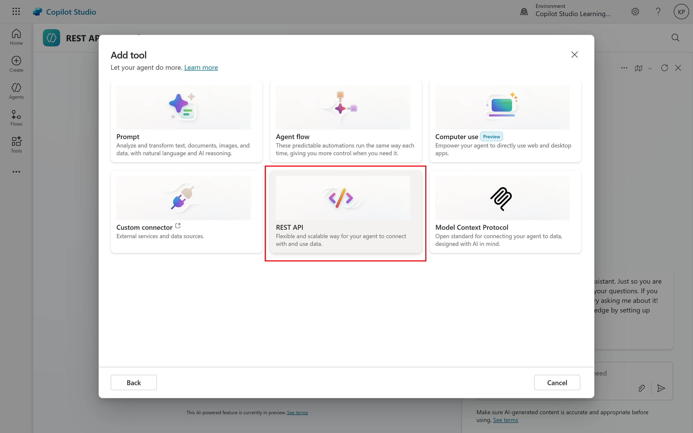
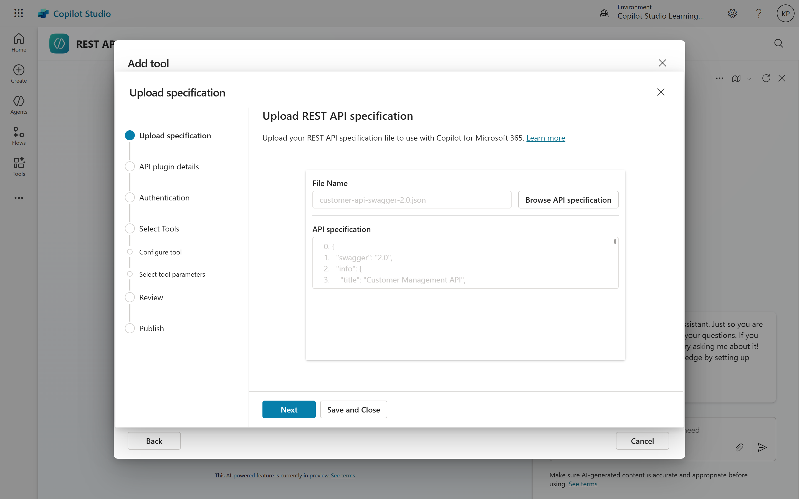
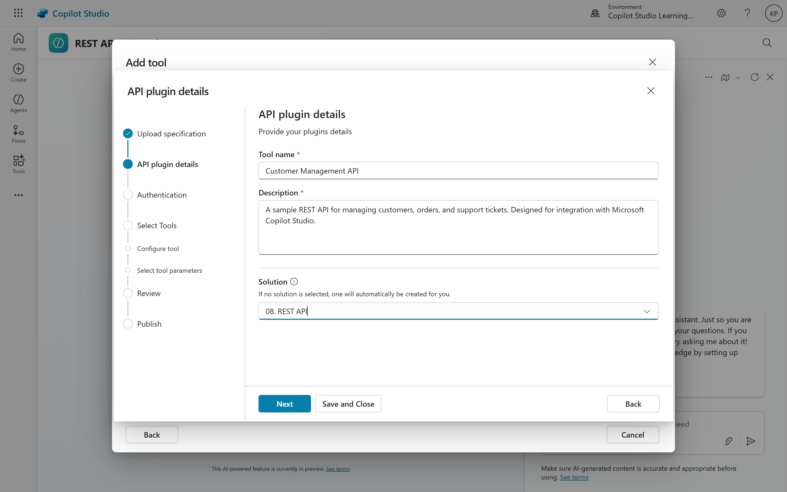
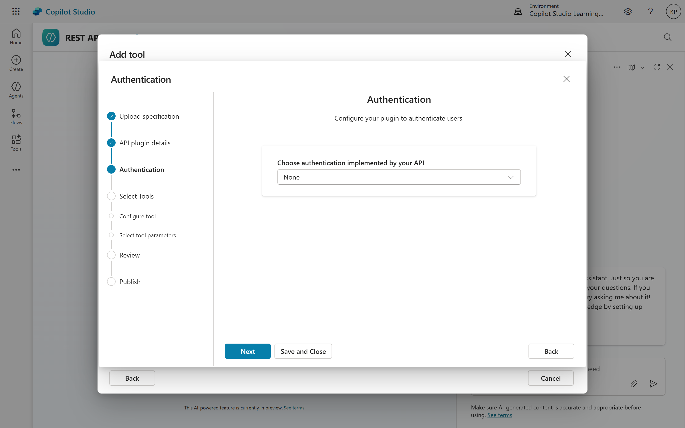
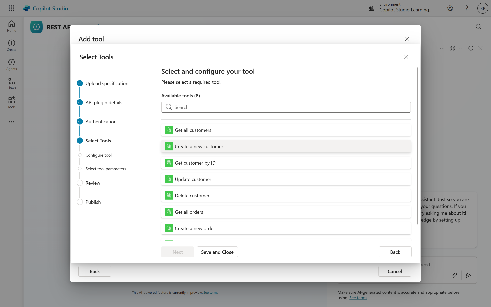
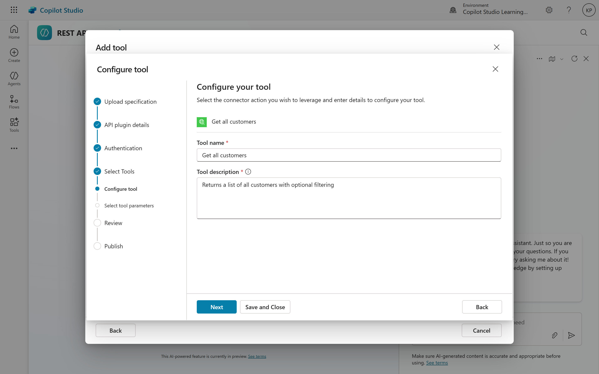
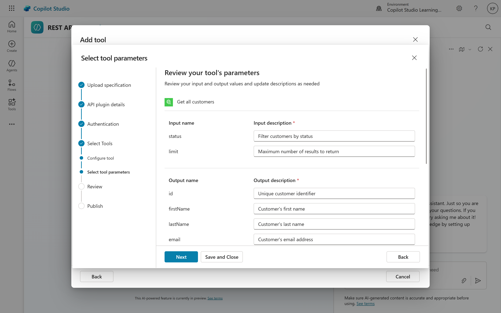
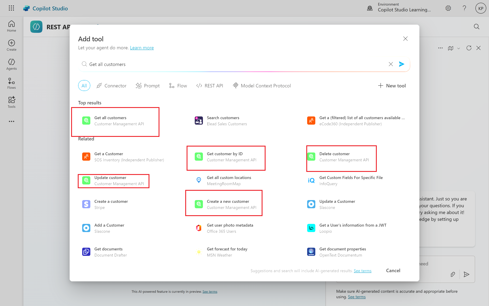

# 02. Creating REST API in Copilot Studio

Microsoft Copilot Studio made a major leap, making it much easier for creators to link their agents with outside data and services. With REST API Actions, you can now connect directly to external systems through a simple, no-code process - removing the need for complicated custom connectors in many cases. This advancement lets citizen developers enrich their agents using REST APIs right inside Copilot Studio’s editor, so building powerful, data-driven conversations is faster and more convenient than ever.

## No-Code API Integration Approach
Making API Integration Easy for Everyone
Over the last few years, no-code tools have completely changed how we connect different services and data sources. I’ve loved seeing how REST API Actions, part of Microsoft’s Power Platform, are making things even simpler—not just for developers, but for anyone who wants to automate tasks or improve business workflows.

Here’s what I find especially exciting: you don’t need coding experience to get started. With Copilot Studio, the journey starts by uploading an API specification file (think Swagger 2.0 or OpenAPI 3.0). The platform takes that file, reads what the API can do, and automatically sets up actions for you—so you can pick and choose which ones to use, set up authentication, and begin testing almost instantly.

If you’re a business analyst or just curious about building integrations without code, these new capabilities lower the barriers and let you focus on solving real problems, rather than wrestling with syntax or technical hurdles.

This streamlined process eliminates several traditional integration barriers:
- No need to understand custom connector creation workflows
- No requirement to write code or scripts
- No manual mapping of request/response schemas
- Automatic generation of action metadata from API documentation

## Getting Started with REST API Actions

If you’re ready to start exploring **REST API** Actions, the first step is to get familiar with a few key concepts in Copilot Studio. This section will walk you through how to find your way around and start connecting external APIs to your Copilot agents.

#### Accessing the Add Tool Interface
Everything begins in your agent’s Tools section. From your agent’s Overview page, look for the Tools panel - there you’ll see an Add tool button that’s hard to miss. You can also reach the same spot by heading to the Tools tab in the left-hand navigation menu, then clicking Add a tool.

Once you do that, Copilot Studio will show a few different tool options. Select New tool, and from the list that appears, choose REST API. This starts the setup flow for creating REST API Actions.

Through this interface, you can create brand-new API actions, manage any you’ve already added, and handle authentication settings - all from one central place. It’s the main hub for everything related to connecting APIs inside Copilot Studio.

#### Creating a New REST API Action
Getting started with a new REST API tool is a breeze, thanks to a handy step-by-step wizard that guides you through all the essential setup choices. Once you select REST API as your tool type, Copilot Studio will prompt you to either upload a new API specification file or choose an existing one. Think of this file as your blueprint; it helps the platform grasp what your API is capable of, allowing it to create the right actions tailored just for you.

## Tools Vs Actions Terminology
**Tools** represent the container or package that holds one or more related capabilities. When you create a REST API tool, you're establishing a logical grouping of operations from a single API. The tool serves as the organizational unit that includes configuration settings like authentication, API base URL, and metadata.

**Actions** are the individual executable operations within a tool. Each action corresponds to a specific API endpoint and HTTP method combination (such as GET /users or POST /orders). When your agent invokes functionality, it's technically calling an action that belongs to a tool.

This distinction becomes particularly relevant when:
- **Managing permissions**: You grant access to tools, which implicitly provides access to all actions within that tool
- **Configuring orchestration**: The agent's planner evaluates available actions when determining how to respond to user requests
- **Monitoring usage**: Analytics and logging typically track action invocations rather than tool-level metrics
- **Version management**: Tools are versioned as complete units, ensuring all actions within a tool remain synchronized

## API Specification File Formats
To create REST API Actions in Copilot Studio, you need to provide an API specification file that describes the endpoints, methods, parameters, and data structures of the API you want to connect to. Copilot Studio supports two widely used formats for these specification files:
- **Swagger 2.0**: An older but still popular format for defining RESTful APIs. Swagger files are typically written in JSON or YAML and provide a comprehensive description of the API's capabilities.
- **OpenAPI 3.0**: The successor to Swagger, OpenAPI 3.0 offers enhanced features and flexibility for defining APIs. Like Swagger, OpenAPI files can be in JSON or YAML format and include detailed information about endpoints, request/response schemas, authentication methods, and more.
When preparing your API specification file, ensure it adheres to the correct syntax and structure for the chosen format. You can use various tools and libraries to generate or validate these files, such as Swagger Editor or OpenAPI Generator.

## Step-by-Step Guide to Creating REST API Actions
The upload workflow in Copilot Studio follows a structured progression designed to guide you through configuration decisions while automating technical complexity wherever possible.

### Step 1: Initiate Tool Creation
Navigate to your agent's Tools section and select "**Add a tool**". Choose "**New tool**" and then "**REST API**" from the available options. This launches the REST API tool creation wizard.

### Step 2: Select and Upload Specification File
The wizard prompts you to upload your API specification file. Copilot Studio accepts Swagger 2.0 (JSON or YAML), OpenAPI 3.0 (which will be auto-downgraded), and API manifest formats. You can upload from your local file system or provide a URL to a hosted specification.

### Step 3: Initial Validation
Upon upload, Copilot Studio immediately validates your specification file, checking for:

- Format correctness and schema compliance
- Required fields and metadata completeness
- Compatible authentication schemes
- Valid endpoint definitions and parameter schemas

If validation issues are detected, the system provides feedback to help you address problems before proceeding.

### Step 4: Basic Information
The wizard displays core API information extracted from your specification, including the API name, description, base URL, and version. This metadata helps you confirm you're working with the correct specification and provides context for future reference.

### Step 5: Solution Assignment
You'll be prompted to select a Power Platform solution to contain your REST API tool. Solutions provide organizational structure and enable lifecycle management, including deployment across environments. You can select an existing solution or allow Copilot Studio to create a new one automatically.

### Step 6: Authentication Configuration
Next, you'll configure authentication settings for your API. Copilot Studio supports several common authentication methods, including:
- **No Authentication**: For public APIs that don't require credentials.
- **API Key**: Simple key-based authentication, where you provide a static key to include in requests.
- **Basic Authentication**: Username and password-based authentication, typically encoded in the request header.
- **OAuth 2.0**: A more secure and flexible authentication method that involves obtaining access tokens through an authorization flow.

Based on the authentication method you choose, Copilot Studio will prompt you for the necessary details, such as token URLs, client IDs, and scopes for OAuth 2.0.

### Step 7: Proceed to Operation Selection
After configuring authentication, click "**Next**" to move to the operation selection step. Here,
Copilot Studio will present a list of all available API operations extracted from your specification file. You can review each operation's details, including the HTTP method, endpoint URL, parameters, and request/response schemas.

<pre><b>Note: </b>Throughout this process, Copilot Studio maintains a draft state, allowing you to save progress and return later if needed. Changes aren't finalized until you complete the entire configuration workflow and explicitly publish the tool.</pre>

### Step 8: Select Operations to Include
From the list of available operations, select the ones you want to include as actions in your REST API tool. You can choose multiple operations based on your agent's requirements. Copilot Studio will automatically generate action metadata for each selected operation, including input/output schemas and parameter definitions.

### Step 9: Automation Action Generation from Specs
One of the most powerful features of REST API Actions is the automatic generation of executable actions from your API specification. This automation eliminates manual configuration work and ensures consistency between your API documentation and agent capabilities.

#### Metadata Extraction
When you upload your API specification file, Copilot Studio parses the document to extract essential metadata for each operation. This includes:

- **Operation ID**: Unique identifier used internally by the orchestration layer
- **Summary and Description**: Human-readable explanations that help the AI understand operation purpose
- **Parameter Definitions**: Complete schemas for all required and optional parameters
- **Request Body Schemas**: Structure definitions for POST/PUT/PATCH operations
- **Response Schemas**: Expected response structures for success and error cases
- **Example Values**: Sample data that illustrates expected inputs and outputs

### Step 10: Final Review and Creation
After configuring your REST API tool and its associated actions, rigorous testing ensures reliable operation before making the tool available to end users. Copilot Studio provides integrated testing capabilities and publishing workflows designed to support quality assurance and controlled deployment.

## Action Creation
Using the extracted metadata, Copilot Studio automatically creates executable actions for each selected operation. These actions are fully integrated into the agent's orchestration layer, making them available for planning and execution during conversations.

# Conclusion
Creating REST API Actions in Microsoft Copilot Studio is a straightforward process that empowers creators to connect their agents with external services quickly and easily. By leveraging no-code tools and automated action generation, Copilot Studio lowers the barriers to API integration, enabling a wider range of users to build powerful, data-driven conversational experiences. Whether you're a developer or a citizen creator, REST API Actions open up new possibilities for enhancing your agents with real-time data and functionality from the broader web.