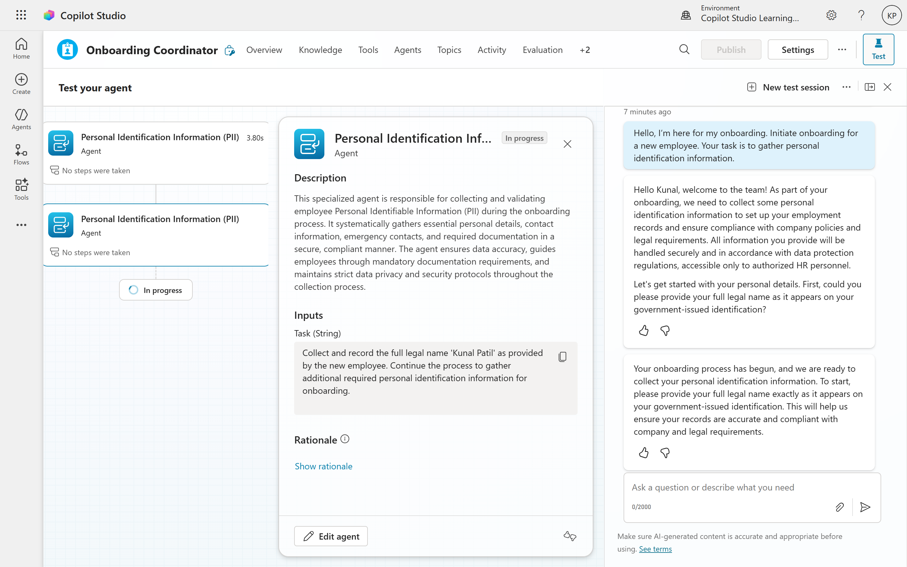
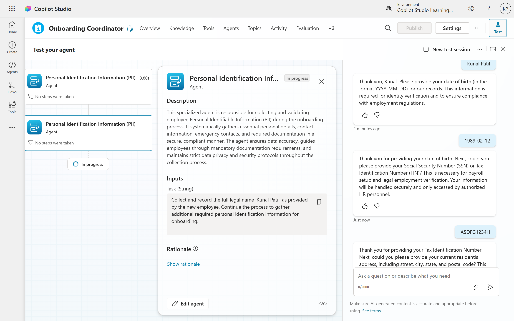
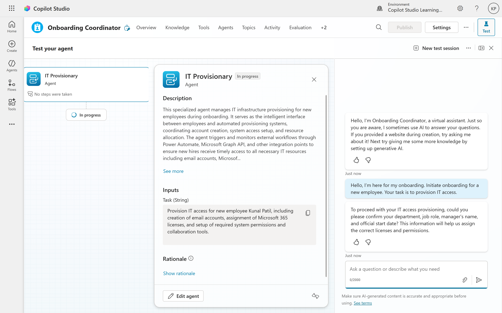

# 03. Parent-Child Agent Architecture

## Overview
In this section, we will explore the Parent-Child Agent Architecture in Copilot Studio. This architecture allows for a hierarchical organization of agents, where a parent agent can delegate tasks to multiple child agents. This structure is particularly useful for complex workflows that require specialized agents to handle different aspects of a task.

## What is Parent–Child Agent Architecture?
- The **Parent Agent (Orchestrator)** acts as the main conversational entry point and decision-maker. It engages the user, interprets intent, maintains context, and delegates tasks.
- **Child Agents** are modular agents specializing in specific domains. They are invoked only when relevant within the parent’s context—handling tasks autonomously but reporting outcomes back to the parent.

#### Key Features:
- Centralized control through the parent agent.
- Specialized task handling by child agents.
- Dynamic invocation of child agents based on context.
- Seamless integration and communication between parent and child agents.

## Real-World Use Case: HR Onboarding
In this example, we’ll design an HR onboarding solution for a mid-sized enterprise. The onboarding process requires handling sensitive personal information and provisioning IT access for new employees. We implement this through one parent agent—Onboarding Coordinator—and two specialized child agents:
- Personal Identification Information (PII) Agent
- IT Provisionary Agent

### Parent Agent: Onboarding Coordinator
#### Roles & Responsibilities
- Greet new employees and explain the onboarding process.
- Routes the conversation to the appropriate child agent based on user responses and workflow state.
- Maintains overall status, tracks progress, and ensures information is passed between steps.

#### Example Conversation Flow
- Onboarding initiation
- The coordinator explains the two main phases: PII data collection and IT provisioning.
- Begins with PII agent, then moves sequentially to IT provisioning.
- Tracks employee progress, schedules reminders, and triggers completion events.

#### Sample Prompt
```
User:
Hello, I’m here for my onboarding. Initiate onboarding for a new employee. Your task is to gather personal identification information.
```



### Child Agent 1: PII Agent
#### Roles & Responsibilities
- Collects sensitive personal information such as full name, address, social security number, and emergency contacts.
- Validates the information for completeness and accuracy.
- Reports back to the Onboarding Coordinator with the collected data.
- Ensures compliance with data privacy regulations.
- Handles errors or missing information by prompting the user for corrections.
- Transitions control back to the Onboarding Coordinator upon completion.
- Logs all interactions securely for auditing purposes.
- Triggers the next phase of onboarding upon successful data collection.

#### Process Breakdown:
1. User initiates onboarding process.
2. PII Agent collects and validates the data.
3. Upon successful validation, the PII Agent reports the data to the Onboarding Coordinator.
4. The Onboarding Coordinator then triggers the IT Provisioning Agent for the next phase.

#### Sample Prompt
```
User:
Hello, I’m here for my onboarding. Initiate onboarding for a new employee. Your task is to gather personal identification information.
PII Agent:
Hello Kunal, welcome to the team! As part of your onboarding, we need to collect some personal identification information to set up your employment records and ensure compliance with company policies and legal requirements. All information you provide will be handled securely and in accordance with data protection regulations, accessible only to authorized HR personnel.
Let's get started with your personal details. First, could you please provide your full legal name as it appears on your government-issued identification?
Your onboarding process has begun, and we are ready to collect your personal identification information. To start, please provide your full legal name exactly as it appears on your government-issued identification. This will help us ensure your records are accurate and compliant with company and legal requirements.
```




### Child Agent 2: IT Provisionary Agent
#### Roles & Responsibilities
- Manages IT access provisioning for new employees.
- Collects necessary information such as department, role, and required systems access.
- Coordinates with IT systems to set up accounts and permissions.
- Notifies the Onboarding Coordinator upon successful provisioning.
- Handles any errors in the provisioning process and communicates them back to the parent agent.
- Ensures compliance with IT security policies.
- Logs all provisioning activities for auditing purposes.
- Triggers completion events upon successful provisioning.

#### Process Breakdown:
1. The Onboarding Coordinator triggers the IT Provisionary Agent after PII data collection.
1. The IT Provisionary Agent collects necessary information for IT access.
1. The agent coordinates with IT systems to set up accounts.
1. Upon successful provisioning, the agent notifies the Onboarding Coordinator.
1. The Onboarding Coordinator finalizes the onboarding process.
1. The agent logs all activities for auditing purposes.
1. The agent triggers completion events upon successful provisioning.

#### Automation and Integration
- Power Automate Workflows: Orchestrates requests and approvals with predefined cloud flows.
- Microsoft Graph API: Connects directly to Microsoft systems for real-time account provisioning.
- Notifications: Sends status updates (success, pending, failed) to both the employee and parent agent.

### Sample Prompt
```
User:
Hello, I’m here for my onboarding. Initiate onboarding for a new employee. Your task is to provision IT access.
```



#### Example Conversation Flow
- After PII data collection, the Onboarding Coordinator triggers the IT Provisionary Agent.
- The IT Provisionary Agent collects necessary information for IT access.
- Coordinates with IT systems to set up accounts.
- Notifies the Onboarding Coordinator upon successful provisioning.
- Finalizes the onboarding process.
- Logs all activities for auditing purposes.

### Sample Prompt
```
User:
Hello, I’m here for my onboarding. Initiate onboarding for a new employee. Your task is to provision IT access.
IT Provisionary Agent:
To proceed with your IT access provisioning, could you please confirm your department, job role, manager's name, and official start date? This information will help us assign the correct licenses and permissions.
```


## Technical flow: How it Works?
1. **Orchestrator Initiates the Flow**
	- Starts in the "Welcome" topic, then calls the PII agent using a secure context-passing contract.
2. **PII Agent Collects Data**
	- Maintains its own topics for flexible, stepwise data collection.
	- Gathers personal identification information, validates it, and returns the data to the Onboarding Coordinator.
3. **Transition to IT Provisionary Agent**
	- On success, signals the parent agent and passes verified data variables.
	- Parent agent triggers the IT Provisionary agent, providing necessary context (e.g., validated name, staff ID).
4. **IT Provisionary Agent Provisions Access**
	- Collects required IT access information.
	- Coordinates with IT systems to set up accounts.
	- Notifies the Onboarding Coordinator upon successful provisioning.
	- Finalizes the onboarding process.
	- Logs all activities for auditing purposes.

### Advantages of this design
- **Privacy & Security:** Sensitive data is only exposed to relevant agents, with centralized auditing and encrypted variable passing.
- **Auditability:** Parent agent maintains a log of all steps and transactions, simplifying compliance.
- **Extensibility:** Easily add new child agents (e.g., Benefits Enrollment, Facility Management) without rewriting workflows.
- **User Experience:** Employees experience a seamless, guided process—each step explained by the relevant specialist agent.

### Extending This Agent
Future child agents can include:
- Benefits Enrollment Agent: Manages health insurance and retirement plans.
- Facilities Setup Agent: Assigns desk, access badges, and parking.
- Training Assignment Agent: Schedules orientation, safety, and compliance courses.

Each new agent plugs into the parent, scaling the onboarding solution modularly.

## Conclusion
The Parent-Child Agent Architecture in Copilot Studio provides a robust framework for managing complex workflows through hierarchical agent organization. By leveraging specialized child agents under a central parent agent, organizations can streamline processes, enhance task management, and ensure compliance with various regulations. This architecture is particularly effective in scenarios like HR onboarding, where multiple specialized tasks need to be coordinated seamlessly.