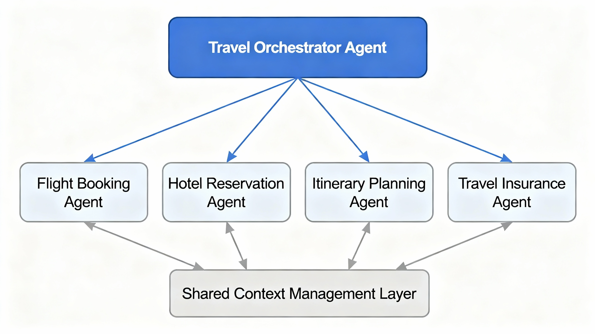

# 04. Connected Agents Architecture

## Overview
The Connected Agents Architecture in Copilot Studio, a design pattern that enables peer-to-peer collaboration between specialized agents. Unlike the hierarchical Parent-Child Agent Architecture, Connected Agents operate as equals within an orchestrated network where agents can communicate, delegate tasks, and share data bidirectionally to achieve complex business goals collaboratively.

Connected Agents Architecture is particularly powerful for scenarios requiring cross-functional expertise, where multiple specialized agents work together to provide comprehensive solutions without a single decision-making entity acting as an intermediary.

## What is Connected Agents Architecture?
**Connected Agents** are a collection of specialized, autonomous agents that operate at the same hierarchical level and communicate directly with each other based on contextual requirements. Unlike parent-child relationships, connected agents maintain peer-to-peer connections enabled by generative AI orchestration.

**Orchestration Layer** acts as an intelligent routing mechanism that determines which agent should participate in a conversation based on user intent and current context. This layer leverages generative AI to make dynamic decisions about agent engagement without requiring explicit hierarchical control.

## Real-World Use Case: Travel Agency Multi-Agent System
To illustrate the power of Connected Agents Architecture, let's design a comprehensive travel booking solution for a travel agency. This system requires coordinating expertise across multiple specialized domains: destination planning, accommodation selection, and flight booking. Instead of routing everything through a single parent agent, we'll implement three connected agents that collaborate as peers.

**Connected Agents in the System**:
- Destination Planning Agent
- Accommodation Selection Agent
- Flight Booking Agent

### Connected Agent 1: Destination Planning Agent
#### Roles & Responsibilities
- Engages with users to understand their travel preferences, budget, and interests.
- Provides personalized destination recommendations based on user input.
- Shares selected destination details with Accommodation and Flight Booking Agents for further processing.
- Maintains context about user preferences to inform subsequent agents.
- Handles user queries related to travel destinations, including local attractions, weather, and cultural insights.
- Triggers the Accommodation Selection Agent once a destination is chosen.

**Knowledge Base & Tools**
- Destination database with climate, attractions, and seasonal data.
- Preference assessment tools to evaluate customer travel styles.
- Integration with travel trend APIs for real-time popularity and pricing data.

#### Sample Prompt
```
User:
Hi, I'm looking to plan a vacation. Can you suggest some destinations based on my interests in beaches and historical sites?
```
### Connected Agent 2: Accommodation Selection Agent
#### Roles & Responsibilities
- Receives destination details from the Destination Planning Agent.
- Presents accommodation options based on user preferences, budget, and destination specifics.
- Coordinates with the Flight Booking Agent to ensure accommodation availability aligns with flight schedules.
- Maintains context about accommodation preferences to inform flight booking.
- Handles user queries related to lodging options, amenities, and reviews.
- Triggers the Flight Booking Agent once accommodation is selected.
- Manages booking confirmations and communicates details back to the user.

**Knowledge Base & Tools**
- Accommodation databases with filters for price, location, and amenities.
- User review aggregation tools for quality assessment.
- Integration with booking platforms for real-time availability.

#### Sample Prompt
```
User:
I love the destination you suggested! Can you help me find a hotel that fits my budget of $150 per night and is close to the beach?
```
### Connected Agent 3: Flight Booking Agent
#### Roles & Responsibilities
- Receives accommodation details from the Accommodation Selection Agent.
- Searches for flight options that align with the user's travel dates and accommodation location.
- Coordinates with both the Destination Planning and Accommodation Selection Agents to ensure seamless travel arrangements.
- Maintains context about flight preferences to provide tailored options.
- Handles user queries related to flight schedules, airlines, and baggage policies.
- Finalizes bookings and provides comprehensive travel itineraries to the user.
- Manages payment processing and booking confirmations.
- Ensures all travel components are synchronized and communicates final details back to the user.

**Knowledge Base & Tools**
- Flight database with schedules, prices, and availability.
- Integration with airline APIs for real-time booking.
- Payment processing tools for secure transactions.
- Travel itinerary generation tools.

#### Sample Prompt
```
User:
Can you help me find a flight from New York to Los Angeles for next month?
```
### Orchestration Layer
#### Roles & Responsibilities
- Monitors user interactions and determines which connected agents to engage based on context.
- Facilitates communication between connected agents, ensuring data flows seamlessly.
- Maintains overall conversation context to provide a cohesive user experience.
- Handles error management and fallback scenarios by redirecting to appropriate agents.
- Ensures that user preferences and selections are consistently shared across all connected agents.
- Generates a unified response to the user, summarizing the actions taken by each connected agent.

#### Sample Prompt
```
User:
I want to plan a trip to Italy with a budget of $2000. Can you help me with that?
```
### Example Conversation Flow
1. User initiates travel planning.
1. Destination Planning Agent suggests destinations based on user interests.
1. User selects a destination, triggering the Accommodation Selection Agent.
1. Accommodation Selection Agent presents lodging options.
1. User selects accommodation, triggering the Flight Booking Agent.
1. Flight Booking Agent finds suitable flights.
1. Orchestration Layer ensures all agents communicate effectively and provides a unified response to the user.
1. User receives a comprehensive travel itinerary including destination, accommodation, and flight details.
1. User confirms bookings and receives confirmation details.
1. The system logs all interactions for future reference and auditing purposes.
1. User completes the travel planning process with a seamless experience across all connected agents.
1. User receives a final summary of their travel plans, including destination, accommodation, and flight details.
1. The system ensures all bookings are confirmed and provides customer support contact information for any further assistance.
1. User expresses satisfaction with the service and provides feedback for future improvements.

>

## Conclusion
The Connected Agents Architecture in Copilot Studio offers a robust framework for building collaborative multi-agent systems that operate as peers. By enabling direct communication and task delegation among specialized agents, this architecture facilitates complex workflows that require cross-functional expertise. The travel agency use case demonstrates how connected agents can work together seamlessly to deliver a comprehensive and personalized user experience, highlighting the potential of this architecture for various business applications.