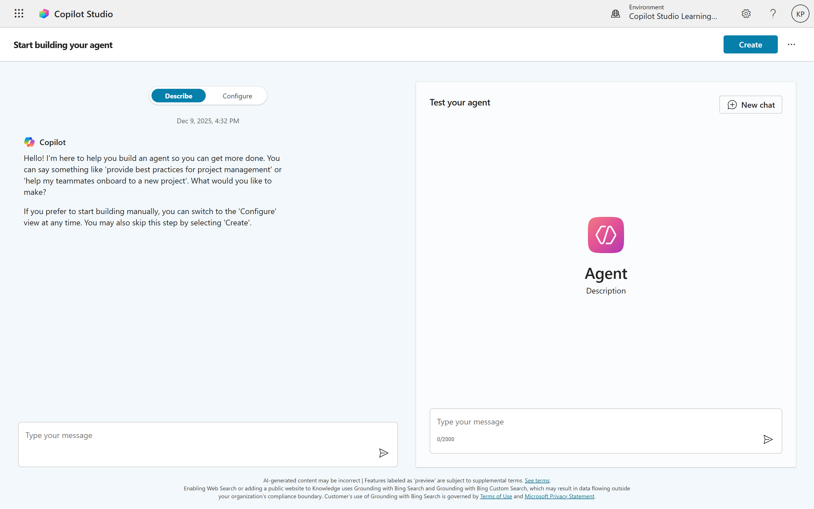
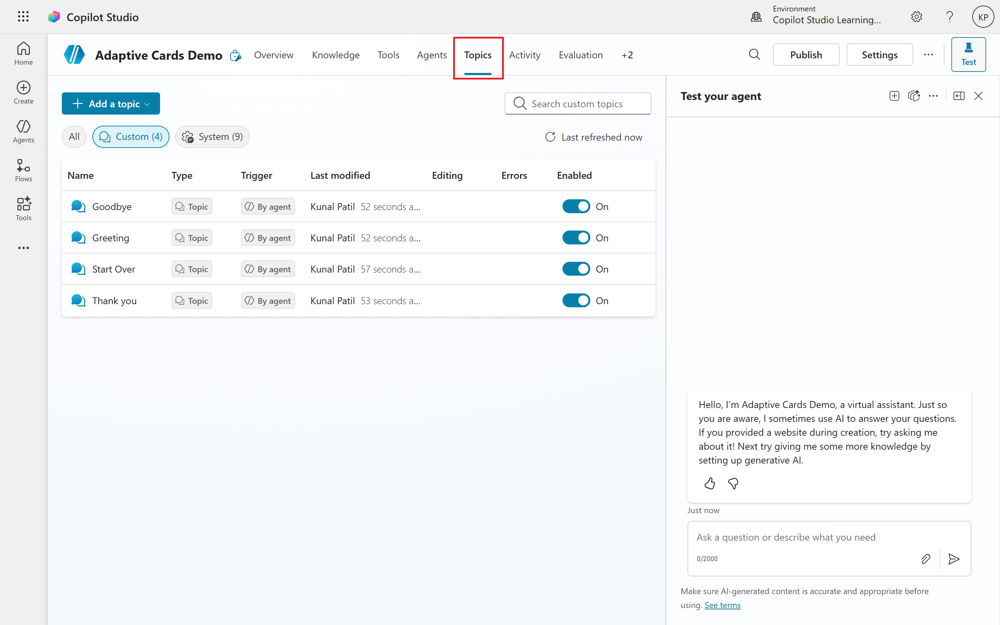
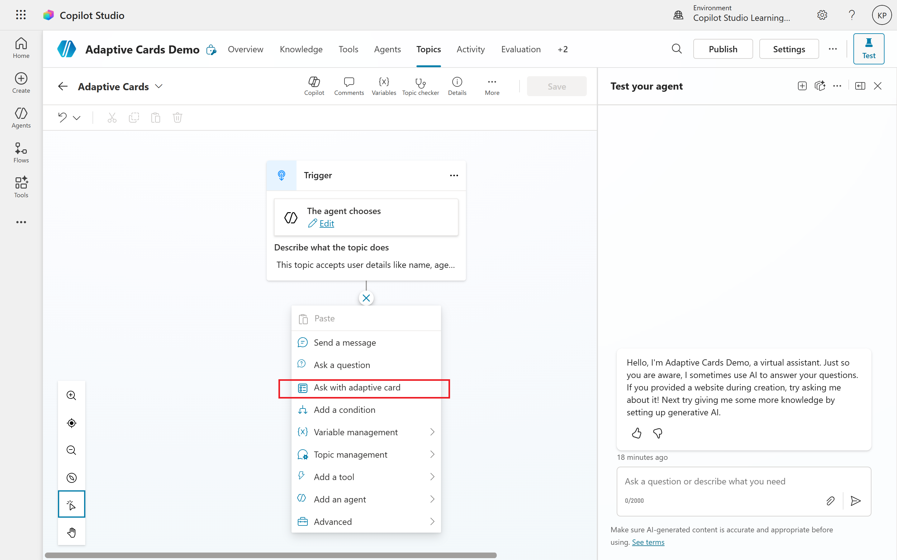
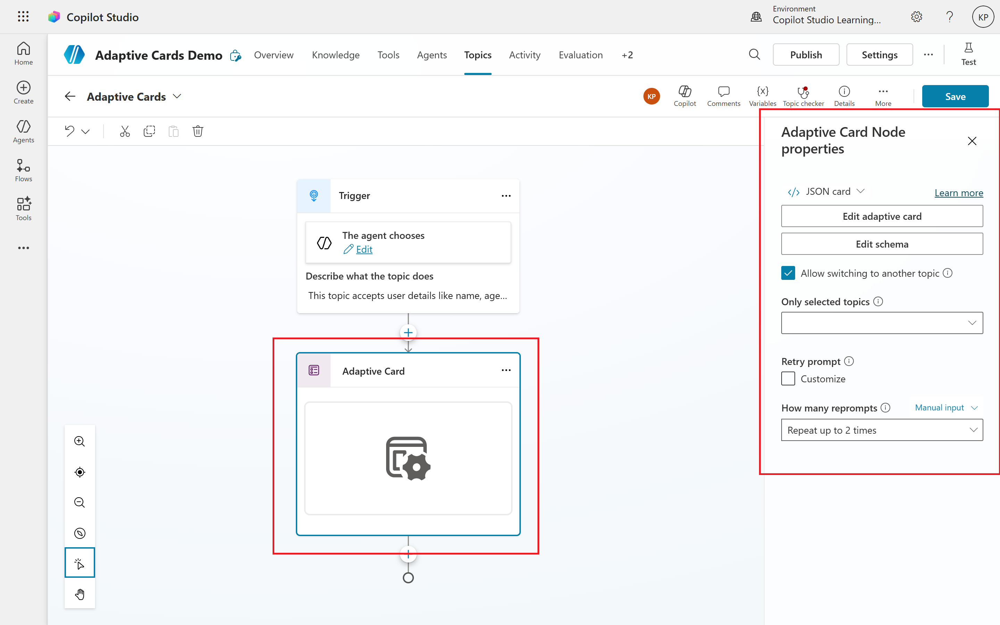
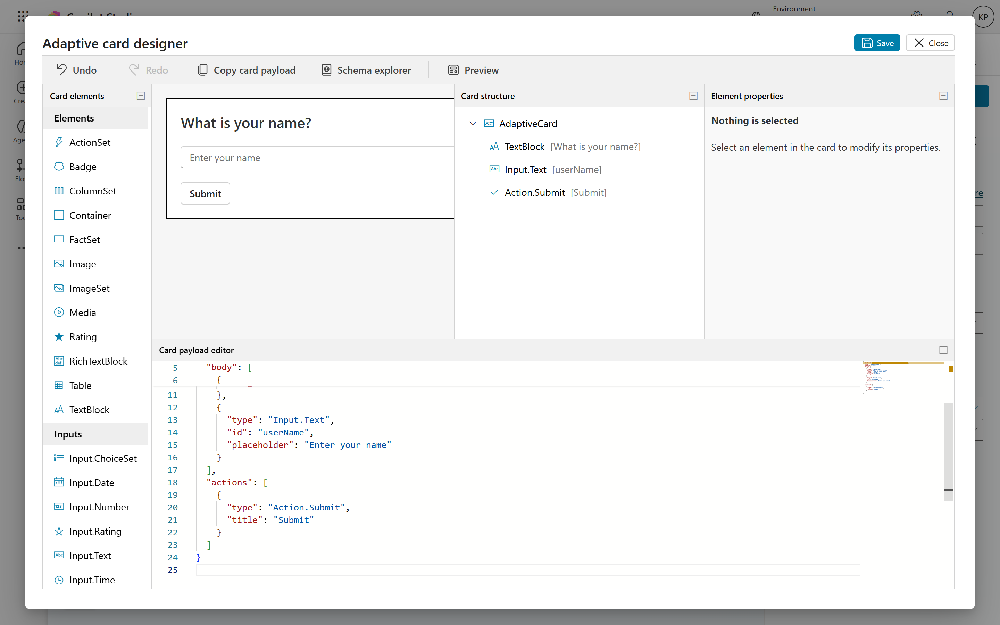
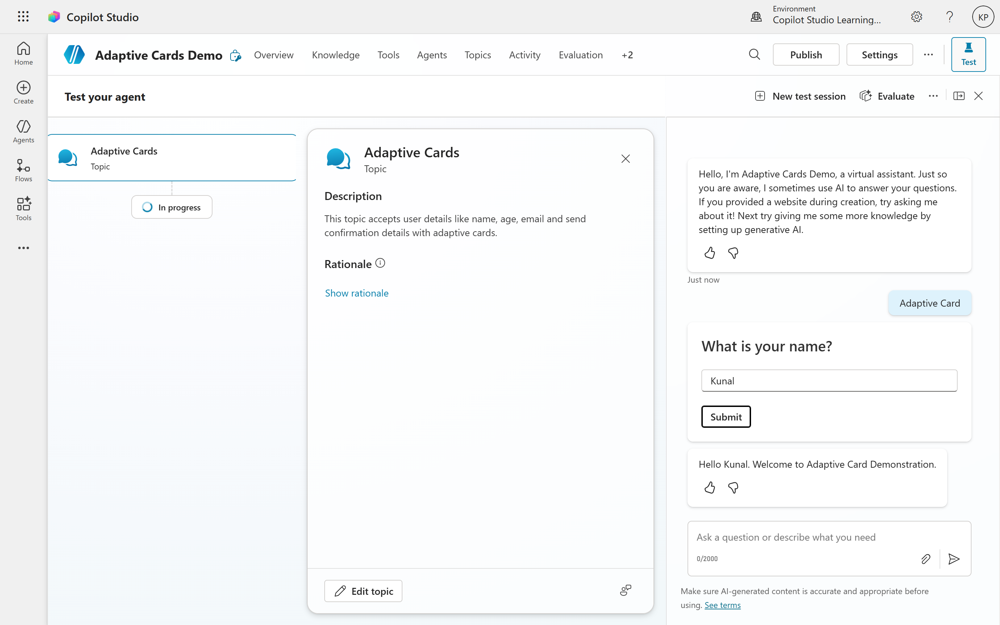

# 03. Getting Started - Enabling and Using Adaptive Cards in Copilot Studio

## Prerequisites and Environment Setup
Before beginning to work with Adaptive Cards in Copilot Studio, it is essential to ensure that all necessary prerequisites are in place. This section outlines the technical, organizational, and access requirements.

### Microsoft 365 Account and Tenant Requirements
The foundational requirement is a Microsoft 365 work or school account (not a personal Microsoft account such as Outlook.com or Gmail). This account provides access to the Microsoft 365 ecosystem and Copilot Studio.

**Microsoft 365 Tenant**: Your organization must have an active Microsoft 365 tenant. Copilot Studio is a cloud-based service that operates within your tenant's environment, ensuring data residency and governance compliance.

**Generative AI Features Enabled**: The Power Platform admin or Dynamics 365 admin in your organization must enable Generative AI features in the Power Platform admin center. This is a prerequisite for Copilot Studio functionality, as the service relies on AI capabilities to power the conversational agents and orchestration features.

**Copilot Studio App Deployment**: Your Microsoft 365 tenant admin must deploy the **Copilot Studio app** in the Microsoft 365 admin center, making the service available to authorized users within the organization.

## Licensing Requirements
Copilot Studio operates on a licensing model that distinguishes between tenant licenses and per-user licenses:

**Tenant License**: The organization (tenant) must acquire a Copilot Studio tenant license from the Microsoft 365 admin center. This license covers the infrastructure and service availability for the organization. It is purchased once and is not assigned to individual users.

**Per-User License**: Individual users who need to create and manage agents must be assigned a Copilot Studio User License (also called a "per-user license"). This is assigned through the Microsoft 365 admin center to specific users.

To purchase both licenses:
- Go to the **Microsoft 365 admin center** and sign in with an administrator account
- Expand the **Billing** menu and select **Purchase services**
- Search for **Copilot Studio** and complete the checkout for the tenant license
- Then search for **Copilot Studio User License** in the Add-ons section and purchase the required number of user licenses

<pre><b>Important Note</b>: Users who only consume (interact with) published agents do not require a Copilot Studio license. Only those creating, editing, and managing agents need the per-user license.</pre>

## Access to Copilot Studio
Once licensing is in place, users can access Copilot Studio through multiple paths:
1. **Web-based Interface**: Navigate to `https://copilotstudio.microsoft.com/` in your browser. This is the primary, full-featured authoring environment.
2. **Microsoft Teams Integration**: Copilot Studio is available as an app within Microsoft Teams, accessible via the app launcher. This provides a native Teams experience for those who prefer to build agents directly within Teams. 
3. **Power Apps Portal**: Copilot Studio can also be accessed from within the Power Apps portal at `https://make.powerapps.com/`, where it integrates with other Power Platform components.

## Optional: Adaptive Card Designer and External Tools
While not strictly required, the following tools enhance the card development experience:

**Adaptive Card Designer**: Available at https://adaptivecards.io/designer/, this web-based visual tool allows designers to create Adaptive Cards without writing JSON. The designer is optional because Copilot Studio includes a built-in card editor, but many makers find the external designer faster for iterating on complex designs.

## Navigating the Copilot Studio Interface
Understanding the Copilot Studio user interface is essential for efficiently authoring agents and incorporating Adaptive Cards.

### Main Dashboard and Navigation
Upon logging into Copilot Studio, users are presented with a main dashboard that provides an overview of existing agents and quick-start options.
1. **Home Page**: The landing page displays:
	a. **Create section**: Quick links to create a new agent using AI-assisted creation or manual configuration.
	b. **Recent Agents**: A list of agents recently worked on
	c. **Templates**: Pre-built agent templates for common scenarios (FAQ bot, customer service, HR assistant, etc.)
	d. **Help and Learning Resources**: Links to documentation and tutorials
2. **Left Navigation Pane** (visible after creating or opening an agent):
	a. **Overview**: Displays general agent information, description, and status
	b. **Topics**: Lists all conversation topics within the agent
	c. **Tools**: Manages integrations with external systems (Power Automate flows, connectors, etc.)
	d. **Knowledge**: Manages knowledge sources (documents, websites, Dataverse data)
	e. **Analytics**: Provides insights into agent performance, usage metrics, and user satisfaction
	f. **Settings**: Allows configuration of agent behavior, authentication, escalation rules, etc.
	g. **Channels**: Manages publication channels (web, Teams, Facebook, etc.)

### Topic Authoring Canvas
When viewing or editing a topic, makers are presented with a visual canvas showing the conversation flow as a series of connected nodes:
1. **Nodes**: Each node represents a step in the conversation:
	A. **Message nodes**: Display information to the user
	B. **Question nodes**: Ask a question and capture a choice response
	C. **Adaptive Card nodes**: Display an Adaptive Card and capture structured input
	D. **Condition nodes**: Branch the conversation based on variable values
	E. **Action nodes**: Call external flows, connectors, or APIs
	F. **Handoff/Escalation nodes**: Transfer to a human agent or external service
2. **Canvas Controls**: The canvas provides several controls for managing the conversation flow:
	A. **Add Node (+) button**: Appears between nodes and after the end node, allowing insertion of new nodes
	B. **Node Properties**: Clicking the three-dot menu on any node opens a properties panel where the node can be configured
	C. **Connection lines**: Show the flow of conversation between nodes
	D. **Variable previews**: Hover over node connections to see what variables are being passed

### Test Pane and Live Preview
On the right side of the authoring canvas, a **test pane** (also called the "chat pane") enables real-time testing of the agent's responses and behaviors:
Features of the Test Pane:
A. **Interactive chat**: Type messages as a user would, triggering the agent's conversational logic
B. **Suggested prompts**: Display example user queries based on the agent's current configuration
C. **Card preview**: Adaptive Cards render in the test pane, showing exactly how they will appear to users
D. **Variable inspection**: In debug mode, makers can see current variable values
E. **Conversation history**: The pane maintains a history of the conversation, allowing makers to scroll back and review interactions
F. **Clear/Reset**: Buttons to clear the chat history and start a fresh test session

## Creating Your First Adaptive Card in Copilot Studio
Before adding Adaptive Cards, a Copilot agent must first be created. This section walks through the agent creation process.

### Two Paths to Agent Creation
Copilot Studio offers two primary creation experiences:
1. **AI-Assisted Creation (Recommended for First-Time Users)**: This guided, conversational experience uses Copilot itself to help configure your agent. The AI asks questions and automatically populates agent configuration based on answers.
2. **Manual Configuration**: A form-based approach where users directly enter all configuration details without AI guidance.

### AI-Assisted Creation Flow
To create an agent using the AI-assisted approach:

#### Step 1: Start the Creation Process
- Navigate to Copilot Studio home page
- In the **Describe your agent** section, enter a brief description of what you want the agent to be (up to 1,000 characters)
- Example: "Help customers troubleshoot common technical issues and provide product recommendations"

#### Step 2: Agent Configuration Dialog
A page appears with two panes:
- **Left pane**: Configuration tabs (Describe and Configure)
- **Right pane**: Live test chat where you can immediately test agent responses

#### Step 3: Conversational Agent Setup
While in the Describe tab, chat with Copilot to define your agent:

Copilot will ask about:
- **Agent Name**: What should the agent be called? (maximum 30 characters)
- **Agent Purpose**: What will the agent primarily help users with?
- **Target Audience**: Who are the users? (customers, employees, etc.)
- **Tone and Personality**: Should responses be formal, casual, technical, etc.?
- **Knowledge Sources**: Will the agent have access to documents, websites, or structured data?
- **Prohibited Topics**: What subjects should the agent avoid or decline to discuss?
- **Suggested Prompts**: What example questions should users see to get started?

#### Step 4: Refinement and Testing
As you provide information, Copilot automatically updates:
- **Agent configuration**: Name, description, system instructions
- **Test pane suggestions**: Suggested prompts change to reflect the agent's new purpose
- Go back and forth between configuration and testing to refine the agent until satisfied

#### Step 5: Create the Agent
Once satisfied with the configuration:
- Review the agent name, description, and instructions
- (Optional) Optionally, select a solution and set the schema name if integrating with Power Platform solutions
- Click **Create** in the top-right corner

The agent is now created and appears in your agents list. You can now begin editing topics and adding Adaptive Cards.

### Manual Configuration Approach
If preferring direct configuration over conversational guidance:
- Go to Create page and select New agent or go to Agents tab and select New agent
- In the form, fill in:
	- **Agent name**
	- **Description**
	- **Instructions** (can be detailed; up to 8,000 characters)
	- **Language** preference
	- **Knowledge sources** (optional at this stage)
	- Click **Create**

Both paths result in a functional agent ready for topic and Adaptive Card authoring.

## Navigating to Topics
After an agent is created, the next step is to work with topics, which are where Adaptive Cards will be added.

### Accessing the Topics Section
From the agent's overview page:
A. Click the Topics tab in the left navigation pane
B. The Topics page displays all existing topics for the agent:
	- **System topics**: Built-in topics for greeting, escalation, and other system behaviors (greyed out or marked distinctly).
	- **Custom topics**: Topics you've created specifically for your agent's conversations.

### Creating a New Topic
To create a new topic that will contain an Adaptive Card:
A. From the **Topics** page, click **+ Add a topic**, select **Add from description with Copilot**
B. A dialog appears asking for:
	- **Name your Topic**: What do you want to call this topic?
	- **Create a topic to** (Descritpion): Briefly describe the purpose of this topic.
C. Click **Create** to generate the topic. Copilot will create an initial conversation flow based on the description provided.

## Adding an Adaptive Card to a Topic
With the topic created, you can now add an Adaptive Card to the conversation flow.

### Adding the Adaptive Card Node
To add an Adaptive Card node to a topic:
1. On the topic's authoring canvas, locate the position where you want to insert the Adaptive Card node
2. Click the **Add node (+)** button at the desired location
3. A menu appears with options:
	A. **Ask with Adaptive Card**: Creates an interactive Adaptive Card node
	B. **Message**: Adds a text message
	C. **Question**: Adds a multiple-choice question
	D. **Action**: Calls an external system (Power Automate flow, connector)
	E. **Condition**: Branches based on variable values
	F. Adn others...
4. Select **Ask with Adaptive Card**

An Adaptive Card node is now inserted into the topic. It appears as a card-shaped element on the canvas.

### Opening the Adaptive Card Node Properties
To configure the Adaptive Card, access its properties:
1. Click on the **Adaptive Card node** itself or the three-dot menu (…) on the node
2. Sele	ct **Properties** from the menu (or double-click the node)
3. The **Adaptive Card node properties panel** opens on the right side. This Panel contains:
	A. **Node name**: The internal name for this node
	B. **Edit adaptive card button**: Opens the card designer
	C. **Edit Schema button**: Manually configure which variables are output from the card
	D. Preview of the current card (if already configured)

## Designing the Card: Two Approaches
Copilot Studio supports two methods for designing the card JSON:

### Approach 1: Using the Adaptive Card Designer (Visual)
This is the recommended approach for first-time users as it requires no JSON knowledge:
1. In the **Adaptive Card node properties** panel, click **Edit adaptive card**
2. The Adaptive Card Designer panel opens, showing:
	A. **Canvas**: Visual representation of the card as you design
	B. **Elements palette** (left sidebar): Drag-and-drop components (TextBlock, Image, Container, Input.Text, Input.ChoiceSet, buttons, etc.)
	C. **Properties panel** (right): Configure properties of the selected element
	D. **Live preview**: Shows how the card will render in real-time
3. Design the card by dragging elements from the palette onto the canvas
4. Click on each element to configure its properties (text, sizing, styling, input type, etc.)
5. When satisfied, click Save to close the designer.

Copilot Studio automatically creates output variables based on all input elements you add to the card.

### Approach 2: Direct JSON Editing
For users comfortable with JSON or those who want to paste pre-written card definitions:
1. In the Adaptive Card node properties panel, click Edit adaptive card
2. Look for an Edit JSON or JSON tab (depending on your Copilot Studio version)
3. The panel switches to a text editor showing the raw JSON
4. Either:
	A. Paste existing JSON (copied from the Adaptive Card Designer or another source)
	B. Manually write JSON, referencing the Adaptive Card schema
5. To exit and view the visual designer, look for a toggle or link to return to visual mode.

## A Simple "Hello World" Adaptive Card
For your first Adaptive Card, here is a minimal example to get started. This card displays a greeting and captures the user's name:
Visual Design Steps (using the Designer approach):
1. Drag a **TextBlock** onto the canvas
2. Set its **text** property to "What is your name?"
3. Set **size** to "large" and **weight** to "bolder"
4. Drag an **Input.Text** element below the TextBlock
5. Set its **id** to "userName" (this becomes the variable name)
6. Set **placeholder** to "Enter your name"
7. Drag a **Submit Button** from the Actions palette
8. Set the button **title** to "Submit"
0. Click **Save**.

### Equivalent JSON (if doing it manually):
<pre>
{
  "$schema": "http://adaptivecards.io/schemas/adaptive-card.json",
  "type": "AdaptiveCard",
  "version": "1.3",
  "body": [
    {
      "type": "TextBlock",
      "text": "What is your name?",
      "size": "large",
      "weight": "bolder"
    },
    {
      "type": "Input.Text",
      "id": "userName",
      "placeholder": "Enter your name"
    }
  ],
  "actions": [
    {
      "type": "Action.Submit",
      "title": "Submit"
    }
  ]
}
</pre>

### Testing the Adaptive Card
After designing the Adaptive Card, it's crucial to test it within the topic to ensure it behaves as expected.

## Publishing Your Agent
Publishing makes the agent available to users on designated channels:
### Steps to Publish:
1. From the agent's overview page, locate the **Publish** button (usually in the top-right corner)
2. Click **Publish**
3. A publication panel appears showing:
	A. **Publication status**: Whether the agent has been published before
	B. **Channels**: Available channels where the agent can be deployed (Web, Teams, Facebook, etc.)
	C. **Last published**: Timestamp of the most recent publication
7. Choose the target **channel(s)** for this publication
8. Click **Publish** to confirm

## Troubleshooting Common Issues
When getting started with Adaptive Cards, common issues may arise. This section addresses them.
### Issue 1: Adaptive Card Not Rendering in Test Pane
**Problem**: The Adaptive Card node appears in the authoring canvas, but the card doesn't display in the test pane.

**Solutions**:
A. Verify node is reachable: Ensure the topic's trigger phrases are correctly configured and are being matched
B. Check topic flow: Confirm that the conversation flow actually reaches the Adaptive Card node (not stopping at a condition or earlier node)
C. Review JSON syntax: If using JSON mode, ensure the JSON is valid (balanced braces, quoted strings, proper commas). Use a JSON validator if unsure
D. Check version compatibility: Ensure the card's version property is supported by your test environment
E. Wait for processing: Sometimes Copilot Studio needs a moment to process changes; wait a few seconds and try again in the test pane

### Issue 2: Input Variables Not Captured
**Problem**: After submitting the Adaptive Card, expected input variables are not available in subsequent nodes.

**Solutions**:
A. Verify input element IDs: Ensure each input element in the card has a unique and valid `id` property
B. Check node configuration: In the Adaptive Card node properties, ensure that output variables are correctly mapped (if manually editing schema)
C. Test submission: Use the test pane to submit the card and inspect variable values in debug mode
D. Review conversation flow: Ensure subsequent nodes are correctly referencing the variable names as defined in the card

### Issue 3: Card Layout Issues
**Problem**: The Adaptive Card appears but text is cut off, colors look wrong, or layout is misaligned.

**Solutions**:
A. Review design in Adaptive Card Designer: Use the designer to visually inspect and adjust layout properties
B. Check element properties: Ensure text blocks have appropriate wrapping, sizing, and alignment settings
C. Test in target channel: Some channels may render cards differently; test in the actual deployment channel to see how it appears
D. Simplify design: If issues persist, simplify the card design to isolate problematic elements

## Conclusion
This guide has provided a comprehensive overview of enabling and using Adaptive Cards in Copilot Studio. By following the steps outlined, you can create engaging, interactive conversational agents that leverage the power of Adaptive Cards to enhance user experiences. As you gain familiarity with the tools and processes, you can explore more advanced features and designs to further enrich your agents. Happy building!