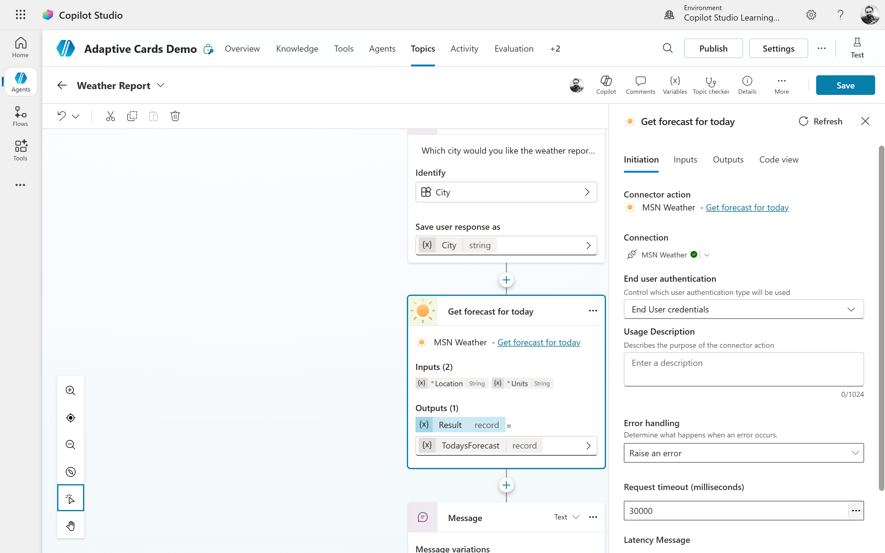
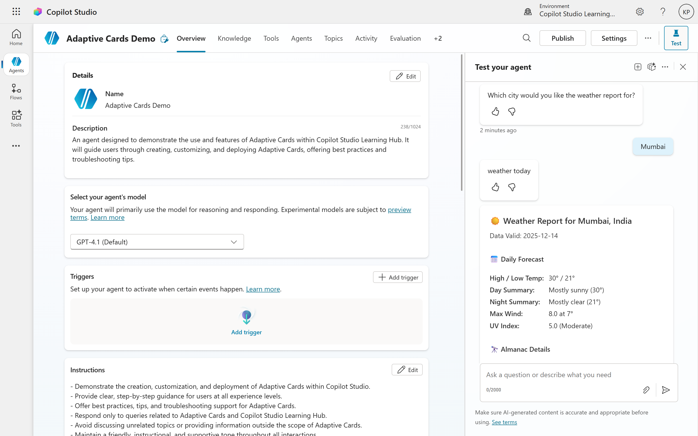

# Chapter 5: Real-World Example – Weather Report Copilot

## 5.1 Scenario Overview

A weather report is a simple but powerful use case for demonstrating how Adaptive Cards and Copilot Studio work together. The goal is to deliver a daily or on-demand forecast into channels like Microsoft Teams or a web chat using a visually rich card instead of plain text.

In this scenario, a Copilot Studio agent retrieves weather data from an external API (or from a Power Automate flow that calls such an API) and presents it using an Adaptive Card styled similarly to established weather templates. Users can ask for the current weather, see key conditions at a glance, and optionally navigate to a full forecast site.

## 5.2 Business Context and Objectives

Weather conditions influence many business activities: field service operations, logistics, outdoor events, construction, and travel planning. While users can always check a dedicated weather app, embedding weather into a Copilot experience offers specific advantages:

- **Contextual awareness**: The same agent that manages shifts, tasks, or site updates can surface weather relevant to a user’s location or job.
- **Channel convenience**: Forecasts appear where people already work and collaborate, such as Teams channels, reducing context switching.
- **Automation potential**: Weather data can drive workflows, such as alerting field teams about storms or adjusting delivery schedules.

Objectives for this example:

- Provide a compact, visually clear daily forecast Adaptive Card.
- Support both scheduled and on-demand requests.
- Use patterns that are easy to reuse for other data-driven scenarios.

## 5.3 High-Level Architecture

A typical weather-report Copilot uses this flow:

1. **User interaction in Copilot Studio**  
   A user asks “What’s the weather today in Mumbai?” or a scheduled process runs without user input.

2. **Data retrieval**  
   A Power Automate flow or Copilot Studio plugin action calls a weather service (for example, MSN Weather or another API) with a city or postal code.

3. **Data shaping**  
   The flow or plugin normalizes response fields such as current temperature, highs/lows, conditions, and icon URLs.

4. **Adaptive Card rendering**  
   Copilot Studio sends an Adaptive Card, populated with these values, back into Teams or web chat.

5. **Optional follow-up actions**  
   Card buttons can open a detailed forecast, show a multi-day view, or trigger another topic.

Copilot Studio handles conversation logic and card delivery, while Power Automate or plugin actions handle external calls and transformations.

## 5.4 Designing the Weather Report Adaptive Card

### 5.4.1 Layout and Content Strategy

Weather samples in the Adaptive Cards gallery highlight effective design patterns: a prominent current temperature, a condition icon, and secondary details such as highs, lows, and a short summary. The card should be readable in one glance and suitable for narrow chat windows.

Typical content elements:

- Location name (for example, “Mumbai, India”).
- Current temperature with explicit units (°C or °F).
- High and low forecast for the day.
- Text summary of conditions (“Mostly cloudy”, “Rain showers”, “Sunny”).
- Optional metrics (humidity, wind speed/direction, precipitation chance).
- Condition icon or weather image.
- A link or button to view a more detailed forecast.

A common layout is:

- Top row: Location and current condition summary.
- Middle: Large current temperature alongside the icon.
- Bottom: Smaller section for high/low, humidity, and other details.

### 5.4.2 Adapting Gallery Templates

AdaptiveCards.io includes compact and large weather card templates that can be adapted for Copilot Studio.

To adapt one of these templates:

- Copy the sample JSON for “Weather compact” or “Weather large” from the gallery.
- Paste it into an Adaptive Card node in Copilot Studio (JSON editing mode).
- Replace sample literals with bindings to Copilot variables or Power Fx expressions (for example, replace hardcoded temperatures with variables like `topic.currentTemp`).
- Remove elements that are not needed in your scenario (for example, extra days of forecast if you only want “today”).

This gives you a professionally designed card structure that you only need to wire to live data.

### 5.4.3 Accessibility and Readability

Weather cards must remain readable across devices and themes:

- Ensure high contrast for primary values such as temperature and condition; avoid light text on light backgrounds.
- Use font sizes that remain legible on mobile; current temperature should be clearly distinguishable.
- Provide descriptive text for icons (either via alt text or supporting TextBlocks) so screen-reader users understand the conditions.
- Keep line lengths short to avoid wrapping that makes quick scanning harder.

## 5.5 Implementing the Example in Copilot Studio

### 5.5.1 Topic Design

Create a “Weather report” topic to handle user queries and orchestration:

- **Trigger phrases**: “What’s the weather?”, “Daily weather”, “Weather in [City]”.
- **Inputs**: If the user does not specify a location, use a question node to ask for city or zip code and store it in a variable.
- **Integration node**: Call a Power Automate flow or plugin action, passing the location variable; the action returns structured weather data (current temp, highs/lows, description, icon URL).

After receiving the data, the topic moves into an Adaptive Card node to present the results.

### 5.5.2 Integrating a Weather API via Flow or Plugin

Power Automate provides a sample for posting daily weather reports to Teams with Adaptive Cards. To reuse this idea with Copilot Studio:

- Configure the flow to:
  - Accept dynamic location input (city or postal code) from Copilot.
  - Call MSN Weather or another provider.
  - Map API response fields into outputs (e.g., `currentTemp`, `tempHigh`, `tempLow`, `description`, `iconUrl`).
- Return these values back to Copilot Studio via action outputs or variables.
- Optionally, let Copilot Studio own the card JSON while the flow only returns raw data; this keeps card authoring within the agent.

Alternatively, implement a custom plugin in Copilot Studio that directly calls a weather service and exposes its outputs to the topic, avoiding a separate flow.

### 5.5.3 Building the Card Node

In the “Weather report” topic, add an **Ask with Adaptive Card** node after data retrieval:

1. Open the card editor (in designer or JSON mode).
2. Define the card structure:
   - Header TextBlock: location and date/time.
   - Large TextBlock: current temperature (bound to `topic.currentTemp`).
   - Secondary TextBlocks: high/low values, condition summary, humidity, wind.
   - Image: bound to an icon URL variable (e.g., `topic.iconUrl`).

<pre>
<b>This is sample JSON output for a weather report Adaptive Card:</b>

{
    "type": "AdaptiveCard",
    "version": "1.5",
    "$schema": "https://adaptivecards.io/schemas/adaptive-card.json",
    "msteams": {
        "width": "full"
    },
    "body": [
        {
            "type": "TextBlock",
            "text": "☀️ Weather Report for Mumbai, India",
            "size": "Medium",
            "weight": "Bolder"
        },
        {
            "type": "TextBlock",
            "text": "Data Valid: 2025-12-14",
            "isSubtle": true,
            "spacing": "Small"
        },
        {
            "type": "Container",
            "spacing": "Medium",
            "items": [
                {
                    "type": "TextBlock",
                    "text": "📅 Daily Forecast",
                    "weight": "Bolder",
                    "size": "Default",
                    "separator": true
                },
                {
                    "type": "FactSet",
                    "facts": [
                        {
                            "title": "High / Low Temp:",
                            "value": "30° / 21°"
                        },
                        {
                            "title": "Day Summary:",
                            "value": "Mostly sunny (30°)"
                        },
                        {
                            "title": "Night Summary:",
                            "value": "Mostly clear (21°)"
                        },
                        {
                            "title": "Max Wind:",
                            "value": "8.0 at 7°"
                        },
                        {
                            "title": "UV Index:",
                            "value": "5.0 (Moderate)"
                        }
                    ]
                }
            ]
        },
        {
            "type": "Container",
            "spacing": "Medium",
            "items": [
                {
                    "type": "TextBlock",
                    "text": "🔭 Almanac Details",
                    "weight": "Bolder",
                    "size": "Default",
                    "separator": true
                },
                {
                    "type": "FactSet",
                    "facts": [
                        {
                            "title": "Sunrise:",
                            "value": "01:33:34 Z"
                        },
                        {
                            "title": "Sunset:",
                            "value": "12:33:12 Z"
                        },
                        {
                            "title": "Moon Phase:",
                            "value": "Waning Crescent (WaCr)"
                        },
                        {
                            "title": "Moonrise:",
                            "value": "21:27:17 Z (Dec 14)"
                        },
                        {
                            "title": "Moonset:",
                            "value": "09:03:47 Z (Dec 15)"
                        }
                    ]
                }
            ]
        }
    ],
    "msTeams": {
        "width": "full"
    }
}
</pre>

3. Add an action:
   - For example, Action.OpenUrl labeled “View detailed forecast”, pointing to a forecast page for that location.

When the node executes, Copilot Studio injects variable values into the card and sends it to the user.

### 5.5.4 Data Binding Pattern

Variable binding patterns commonly look like this:

- **Location**: `"Location: " & topic.locationName`
- **Current temperature**: `topic.currentTemp & " °C"` (or °F)
- **High/low**: `"High " & topic.tempHigh & " / Low " & topic.tempLow`
- **Condition summary**: `topic.conditionDescription`
- **Humidity**: `"Humidity: " & topic.humidity & "%"`
- **Wind**: `"Wind: " & topic.windSpeed & " " & topic.windDirection`

You can define these either as Power Fx expressions in formula mode or as placeholder variables referenced in JSON bindings, depending on Copilot Studio’s supported pattern.

## 5.6 Scheduled Daily Weather Broadcasts

### 5.6.1 Posting Daily Cards to Teams

The Power Automate daily weather sample shows how to schedule a flow that posts a weather Adaptive Card to a Teams channel at a fixed time each day. To integrate that idea with Copilot Studio:

- Use a scheduled cloud flow to call the weather API and construct the Adaptive Card payload.
- Post the card directly to a Teams channel used by field, facilities, or events teams.
- Optionally, involve Copilot Studio by invoking a plugin or webhook that logs or comments on the forecast (for example, suggestions for shift planning).

This gives teams a consistent “morning weather briefing” without requiring anyone to ask the Copilot explicitly.

### 5.6.2 Combining On-Demand and Scheduled Use

To maximize usefulness:

- Keep the **on-demand topic** available for ad-hoc questions, including different locations.
- Maintain a **scheduled flow** for daily updates to shared channels.

Both paths can reuse the same underlying card layout and variables, ensuring consistency.

## 5.7 User Experience and Design Lessons from the Weather Example

Weather card implementations across samples and tutorials highlight several UX lessons:

- **Emphasize the key metric**: Make current temperature and condition the most prominent elements; everything else is secondary.
- **Be explicit about units and context**: Clearly show °C or °F and, where relevant, the time the data was last updated.
- **Keep vertical size small**: Short cards work better in chat clients, especially where multiple system messages might appear together.
- **Use imagery meaningfully**: Condition icons help recognition, but oversized or decorative images can distract and waste space.
- **Offer a simple next step**: A single “More details” button that opens a full forecast is often enough; extra buttons can clutter the card.

Because weather conditions are dynamic, this example also reinforces the value of designing cards that continue to look good as numbers and descriptions change day to day.

## 5.8 Generalizing the Weather Pattern

The weather-report Copilot is a template for many other real-world Copilot Studio scenarios:

1. User supplies a simple parameter (location, ID, or date).
2. The agent or flow calls one or more external APIs.
3. The result is normalized into clear variables.
4. An Adaptive Card presents a focused summary with key metrics.
5. Buttons offer guided next actions.

Examples include:

- **Stock or currency snapshot** cards for finance teams.
- **Site or system health** summaries for operations.
- **Daily KPI snapshots** for sales and marketing.
- **Event-day briefings** combining weather, schedule, and location info.

By building and refining the weather-report scenario, makers learn a reusable pattern for data retrieval, transformation, and presentation that they can apply to many other Adaptive Card experiences in Copilot Studio.

## Conclusion
This chapter demonstrated how to create a weather report Copilot using Adaptive Cards in Copilot Studio. By integrating external weather data and designing a clear, user-friendly card layout, you can deliver valuable information directly within collaboration channels. The patterns and lessons from this example can be adapted to numerous other scenarios, empowering you to build rich, data-driven experiences that enhance productivity and decision-making.