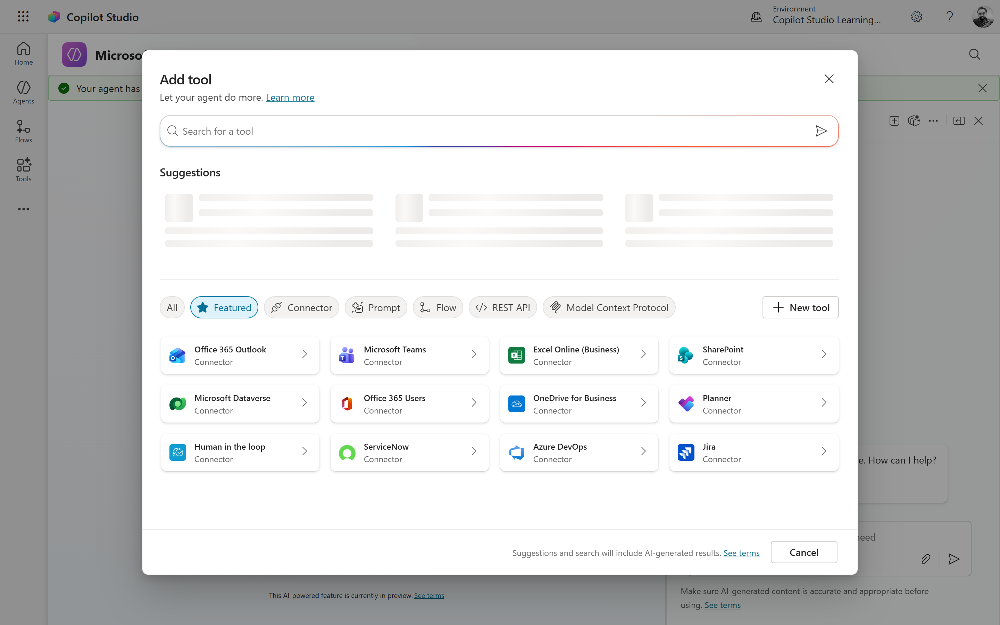
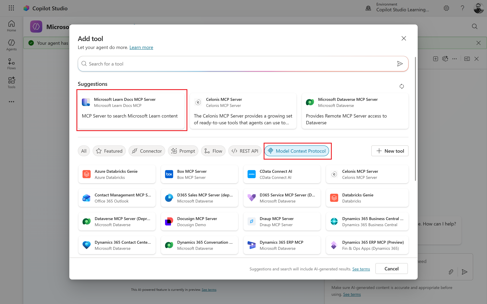
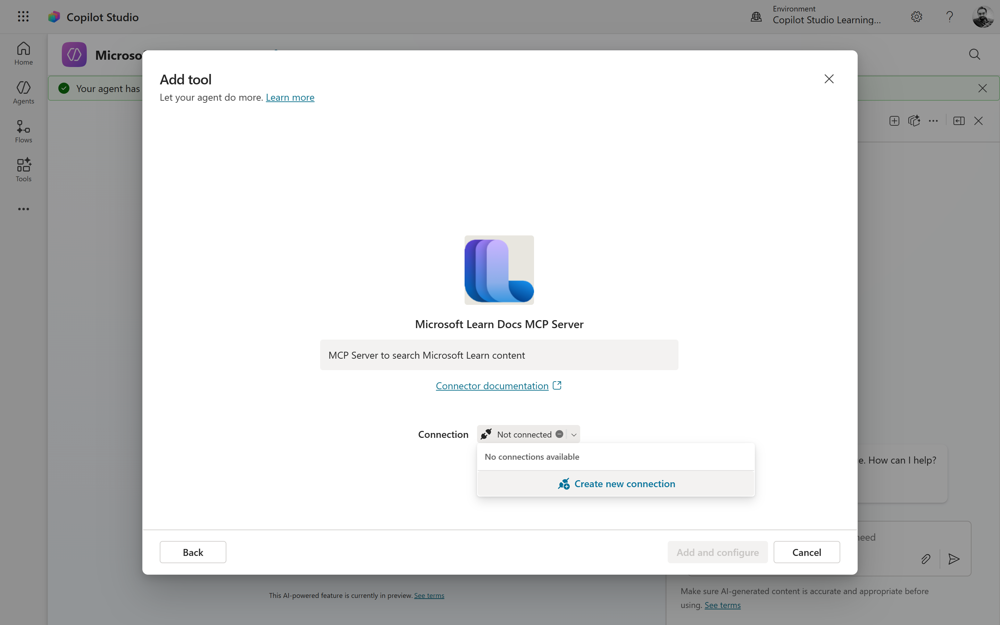
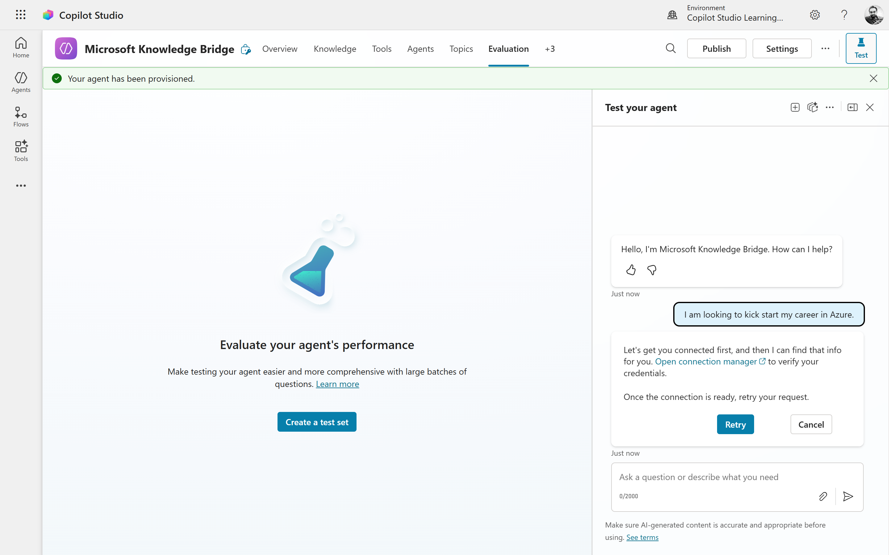
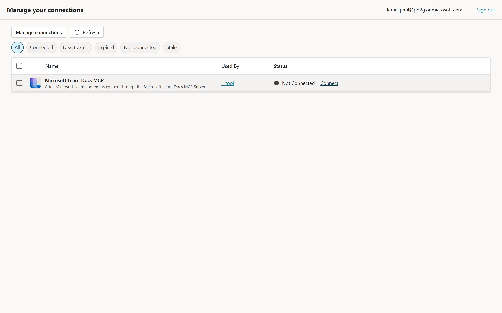
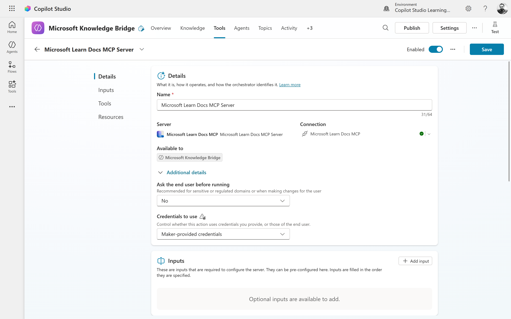
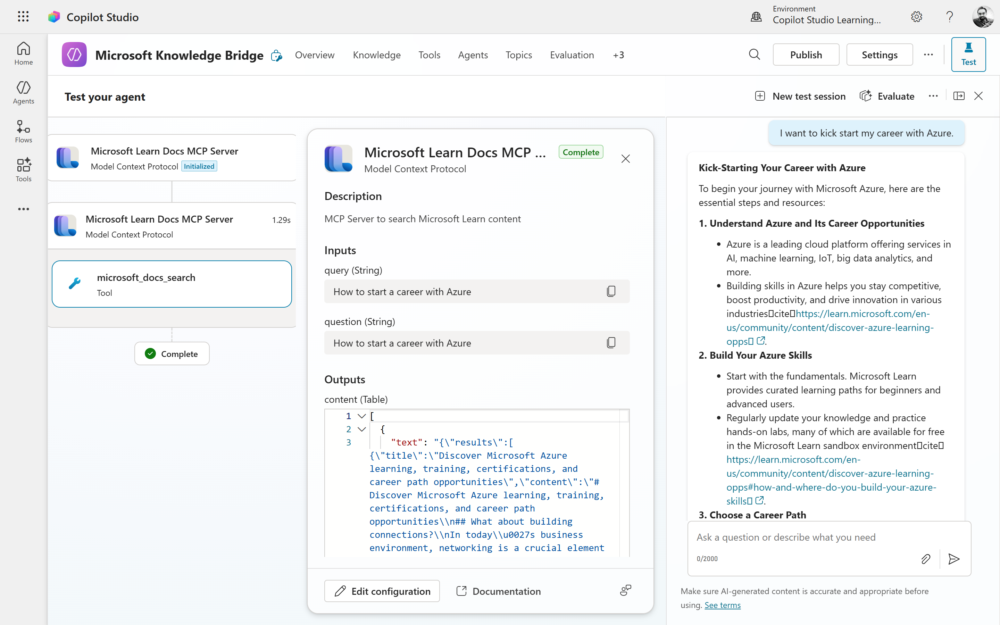

# 02. First MCP Connection with Copilot Studio

## Introduction
Building on section of conceptual foundation, this chapter takes a hands-on approach to connecting your first MCP server to a live Copilot Studio agent. You'll walk through Microsoft Learn's MCP server—a real-world, production-ready example—discover its available tools, configure authentication, and test end-to-end.

## Prerequisites
Before proceeding, ensure you have the following:
- A Copilot Studio environment with MCP support enabled (GA as of late 2025).
- A working agent
- Access to the Microsoft Learn MCP server endpoint (publicly available, no credentials required for read-only access).
- Basic familiarity with the agent builder UI and the Tools tab.

## Step 1: Navigate to the Tools Tab and Add MCP Server
### Open Your Agent
1. Log in to your **Copilot Studio environment**.
2. Navigate to your existing agent or create a new one.
3. Open the **agent builder interface**.

### Access the Add Tool Dialog
1. In the agent builder, click on the **Tools** tab located in the left-hand menu.
2. Click the **Add Tool** button to open the tool selection dialog.

## Step 2: Select Microsoft Learn MCP Server
3. In the search bar, type "**MCP Server**" to filter the available tools.

4. Select the **MCP Server** tool from the list.
5. Click **Next** to proceed to the configuration screen.

## Step 3: Configure the Microsoft Learn MCP Server
6. Click **Add MCP Server** to add a new MCP server configuration.
7. Create **New Connection** to connect with the Microsoft Learn MCP server.

8. In the configuration dialog, enter the following details:
   - **Server Name**: `Microsoft Learn Docs MCP Server`
   - **Endpoint URL**: `https://mcp.microsoftlearn.com/api`
   - **Authentication Type**: Select `None` (for public read-only access).

## Step 4: Test the Connection
Sometimes, copilot studio create connections and add to connection manager but doesn't make connection live until you connect it. In this agent responding to user queries, it will try to connect to the MCP server but unable to establish a connection.

To resolve this, open connection manager and connect to the MCP server manually.

## Step 5: Configure Tool Behavior (Advanced)
Depending on your Copilot Studio build, you may see additional options:

#### Ask User Before Running
- Enabled: Agent prompts the user for confirmation before invoking this tool.
- Use case: Sensitive operations (e.g., "Send email via Outlook MCP").
- For Microsoft Learn: Disable (searches are read-only, low-risk).

#### Credentials Type
- Maker-provided: Agent uses the credentials configured in Step 3 (recommended for service accounts).
- End-User: Each end-user supplies their own credentials when they use the agent (for per-user authorization).
- For Microsoft Learn: Maker-provided (single shared service account).

## Step 6: Save and Test Your Agent
9. Click **Save** to finalize the MCP server tool configuration.
10. Return to the main agent builder interface.
11. Test your agent by asking a question that requires information from the Microsoft Learn MCP server, such as:

<pre>User: I want to kick start my career with Azure</pre>

<pre>Agent: Kick-Starting Your Career with Azure

To begin your journey with Microsoft Azure, follow these structured steps based on official Microsoft guidance:

1. Understand Azure and Its Career Opportunities
Azure is a leading cloud platform offering services in AI, machine learning, IoT, big data analytics, and more.
Building skills in Azure helps you stay competitive, boost productivity, and drive innovation in various industriescite​https://learn.microsoft.com/en-us/community/content/discover-azure-learning-opps​.

2. Build Your Azure Skills
Start with the fundamentals and basics, as they are foundational for all Azure roles.
Use Microsoft Learn for free, curated learning paths, hands-on labs, and up-to-date training resources.
Explore areas like AI, security, automation, CI/CD, and machine learning according to your interestscite​https://learn.microsoft.com/en-us/community/content/discover-azure-learning-opps#how-and-where-do-you-build-your-azure-skills​.

3. Choose a Role and Certification Path
Azure offers multiple career paths, including:
Azure Solutions Architect: Designs and manages cloud solutions. Certification: ​AZ-305​cite​https://learn.microsoft.com/en-us/community/content/discover-azure-learning-opps#what-about-building-connections​.
Azure Data Engineer: Manages and transforms data. Certification: ​DP-203​cite​https://learn.microsoft.com/en-us/community/content/discover-azure-learning-opps#what-do-azure-data-engineers-do​.
Azure Security Engineer: Secures cloud environments. Certification: ​AZ-500​cite​https://learn.microsoft.com/en-us/community/content/discover-azure-learning-opps#what-do-azure-data-engineers-do​.
Use the ​Azure Certification Poster​ to match certifications to your skillscite​https://learn.microsoft.com/en-us/credentials/certifications/posts/understanding-microsoft-azure-certifications#target-the-right-certification-for-your-skills​.

4. Training and Learning Modalities
Microlearning, online courses, and instructor-led training are available.
Microsoft Learn provides interactive tutorials and achievement badges.
Practice tests and partner content (Pluralsight, LinkedIn Learning) are recommended for exam preparationcite​https://learn.microsoft.com/en-us/credentials/certifications/posts/skill-up-and-stand-out-with-new-role-based-training-and-certification#the-training​.

5. Networking and Community
Engage with the Microsoft Learn Community for support, networking, and mentorship.
Attend events, workshops, and seminars to learn from industry leaders and expand your professional networkcite​https://learn.microsoft.com/en-us/community/content/discover-azure-learning-opps#what-about-building-connections​.

6. Get Started
Sign up for a free Azure account to practice and explore services: ​Azure Free Account​cite​https://learn.microsoft.com/en-us/training/paths/start-career-in-tech/​.
Begin with beginner-level learning paths and modules tailored for students and new professionalscite​https://learn.microsoft.com/en-us/training/paths/start-career-in-tech/​.
Useful Links
​Microsoft Learn: Azure Training​
​Azure Certifications Overview​
If you need guidance on a specific Azure role or certification, let me know your area of interest!
</pre>

Congratulations! You've successfully connected your first MCP server to a Copilot Studio agent. You can now leverage the rich data and capabilities provided by the Microsoft Learn MCP server in your agent's interactions.

## Common Patterns: Using MCP Servers

### Pattern 1: MCP + Custom Prompts
Use a custom system prompt to guide the agent when invoking MCP tools:

<pre>System: You have access to the Microsoft Learn MCP server. Use it to provide accurate and up-to-date information about Microsoft Learn content when users ask related questions.</pre>

### Pattern 2: MCP + Adaptive Cards
Incorporate Adaptive Cards to present MCP data in a structured format:

<pre>User: Show me the top learning paths for Azure.
Agent: Here are the top learning paths for Azure:
1. Azure Fundamentals
2. Azure Administrator
3. Azure Developer
4. Azure Solutions Architect
5. Azure DevOps Engineer
</pre>

### Pattern 3: MCP + Multi-Agent
Leverage multiple agents, each with access to different MCP servers for specialized knowledge
<pre>User: I need help with Azure certifications and Microsoft 365 training.
Agent 1 (Azure MCP): Here are the Azure certifications you can pursue...
Agent 2 (Microsoft 365 MCP): Here are the Microsoft 365 training resources available...
</pre>

## Key Takeaways
- MCP simplifies setup: No custom connector code; point, authenticate, and discover tools.
- Auto-discovery saves time: All tools are enumerated automatically—select what you need.
- Security matters: Use OAuth for enterprise APIs; API keys for third-party services; no auth for public servers.
- Testing is critical: Verify tool discovery, then test end-to-end before publishing.
- Integration is seamless: MCP tools work alongside traditional connectors, REST, and multi-agent patterns from prior chapters.

## Next Steps
With your first MCP connection established, you're ready to explore more advanced scenarios. In future chapters, we'll dive into customizing MCP tool behavior, handling authentication for secure APIs, and optimizing agent performance with multiple MCP servers. Stay tuned!

## Conclusion
You've successfully connected your first MCP server to a Copilot Studio agent using the Microsoft Learn MCP server as an example. This hands-on experience lays the groundwork for leveraging MCP in your agents, enabling them to access rich data sources and perform complex tasks with ease. As you continue your journey, remember to experiment with different configurations, explore additional MCP servers, and refine your agents to meet specific use cases.