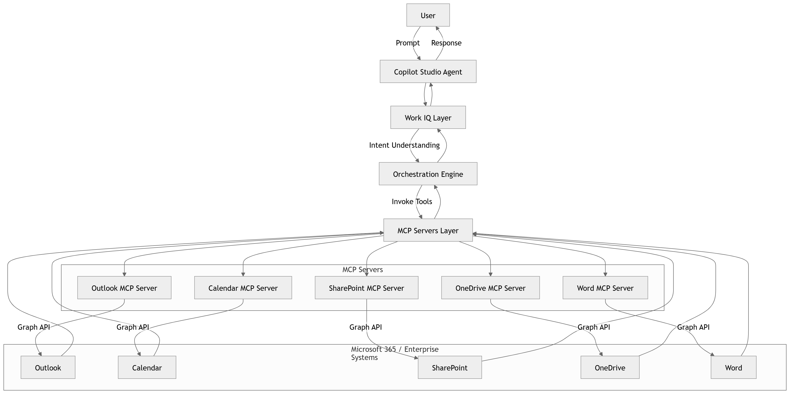

# 01. Introduction to Work IQ + MCP

Copilot Studio's Work IQ and Model Context Protocol (MCP) servers are designed to empower enterprises to build intelligent, context-aware copilots that seamlessly integrate with the Microsoft 365 ecosystem. By leveraging Work IQ's ability to connect to real-time data sources and MCP's standardized protocol for sharing contextual information, organizations can create copilots that go beyond generic responses and deliver actionable insights tailored to their specific needs.

## 🚀 Why This Matters
As enterprises accelerate adoption of Low-Code / No-Code (LCNC) platforms like Copilot Studio, a critical challenge emerges:
<pre><b>How do you make copilots truly intelligent, context-aware, and enterprise-ready?</b></pre>
Out-of-the-box copilots are powerful—but without access to enterprise context, real-time data, and actionable tools, they remain limited to generic responses.
This is where Work IQ and the Model Context Protocol (MCP) fundamentally change the game.

## 🧠 What is Work IQ?
Work IQ represents the intelligence layer for enterprise copilots, enabling them to:
- Understand context and connect to real-time data sources across the Microsoft 365 ecosystem (e.g., emails, documents, calendar events)
- Access enterprise data securely
- Execute actions across systems
- Deliver grounded, task-oriented responses

Instead of a copilot that only answers, Work IQ enables a copilot that can:
- Read (emails, documents, knowledge bases)
- Reason (derive insights, summarize, correlate)
- Act (send emails, schedule meetings, generate documents)

### 🔑 Core Idea
<pre>
<b>Work IQ + MCP = Enterprise-Ready Copilots</b>
Work IQ transforms copilots from passive assistants → active digital workers
</pre>

## 🔌 What is MCP (Model Context Protocol)?
The Model Context Protocol (MCP) is a standardized protocol that allows different systems to share contextual information with AI models in a secure and structured way. MCP enables:
- Access structured context
- Invoke external tools and APIs
- Interact with enterprise systesms in real-time and in controlled manner

### 📌 In simple terms:
<pre><b>MCP is the language or bridge (between AI Models and enterprise systems) that allows your copilot to understand and interact with your enterprise data</b></pre>

## 🧩 MCP: The Missing Layer in Copilot Architecture
Traditional Copilot integrations rely on:
- Public connectors
- Static APIs
- Limited extensibility

These approaches often lead to:
- Context fragmentation
- Poor compasibility
- Limited control over execution

### MCP solves this by introducing:
| Capability        | Without MCP | With MCP              |
| ----------------- | ----------- | --------------------- |
| Context Awareness | Limited     | Rich, dynamic         |
| Tool Invocation   | Rigid       | Flexible & extensible |
| Orchestration     | Manual      | Structured            |
| Governance        | Scattered   | Centralized           |

## ⚙️ Core Concepts of MCP
### Context Injection
MCP enables copilots to receive relevant, structured context at runtime.
Examples:
- Recent emails from outlook
- Documents from SharePoint
- Files from OneDrive

This ensures copilots have the necessary information to generate accurate, relevant responses:
- Grounded
- Relevant
- Up-to-date

### Tool Invocation
Instead of relying on static APIs, MCP allows copilots to invoke tools and services in a flexible way:
- Send an email
- Schedule a meeting
- Generate a document

### 🔄 Flow
<pre>User Prompt → Copilot → MCP Server → Enterprise API → Response</pre>

## 🏗️ How Work IQ and MCP Work Together
Work IQ provides the intelligence and reasoning capabilities, while MCP serves as the communication protocol that allows the copilot to access enterprise data and tools in real-time. Together, they enable a new class of intelligence.

### 🔗 Relationship
- **Work IQ** → Defines intelligence, reasoning, orchestration
- **MCP** → Enables access, execution, and integration

### 🧠 Combined Effect
| Layer                              | Responsibility           |
| ---------------------------------- | ------------------------ |
| Copilot Studio                     | User interaction layer   |
| Work IQ                            | Intelligence + reasoning |
| MCP Servers                        | Context + tools          |
| Microsoft 365 / Enterprise Systems | Data + actions           |

## 🔄 End-to-End Flow
Let's walk through a typical user interaction with a Work IQ-powered copilot using MCP:
🧑‍💼 User Prompt:
<pre><b>"Summarize my important emails and create a report."</b></pre>

### ⚙️ Execution Flow:
- Copilot receives the prompt and identifies the need for context and action.
- Work IQ processes the prompt, determines relevant context (e.g., recent emails), and decides on necessary actions (e.g., summarization, report generation).
- MCP server is invoked to fetch the relevant emails from Outlook.
- Copilot uses the retrieved context to generate a summary and creates a report.
- MCP server is invoked again to save the report to SharePoint and send a notification email.
- Final response is delivered to the user, confirming the actions taken and providing the generated report.

### 💡 Key Insight:
<pre><b>Work IQ + MCP transforms a simple user prompt into a complex, multi-step workflow that delivers real value.</b></pre>

## 🆚 MCP vs Traditional Integration Approaches
### MCP vs Graph Connectors
| Feature     | Graph Connectors | MCP       |
| ----------- | ---------------- | --------- |
| Data Access | Indexed          | Real-time |
| Actions     | ❌                | ✅         |
| Flexibility | Limited          | High      |

### MCP vs Plugins
| Feature            | Plugins  | MCP        |
| ------------------ | -------- | ---------- |
| Standardization    | Varies   | Structured |
| Orchestration      | Manual   | Built-in   |
| Enterprise Control | Moderate | Strong     |

### MCP vs Native Connectors (Copilot Studio)
| Feature            | Native Connectors | MCP       |
| ------------------ | ----------------- | --------- |
| Ease of Use        | High              | Medium    |
| Customization      | Limited           | Extensive |
| Advanced Scenarios | ❌                 | ✅         |

## 🔐 Security & Governance Considerations
MCP is designed with enterprise security and governance in mind:
- Scoped permissions (least privilege via APIs like Microsoft Graph)
- Auditability (track tool usage)
- Isolation (server-level boundaries)
- Policy enforcement

### 🛡️ Key Principle
<pre><b>Never expose raw enterprise APIs directly to copilots—always mediate through MCP servers.</b></pre>

## 🧱 Design Principles for MCP-Driven Systems
To build effective MCP-driven copilots, keep these design principles in mind:
- Modularity: Design MCP servers as modular components that can be reused across different copilots and scenarios.
- Reusability: Build MCP servers with reusability in mind, allowing them to serve multiple copilots and use cases.
- Observability: Implement robust logging and monitoring to track MCP server interactions and performance.
- Security First: Always prioritize security in the design and implementation of MCP servers, ensuring that access to enterprise data and tools is tightly controlled.
- Context Efficiency: Ensure that the context provided to the copilot is relevant and concise to optimize response quality and performance.

### 🌐 Why This is a Paradigm Shift
- Before MCP: Copilots were **informational**
- After MCP: Copilots become **actionable digital workers** that can understand, reason, and act on enterprise context in real-time.

### 🔄 Evolution
| Stage         | Capability        |
| ------------- | ----------------- |
| Chatbots      | Answer questions  |
| Copilots      | Assist users      |
| Work IQ + MCP | Execute workflows |

## 🚀 What’s Next
In the upcoming chapters, we will deeper into domain specific MCP server implementations, best practices for designing MCP-driven copilots, and real-world case studies showcasing the transformative power of Work IQ and MCP in the Microsoft 365 ecosystem.
- Outlook MCP → Email intelligence
- Calendar MCP → Scheduling automation
- SharePoint MCP → Knowledge retrieval
- OneDrive MCP → File intelligence
- Word MCP → Document generation

Each chapter will provide hands-on examples, architectural patterns, and practical guidance to help you build your own intelligent, context-aware copilots using Work IQ and MCP.
- Architectural patterns for MCP server design
- Tool Definitions
- Implementation and patterns
- Real-world case studies and examples

## 💬 Final Thought
Overall, Work IQ and MCP represent a fundamental shift in how we build and interact with AI-powered copilots in the enterprise. By enabling real-time access to context and tools, they empower organizations to create intelligent digital workers that can truly transform productivity and collaboration across the Microsoft 365 ecosystem.
<pre><b>Work IQ + MCP = The future of enterprise copilots is here.</b></pre>