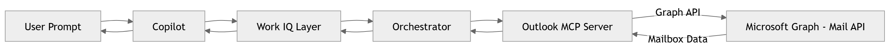

# 02. Outlook MCP Server - Enabling Intelligent Email Automation in Work IQ
Outlook MCP Server is a component of the Microsoft 365 ecosystem that provides a secure and efficient way to manage email communication. It acts as an intermediary between the email client and the email server, ensuring that all email traffic is properly authenticated and encrypted.

## 🚀 Why Outlook MCP Server Matters
Email remains a critical communication tool in the workplace, and managing it effectively is essential for productivity. Outlook MCP Server helps organizations automate email-related tasks, such as sorting, categorizing, and responding to emails, which can save time and reduce the risk of human error. Email remains the central nervous system of enterprise communication. Yet, most users spend a disproportionate amount of time:
- Reading long email threads
- Drafting repetitive responses
- Searching for critical information buried in their inbox
- Managing email overload

Traditional automation has struggled here due to context complexity and unstructured data.
<pre><code class="language-plaintext"><b>Outlook MCP Server</b> changes the game by leveraging AI to understand email content and context, enabling intelligent automation that goes beyond simple rules-based systems.</code></pre>

## 🧠 What is the Outlook MCP Server?
The Outlook MCP Server is a domain-specific MCP implementation that exposes Outlook capabilities as structured, callable tools for copilots.

It enables Work IQ-powered agents to:
- Access mailbox data in real-time
- Read and understand email content, including attachments
- Perform actions such as read emails, sending emails, and summarize email messages
- Automate communication workflows, such as drafting responses or categorizing emails based on content

### 🔑 Core Idea
<pre><code class="language-plaintext">Convert email operations into <b>AI-executable tools</b> with governance, structure, and context awareness.</code></pre>

## ⚙️ Core Capabilities
### Email Retrieval
Email retrieval allows agents to access and read emails from a user's mailbox. This includes:
- Fetching email metadata (sender, subject, date)
- Fetching email content (body, attachments)
- Access to email threads and conversation history

### Intelligent Searching and Filtering
Email searching and filtering capabilities enable agents to find specific emails based on criteria such as keywords, sender, date range, or attachment type. This allows for efficient information retrieval and organization.
- Symantic search capabilities to understand the intent behind search queries
- Context-aware filtering to prioritize relevant emails

### Email Summarization
Email summarization allows agents to generate concise summaries of email content, making it easier for users to quickly understand the key points without reading the entire email. This is particularly useful for long email threads or complex messages.
- Thread summarization to capture the essence of ongoing conversations
- Actionable insights extracted from email content to guide user responses
- Decision support by highlighting critical information and suggesting next steps

### Email composition and Response Generation
The email composition and response generation capabilities enable agents to draft email responses based on the content of received emails. This can include:
- Drafting replies to specific emails or entire threads
- Generate new emails based on user prompts or templates
- Send emails on behalf of the user, with appropriate permissions and governance controls
- Attachement handling to include relevant files or documents in email responses

### Context Enrichment and Personalization
Context enrichment and personalization capabilities allow agents to tailor email interactions based on user preferences, historical email interactions, and organizational context. This can include:
- Personalizing email responses based on user communication style and preferences
- Extracting key information from emails to enrich user profiles and improve future interactions
- Sentiment analysis to gauge the tone of incoming emails and adjust responses accordingly
- Intent recognition to understand the purpose of incoming emails and prioritize responses

## 🏗️ Architecture Overview
Outlook MCP Server is built on a robust architecture that ensures scalability, security, and seamless integration with the Microsoft 365 ecosystem. The architecture includes:
- **API Layer**: Exposes Outlook capabilities as structured APIs for agents to interact with.
- **Authentication and Authorization**: Ensures secure access to email data with proper permissions and governance controls.
- **Data Processing Layer**: Handles the processing of email data, including parsing, summarization, and response generation.
- **Integration Layer**: Facilitates seamless integration with other Microsoft 365 services and third-party applications to enhance email automation capabilities.



### 🔄 End-to-End Flow
🧑‍💼 Scenario:
<pre><code class="language-plaintext">“Summarize my important emails from today and draft replies”</code></pre>

#### Exceution Flow
- Copilot receives user request and identifies the need to access email data.
- Work IQ Identifies Outlook MCP Server as the appropriate tool to fulfill the request.
- Outlook MCP Identifies: Intent -> Summarization + Action
- Orcherstration: Sequential execution of Summarization followed by Response Generation
- Outlook MCP Server calls Graph API to retrieve relevant emails based on user preferences and criteria (e.g., important emails from today).
- Email are returened and summarized using AI capabilities to extract key points and insights.
- Copilot generates draft responses based on the summarized email content, user communication style, and organizational context.

## 🧰 Tool Definitions
Outlook MCP tools enable servers to offer executable functionalities, allowing LLMs to interact with external systems and perform real-world actions. Below are the available tool definitions for the Microsoft Work IQ Mail / Outlook MCP Server:

### 📬 Message Management Tools

| Tool | Description |
|---|---|
| `GetMessage` | Get a message by ID from the signed-in user's mailbox. |
| `UpdateMessage` | Update a message's mutable properties (subject, body, categories, importance). |
| `DeleteMessage` | Delete a message from the signed-in user's mailbox. |
| `FlagEmail` | Update the flag status on an email message (flag, complete, or clear a flag). |

### ✍️ Draft & Send Tools

| Tool | Description |
|---|---|
| `CreateDraftMessage` | Create a draft email in the signed-in user's mailbox without sending it. Recipients can be provided as names or email addresses—names are automatically resolved to email addresses using Microsoft Graph. |
| `UpdateDraft` | Update a draft's recipients, subject, body, and attachments. Supports both file URIs (OneDrive/SharePoint) and direct file uploads (base64-encoded). Recipients are automatically resolved. |
| `SendDraftMessage` | Send an existing draft message by ID. |
| `SendEmailWithAttachments` | Create and send an email with optional attachments. Supports file URIs and base64 uploads. Recipients are automatically resolved. |

### 💬 Reply & Forward Tools

| Tool | Description |
|---|---|
| `ReplyToMessage` | Reply to an existing message. By default creates a reply draft; set `sendImmediately=true` to send immediately. Recipients are automatically resolved. |
| `ReplyAllToMessage` | Reply-all to an existing message. By default creates a reply-all draft; set `sendImmediately=true` to send immediately. Recipients are automatically resolved. |
| `ReplyWithFullThread` | Reply (or reply-all) adding new recipients while preserving the full quoted thread and optionally re-attaching original files. By default creates a draft unless `sendImmediately=true`. |
| `ReplyAllWithFullThread` | Reply-all adding new recipients while preserving the full quoted thread and optionally re-attaching original files. By default creates a draft unless `sendImmediately=true`. |
| `ForwardMessage` | Forward an existing message, optionally adding a comment, recipients, and new attachments while preserving the quoted thread. Recipients are automatically resolved. |
| `ForwardMessageWithFullThread` | Forward a message adding new recipients and an optional intro comment while preserving the full quoted thread; returns sensitivity label. Recipients are automatically resolved. |

### 🔍 Search Tools

| Tool | Description |
|---|---|
| `SearchMessages` | Search for email messages using natural language queries powered by Microsoft 365 Copilot. Searches across your mailbox for relevant emails (e.g., 'emails from Sarah about the budget', 'unread messages from this week'). Note: this tool can take up to 30 seconds to execute as it uses semantic indexing. |
| `SearchMessagesQueryParameters` | Search for email messages with OData query parameters. Query parameters replace `{queryParameters}` in the URI `https://graph.microsoft.com/v1.0/me/messages{queryParameters}`. Example: `?$filter=isdraft eq true`. |

### 📎 Attachment Management Tools

| Tool | Description |
|---|---|
| `AddDraftAttachments` | Add attachments (URI) to an existing draft message. |
| `GetAttachments` | Get all attachments from a message, returning attachment metadata (ID, name, size, type). |
| `DownloadAttachment` | Download attachment content from a message. Returns the content as a base64-encoded string. |
| `UploadAttachment` | Upload a small file attachment (less than 3 MB) to a message. File content must be base64-encoded. |
| `UploadLargeAttachment` | Upload a large file attachment (3–150 MB) to a message using chunked upload. File content must be base64-encoded. |
| `DeleteAttachment` | Delete an attachment from a message. |

### 🔐 Governance & Scopes

All actions require appropriate Microsoft Graph scopes such as:
- `Mail.Read` - for reading messages
- `Mail.ReadWrite` - for modifying messages and creating drafts
- `Mail.Send` - for sending messages
- `Files.ReadWrite` - when using file URIs from OneDrive/SharePoint

Actions that send messages or expose attachments must follow tenant governance policies and may require explicit user consent.

## 🔌 Integration with Microsoft Graph

The Outlook MCP Server leverages **Microsoft Graph API** as the underlying mechanism to access and manipulate mailbox data. Microsoft Graph is a RESTful web API that provides a unified entry point for Microsoft 365 services, including Exchange Online (Outlook).

### 📍 Key Graph API Endpoints

The following table maps common Outlook MCP tools to their corresponding Microsoft Graph REST API endpoints:

| MCP Tool | HTTP Method | Graph API Endpoint | Description |
|---|---|---|---|
| `GetMessage` | GET | `/me/messages/{id}` | Retrieve a specific message by ID |
| `GetEmailById` (implied) | GET | `/me/messages/{id}?$select=subject,from,toRecipients,bodyPreview,receivedDateTime` | Fetch message with metadata |
| `SearchMessages` | GET | `/me/messages?$search="..."` | Search messages using KQL (Keyword Query Language) |
| `SearchMessagesQueryParameters` | GET | `/me/messages{queryParameters}` | Advanced OData filtered search |
| `CreateDraftMessage` | POST | `/me/messages` | Create a draft message (isDraft=true) |
| `UpdateMessage` | PATCH | `/me/messages/{id}` | Update mutable message properties |
| `SendDraftMessage` | POST | `/me/messages/{id}/send` | Send a draft message |
| `DeleteMessage` | DELETE | `/me/messages/{id}` | Delete a message |
| `FlagEmail` | PATCH | `/me/messages/{id}` | Update flag status via `flag` property |
| `ReplyToMessage` | POST | `/me/messages/{id}/reply` | Create a reply draft |
| `ReplyAllToMessage` | POST | `/me/messages/{id}/replyAll` | Create a reply-all draft |
| `ForwardMessage` | POST | `/me/messages/{id}/forward` | Forward a message |
| `GetAttachments` | GET | `/me/messages/{id}/attachments` | List all attachments on a message |
| `DownloadAttachment` | GET | `/me/messages/{id}/attachments/{attachmentId}/$value` | Download attachment content |
| `UploadAttachment` | POST | `/me/messages/{id}/attachments` | Add attachment to message |

### 🔐 Authentication Flow

All requests to the Microsoft Graph API must include a valid OAuth 2.0 access token in the `Authorization` header:

```
GET /me/messages HTTP/1.1
Host: graph.microsoft.com
Authorization: Bearer {access_token}
```

**Token acquisition:**
1. Client registers application in Azure AD (Microsoft Entra ID)
2. User grants consent for required scopes (Mail.Read, Mail.Send, etc.)
3. Application receives refresh token and access token
4. Access token is included in every Graph API call
5. Token is refreshed before expiration using refresh token

### 📊 Request & Response Examples

#### Example 1: Get a Message

**Request:**
```
GET https://graph.microsoft.com/v1.0/me/messages/{messageId}
Authorization: Bearer {access_token}
```

**Response:**
```json
{
  "id": "AAMkADFlNTU...",
  "subject": "Project Update",
  "from": {
    "emailAddress": {
      "name": "Sarah",
      "address": "sarah@contoso.com"
    }
  },
  "toRecipients": [
    {
      "emailAddress": {
        "name": "Team",
        "address": "team@contoso.com"
      }
    }
  ],
  "bodyPreview": "Here's the latest status on the project...",
  "receivedDateTime": "2024-01-15T10:30:00Z",
  "isRead": false,
  "isDraft": false
}
```

#### Example 2: Create a Draft Message

**Request:**
```
POST https://graph.microsoft.com/v1.0/me/messages
Authorization: Bearer {access_token}
Content-Type: application/json

{
  "subject": "Meeting Tomorrow",
  "bodyPreview": "Quick reminder about our meeting tomorrow.",
  "body": {
    "contentType": "HTML",
    "content": "<p>Quick reminder about our meeting tomorrow at 2 PM.</p>"
  },
  "toRecipients": [
    {
      "emailAddress": {
        "address": "john@contoso.com"
      }
    }
  ]
}
```

**Response:**
```json
{
  "id": "AAMkADFlNTU...",
  "subject": "Meeting Tomorrow",
  "isDraft": true,
  "createdDateTime": "2024-01-15T15:00:00Z"
}
```

#### Example 3: Search Messages

**Request:**
```
GET https://graph.microsoft.com/v1.0/me/messages?$search="from:sarah budget"&$select=subject,from,receivedDateTime
Authorization: Bearer {access_token}
```

**Response:**
```json
{
  "value": [
    {
      "id": "AAMkADFlNTU...",
      "subject": "FY2024 Budget Review",
      "from": {
        "emailAddress": {
          "name": "Sarah",
          "address": "sarah@contoso.com"
        }
      },
      "receivedDateTime": "2024-01-10T09:15:00Z"
    }
  ]
}
```

### 🔄 Batch Operations

Microsoft Graph supports batch requests, allowing multiple API calls in a single HTTP request. This is useful for performance optimization:

```json
POST https://graph.microsoft.com/v1.0/$batch
Authorization: Bearer {access_token}
Content-Type: application/json

{
  "requests": [
    {
      "id": "1",
      "method": "GET",
      "url": "/me/messages/AAMkADFlNTU..."
    },
    {
      "id": "2",
      "method": "GET",
      "url": "/me/messages/AAMkADFlNTU.../attachments"
    }
  ]
}
```

### ⚡ Webhooks & Subscriptions

The Outlook MCP Server can subscribe to change notifications for mailbox events using Microsoft Graph webhooks:

```json
POST https://graph.microsoft.com/v1.0/subscriptions
Authorization: Bearer {access_token}
Content-Type: application/json

{
  "changeType": "created,updated",
  "notificationUrl": "https://your-notification-endpoint.com/webhook",
  "resource": "/me/mailFolders('Inbox')/messages",
  "expirationDateTime": "2024-02-15T10:00:00Z",
  "clientState": "secret-state-value"
}
```

When a new message arrives or an existing message is updated, Microsoft Graph sends a notification to the specified webhook endpoint, enabling real-time reactivity.

### 🛡️ Best Practices

1. **Scope Minimization**: Request only the minimum required scopes (e.g., Mail.Read instead of Mail.ReadWrite if only reading)
2. **Token Caching**: Cache and reuse tokens until expiration to reduce authentication overhead
3. **Rate Limiting**: Implement exponential backoff for throttled requests (429 HTTP status)
4. **Error Handling**: Check for Graph error responses and handle them gracefully
5. **Filtering & Selection**: Use `$filter` and `$select` parameters to reduce payload size
6. **Pagination**: Use `$top` and `$skip` for large result sets to avoid timeout
7. **Audit & Logging**: Log all Graph API calls for security and compliance auditing

## 🧠 Prompt Engineering Patterns

When interacting with Work IQ Mail MCP Server through copilots, use these practical patterns to get optimal results:

### 📧 Email Retrieval Patterns

| Pattern | Example | Use Case |
|---|---|---|
| **Contextual Filter** | "Show me emails from [sender] about [topic] from the last [timeframe]" | Find specific conversations quickly |
| **Multi-Criteria Search** | "Find unread emails with attachments from my manager" | Combine multiple filters for precision |
| **Importance-Based** | "What are my high-priority emails from today?" | Focus on critical messages |
| **Folder Navigation** | "List recent emails in my [folder name]" | Browse specific mail folders |

### 📋 Summarization Patterns

| Pattern | Example | Use Case |
|---|---|---|
| **Thread Summary** | "Summarize the email thread with [person] about [topic]" | Quick catch-up on conversations |
| **Action Extraction** | "What action items are in this email?" | Extract next steps from messages |
| **Decision Points** | "What decisions were made in my emails about [topic] this week?" | Track decisions across threads |
| **Sentiment Analysis** | "Which emails from [sender] seem urgent or concerning?" | Gauge tone and priority |

### ✍️ Draft & Compose Patterns

| Pattern | Example | Use Case |
|---|---|---|
| **Tone-Specific Draft** | "Draft a [formal/friendly/concise] reply to [sender]'s email about [topic]" | Match communication style |
| **Template-Based** | "Create an email to [recipient] with [context], keeping it under 150 words" | Generate concise messages |
| **Contextual Response** | "Reply to this email referencing my previous conversation with [person]" | Add relevant context automatically |
| **Batch Compose** | "Draft replies to my unread emails from [team/department]" | Handle multiple responses efficiently |

### 🔍 Search & Filter Patterns

| Pattern | Example | Use Case |
|---|---|---|
| **Semantic Search** | "Find emails where we discussed [complex topic]" | NL-powered deep search |
| **Date Range** | "Show me emails about [project] from [start date] to [end date]" | Historical email mining |
| **Content Search** | "Find emails containing [specific phrase or keyword]" | Locate exact content |
| **Exclusion Filter** | "Show me important emails except those from [sender]" | Filter out noise |

### 💬 Reply & Forward Patterns

| Pattern | Example | Use Case |
|---|---|---|
| **Smart Reply** | "Reply to [sender] confirming receipt and asking for clarification on [point]" | Generate intelligent responses |
| **Forward with Context** | "Forward this email to [team] with a note explaining [context]" | Add context when sharing |
| **Reply-All Smart** | "Reply-all to [sender]'s email but only include [specific recipients]" | Control recipient list |
| **Thread Preservation** | "Reply to [sender] referencing our earlier discussion about [topic]" | Maintain full context |

### 📎 Attachment Patterns

| Pattern | Example | Use Case |
|---|---|---|
| **Attachment Verification** | "Check which emails from [sender] have attachments" | Identify messages with files |
| **Bulk Download** | "Get all attachments from emails about [project]" | Extract multiple files |
| **File Sharing** | "Forward this email with attachments to [recipient]" | Share files with context |
| **Attachment Metadata** | "Show me attachment details (size, type) from [sender]'s emails" | Inventory large files |

### 🎯 Advanced Automation Patterns

| Pattern | Example | Use Case |
|---|---|---|
| **Conditional Action** | "If any emails from [VIP] arrive unread, summarize and flag them" | Priority automation |
| **Chained Operations** | "Find emails about [topic], summarize them, then draft a response" | Multi-step workflows |
| **Time-Based** | "Summarize my emails from the past [timeframe] by sender" | Periodic digests |
| **Category Organization** | "Categorize my unread emails as urgent/follow-up/info-only" | Auto-organization |

### ✨ Best Practice Tips

- **Be Specific**: Include sender names, topics, and timeframes for better results
- **Combine Filters**: Mix date ranges, senders, and keywords for precision
- **Use Tone Markers**: Specify "formal", "friendly", or "professional" for draft generation
- **Reference Context**: Include relevant details from previous interactions
- **Leverage Full Thread**: Always ask for "full thread" when context matters
- **Batch Operations**: Group similar tasks (e.g., multiple replies) in one prompt
- **Verify Results**: Always review AI-generated drafts before sending critical emails

## 🧩 Potential Enterprise Use Cases

### 1️⃣ Executive Communication Intelligence & Inbox Triage

**Problem Statement:**
Executives receive 100+ emails daily across multiple projects and stakeholders. Critical messages get buried, urgent decisions are delayed, and time is wasted on repetitive administrative tasks.

**Solution Workflow:**
1. **Daily Email Digest**: Work IQ Mail MCP summarizes all emails from C-suite stakeholders and board members using `SearchMessages` + `SummarizeEmail`
2. **Smart Flagging**: Automatically identifies and flags emails requiring executive decision using sentiment analysis and intent recognition
3. **Draft Responses**: Generates draft replies in the executive's communication style using `DraftReply` with tone=formal
4. **Batch Approval**: Executive reviews and approves multiple draft responses in one session via `SendDraftMessage`
5. **Archive & Organize**: Auto-categorizes and files emails using `UpdateMessage` for future reference

**Key Benefits:**
- ⏱️ Reduces email processing time by 60–70%
- 📊 Ensures no critical decision gets missed
- 🎯 Maintains consistent, professional communication tone
- 📈 Improves response time to board and stakeholder inquiries

**Tools Used:**
`SearchMessages`, `SummarizeEmail`, `DraftReply`, `SendDraftMessage`, `UpdateMessage`, `FlagEmail`

---

### 2️⃣ Legal & Compliance Email Review & Audit Trail

**Problem Statement:**
Legal and compliance teams must manually review thousands of emails for contractual obligations, regulatory requirements, and risk exposure. This process is time-consuming, error-prone, and creates liability gaps.

**Solution Workflow:**
1. **Compliance Search**: Use `SearchMessagesQueryParameters` to find emails containing legal keywords (e.g., "contract", "confidentiality", "liability", "breach")
2. **Thread Analysis**: Retrieve full email threads using `ReplyWithFullThread` to understand complete context and decision history
3. **Automated Categorization**: Classify emails by risk level (high/medium/low) and compliance domain using AI analysis
4. **Attachment Audit**: Extract and catalog all attachments using `GetAttachments` and `DownloadAttachment` for document management systems
5. **Audit Report**: Generate compliance summary with action items for legal review
6. **Secure Forwarding**: Forward emails to external counsel or compliance partners using `ForwardMessageWithFullThread` with sensitivity labels preserved

**Key Benefits:**
- ✅ Ensures regulatory compliance (SOX, GDPR, HIPAA, etc.)
- 🔒 Reduces legal and compliance risk by 40–50%
- 📝 Creates defensible audit trail for eDiscovery
- ⚡ Accelerates contract and legal review cycles
- 💼 Integrates with legal document management systems

**Tools Used:**
`SearchMessagesQueryParameters`, `SearchMessages`, `GetAttachments`, `DownloadAttachment`, `ForwardMessageWithFullThread`, `UpdateMessage`, `SummarizeEmail`

---

### 3️⃣ Customer Support & Service Ticket Automation

**Problem Statement:**
Support teams struggle with email overflow—customer inquiries are missed, response times are slow, and tickets fall through the cracks due to manual routing and categorization.

**Solution Workflow:**
1. **Intelligent Triage**: Automatically categorize incoming customer emails by priority, issue type, and sentiment using `SearchMessages` with NL queries
2. **Unified Context**: Retrieve customer email history using `GetMessage` + `ReplyWithFullThread` to provide support agents with full context
3. **Auto-Response**: Generate acknowledgment replies for high-volume inquiries using `CreateDraftMessage` → `SendEmailWithAttachments` with relevant documentation
4. **Escalation**: Identify urgent or sensitive issues (e.g., complaints, security) and flag them for supervisor review using `FlagEmail`
5. **Knowledge Base Linking**: Attach relevant KB articles or solutions to reply drafts using `UpdateDraft` with URI-based attachments
6. **SLA Tracking**: Monitor response time and follow-up deadlines using `SearchMessagesQueryParameters` filters (e.g., emails older than 24 hours)

**Key Benefits:**
- 📞 Reduces first-response time by 50%+
- ✨ Improves customer satisfaction (CSAT) by 30–40%
- 🎯 Ensures SLA compliance across support team
- 🤖 Automates 60–70% of routine acknowledgments and categorization
- 💾 Maintains complete customer interaction history

**Tools Used:**
`SearchMessages`, `SearchMessagesQueryParameters`, `GetMessage`, `ReplyWithFullThread`, `CreateDraftMessage`, `SendEmailWithAttachments`, `UpdateDraft`, `FlagEmail`, `DownloadAttachment`


## 🔒 Security & Governance Considerations

When deploying Work IQ Mail MCP Server in enterprise environments, ensure:

- **Data Residency**: Verify that email data processing complies with regional data residency requirements (GDPR, HIPAA, etc.)
- **Access Control**: Implement role-based access control (RBAC) so agents only access emails they're authorized to handle
- **Encryption**: Ensure end-to-end encryption for sensitive emails and attachments in transit and at rest
- **Audit Logging**: Enable comprehensive audit logging for all email operations (who accessed what, when, and from where)
- **Consent & Privacy**: Ensure users consent to AI-powered email analysis and summarization
- **Sensitive Data Handling**: Configure data masking for PII (personally identifiable information) in summaries and drafts
- **Retention Policy**: Align email retention and deletion with corporate and legal retention policies
- **DLP Integration**: Integrate with Data Loss Prevention (DLP) systems to prevent sensitive data exposure

## 💬 Final Thought

The **Outlook MCP Server** represents a fundamental shift in how organizations approach email automation. For decades, email has been treated as a black box—unstructured, difficult to process, and resistant to automation beyond simple rule-based systems.

By exposing Outlook capabilities as structured, AI-executable tools through the MCP protocol, Work IQ enables copilots to understand email **context, intent, and nuance** in ways that traditional automation cannot. This is transformative:

- **For Executives**: Reclaim hours lost to email processing and focus on strategic decisions
- **For Legal & Compliance Teams**: Reduce risk exposure and accelerate regulatory reviews with defensible audit trails
- **For Support Organizations**: Deliver faster, more personalized customer service while maintaining SLA compliance
- **For Enterprises**: Unlock productivity gains across thousands of workers while maintaining strict governance and security

The key to successful deployment is balancing **automation with human oversight**. Drafts should be reviewed, sensitive emails should be flagged, and governance policies must be enforced at every step.

As email remains the backbone of enterprise communication, the ability to intelligently process, summarize, and automate email workflows—while maintaining trust and compliance—will be a competitive advantage. The Outlook MCP Server provides the foundation for that advantage.

**Next Steps:**
- Evaluate use cases relevant to your organization
- Pilot implementations in low-risk departments (e.g., support, business operations)
- Establish governance policies and audit processes
- Measure impact on productivity, compliance, and user satisfaction
- Scale successful patterns across your enterprise

The future of work is intelligent, context-aware, and human-centered. The Outlook MCP Server is a critical building block on that journey.