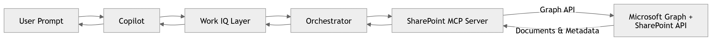

# 04. SharePoint MCP Server - Unlocking Enterprise Knowledge with Context-Aware Retrieval in Work IQ
SharePoint MCP Server is a powerful component of the Work IQ ecosystem that enables organizations to unlock the full potential of their enterprise knowledge. By leveraging context-aware retrieval capabilities, SharePoint MCP Server allows users to access relevant information and insights from their SharePoint repositories seamlessly.

## 🚀 Why SharePoint MCP Server Matters
In most enterprises, a significant amount of valuable information is stored in SharePoint. However, accessing this information can be challenging due to the sheer volume of data and the lack of context-aware retrieval mechanisms. SharePoint MCP Server addresses this issue by providing a robust solution that enhances the search experience and delivers relevant results based on user context.

SharePoint acts as backbone for organizational knowledge:
- Centralized repository for documents, files, and information.
- Policies and SOPs
- Project documentation
- Reports and Presentations

However , traditional search methods often fail to deliver relevant results due to:
- Poor search relevance
- Information Siols
- Large, unstructured documents
- Lack of contectual understanding

<pre>The <b>SharePoint MCP Server</b> transforms SharePoint from a document repository into an <b>intelligent, queryable knowledge system</b> for Work IQ-powered copilots.</pre>

## 🧠 What is the SharePoint MCP Server?
The SharePoint MCP Server is a specialized server that integrates with SharePoint to provide enhanced search and retrieval capabilities. It utilizes advanced algorithms and machine learning techniques to understand the context of user queries and deliver relevant results from the SharePoint repositories.

It enables Work IQ copilots to:
- Discover relevant information from SharePoint repositories based on user context.
- Retrieve specific documents, files, and information that are relevant to the user's query.
- Ground Responses in the most up-to-date and relevant information available in SharePoint.
- Enable context-aware retrieval, ensuring that users receive information that is relevant to their specific needs and queries.

### 🔑 Core Idea
<pre>The core idea behind the SharePoint MCP Server is to enhance the search experience by providing context-aware retrieval capabilities. This allows users to access relevant information from their SharePoint repositories seamlessly, improving productivity and decision-making.</pre>

## ⚙️ Core Capabilities

### Intelligent Document Search
SharePoint MCP Server utilizes advanced algorithms to understand the context of user queries and deliver relevant results from SharePoint repositories. This includes the ability to search for specific documents, files, and information based on user context.
- Keyword + Semantic Search
- Filter By: Site, Library, Author, Date, etc.
- Ranking based on relevance and user context

### Context-Aware Retrieval
It enables context-aware retrieval, ensuring that users receive information that is relevant to their specific needs and queries. This means that the server can understand the intent behind user queries and deliver results that are most relevant to their current context.
- Fetch relevant information based on user context (e.g., current project, role, recent activity)
- Retrive metadata and content from SharePoint documents to provide comprehensive answers

### Content Extraction and Chunking
This capability allows the SharePoint MCP Server to extract relevant content from documents and chunk it into manageable pieces for retrieval. This is particularly useful for large, unstructured documents that may contain valuable information but are difficult to search through using traditional methods.
- Break large documents into smaller, manageable chunks for retrieval
- Extract meaningful content and metadata to enhance search relevance
- Enable LLMs to understand and utilize the content effectively in responses

### Knowledge Grounding
It grounds responses in the most up-to-date and relevant information available in SharePoint. This ensures that users receive accurate and timely information based on the latest data stored in their SharePoint repositories.
- Provide context to copilot before response generation
- Reduce hallucinations by grounding responses in actual SharePoint content

## 🏗️ Architecture Overview
SharePoint MCP Server is designed to integrate seamlessly with the Work IQ ecosystem. It consists of several components that work together to provide enhanced search and retrieval capabilities for SharePoint repositories.


## 🔄 End-to-End Flow
🧑‍💼 Scenario:
<pre>Summarize the latest HR policy document and highlight key changes</pre>

### Execution Steps:
- Copilot receives user query and identifies the need to access SharePoint for relevant information.
- Work IQ interprets intent and determines that the SharePoint MCP Server is the appropriate tool to retrieve the necessary information.
- Orcherstrator routes the query to the SharePoint MCP Server, providing necessary context (e.g., user role, recent activity).
- SharePoint MCP Server processes the query, performs intelligent document search, and retrieves relevant content from SharePoint repositories.
- MCP retrieves the content, extracts relevant information, and chunks it for efficient retrieval.
- Content is chunked and processed
- Copilot generate grounded summary based on retrieved content and provides response to the user.

## 🧰 MCP Tool Definitions

The SharePoint MCP Server provides a comprehensive set of tools organized into functional categories for intelligent knowledge management and document retrieval:

### 🔍 Site Discovery & Navigation

| Tool | Description |
|---|---|
| `findSite` | Find SharePoint sites accessible to the user. Can search for specific sites by name or retrieve top 20 relevant sites if no query is provided. Returns site metadata including site ID and display name. |
| `getSiteByPath` | Resolve a SharePoint site using its exact hostname and server-relative path. Use this when you have the complete site URL structure (e.g., hostname='contoso.sharepoint.com', path='sites/Marketing'). Requires precise URL components. |
| `listSubsites` | List all subsites (child sites) of a SharePoint site. Use this to discover the hierarchical structure and what subsites exist within a parent site. |

### 📋 List Management

| Tool | Description |
|---|---|
| `listLists` | Get all SharePoint lists available on a specific site. Returns list metadata including list ID, display name, and description. Use this to discover what lists exist within a SharePoint site before working with list items. |
| `createList` | Create a new SharePoint list within a site. Requires the site ID and display name. After creation, you can add items and columns to the list. |
| `deleteList` | Delete a SharePoint list from a site. Requires the list ID and optional ETag for concurrency control. This deletes the entire list container and all items within it. |

### 📝 List Items & Data

| Tool | Description |
|---|---|
| `listListItems` | Get items (rows/records) from a specific SharePoint list. Requires both site ID and list ID. Returns item data including all field values. Use this to retrieve data from within a list. |
| `getListItem` | Get a single list item by its ID. Returns detailed data for one specific item including all field values and metadata. Useful for retrieving complete details of a specific record. |
| `createListItem` | Create a new item (row/record) in a SharePoint list. Requires site ID, list ID, and field key-value pairs. Field names must match internal column names in the list. |
| `updateListItem` | Update an existing item in a SharePoint list. Requires site ID, list ID, item ID, and field key-value pairs. Only provided fields are updated; other fields remain unchanged. Supports optional ETag for concurrency control. |
| `deleteListItem` | Delete an item from a SharePoint list. Requires site ID, list ID, and item ID. Optionally supports ETag for concurrency control to prevent overwriting concurrent changes. |

### 📊 List Columns & Schema

| Tool | Description |
|---|---|
| `listColumns` | Get all columns from a SharePoint list. Returns column definitions including column ID, name, type, and properties. Use this to understand the schema of a list before creating or updating items. |
| `createColumn` | Create a new column in a SharePoint list. Supports 20+ column types including text, number, choice, date, lookup, user, and managed metadata. Requires column type and optional properties for type-specific configuration. |
| `updateColumn` | Update an existing column in a SharePoint list. Can modify display name, description, requirements, and type-specific properties. Requires column type when providing column properties. |
| `deleteColumn` | Delete a column from a SharePoint list. Removes all data stored in that column for all items. Requires column ID for precise identification. |

### 📂 Document Library & Files

| Tool | Description |
|---|---|
| `getDefaultDocumentLibraryInSite` | Get the default Document Library (Drive) in a SharePoint site. If not specified, the root site will be used. Returns library metadata needed for file operations. |
| `listDocumentLibrariesInSite` | List all Document Libraries (Drives) in a specified SharePoint site. Returns all available document libraries within that site. |
| `getFolderChildren` | Enumerate files and folders contained within a specified parent folder in a Document Library. Returns top 20 items including file/folder metadata. Useful for browsing library contents. |
| `readSmallTextFile` | Read/download a text file (less than 5MB) from a Document Library. Requires file ID (driveItemId) and document library ID. Returns file content as text. |
| `readSmallBinaryFile` | Read a binary file (less than 5MB) from a Document Library. Requires file ID and document library ID. Returns file content as base64-encoded string. |
| `createSmallTextFile` | Create or upload a text file (less than 5MB) to a Document Library. Can be uploaded to a specific folder or root if not specified. Useful for creating documents and configuration files. |
| `createSmallBinaryFile` | Create a binary file (less than 5MB) in a Document Library by base64 encoding its content. Can be created in a specific folder or root folder. |
| `renameFileOrFolder` | Rename a file or folder within a Document Library. New name must comply with SharePoint naming conventions. Returns updated item metadata. |
| `createFolder` | Create a new folder within a Document Library as a child of a specified parent folder. Returns newly created folder metadata. |
| `deleteFileOrFolder` | Delete a file or folder from a Document Library. Removes the item and all contents if it's a folder. Returns confirmation of deletion. |
| `moveSmallFile` | Move a file (less than 5MB) to another folder within the same Document Library. Files cannot be moved between drives with this tool. Returns updated file metadata. |
| `copyFileOrFolder` | Copy a file or folder to a destination folder. Supports copying across different Document Libraries within SharePoint. Asynchronous operation returns a token to check completion status. |
| `getFileOrFolderMetadata` | Get metadata of a file or folder from a Document Library. Returns detailed information including name, size, type, created/modified dates, and access permissions. |
| `getFileOrFolderMetadataByUrl` | Get metadata of a file or folder from a sharing URL. Returns metadata for users with existing explicit permissions to access the file. |
| `findFileOrFolder` | Find a file or folder across all sites and document libraries accessible to the user. Less efficient than searching within a specific site, but comprehensive across all accessible libraries. |
| `uploadFileFromUrl` | Upload a file from a SharePoint or OneDrive URL to a destination folder. Takes source URL and copies file to destination. Only supports SharePoint and OneDrive URLs with valid access permissions. |

### 🔗 Sharing & Permissions

| Tool | Description |
|---|---|
| `shareFileOrFolder` | Send a sharing invitation to grant read/write permissions on a file or folder. Supports assigning roles and notifying recipients. Can grant 'read' or 'contribute' permissions. |
| `sendInviteForList` | Send a sharing invitation to grant permissions for a SharePoint list. Use this to share an entire list with other users. Supports 'read', 'contribute', and 'edit' roles. Optionally sends email notification to recipients. |

### ⚙️ Utilities & Advanced Operations

| Tool | Description |
|---|---|
| `setSensitivityLabelOnFile` | Set the sensitivity/classification label on a file in a Document Library. Applies data protection and compliance labels to files based on organizational policies. |
| `checkOperationStatus` | Check the status of asynchronous operations (such as copy or move) using the operation token. Returns progress information if still in progress, error details if failed, or final File/Folder metadata if completed. |

## 🔌 Integration with Microsoft Graph & SharePoint APIs

SharePoint MCP Server integrates with Microsoft Graph and SharePoint REST APIs to perform its operations. It uses these APIs to interact with SharePoint sites, lists, document libraries, and files to provide the necessary data for intelligent retrieval and knowledge management.

### 📍 Key Graph API Endpoints

The following table maps common SharePoint MCP tools to their corresponding Microsoft Graph REST API endpoints:

| MCP Tool | HTTP Method | Graph API Endpoint | Description |
|---|---|---|---|
| `findSite` | GET | `/sites?$search="{query}"` | Search for SharePoint sites by name or keyword |
| `getSiteByPath` | GET | `/sites/{hostname}:/sites/{path}` | Resolve a site by hostname and server-relative path |
| `listSubsites` | GET | `/sites/{siteId}/sites` | List all subsites (child sites) of a parent site |
| `listLists` | GET | `/sites/{siteId}/lists` | Retrieve all lists available on a specific site |
| `createList` | POST | `/sites/{siteId}/lists` | Create a new list within a site |
| `deleteList` | DELETE | `/sites/{siteId}/lists/{listId}` | Delete a list from a site |
| `listListItems` | GET | `/sites/{siteId}/lists/{listId}/items` | Get all items from a specific list |
| `getListItem` | GET | `/sites/{siteId}/lists/{listId}/items/{itemId}` | Retrieve a single list item by ID |
| `createListItem` | POST | `/sites/{siteId}/lists/{listId}/items` | Create a new item in a list |
| `updateListItem` | PATCH | `/sites/{siteId}/lists/{listId}/items/{itemId}` | Update an existing list item |
| `deleteListItem` | DELETE | `/sites/{siteId}/lists/{listId}/items/{itemId}` | Delete a list item |
| `listColumns` | GET | `/sites/{siteId}/lists/{listId}/columns` | Get all columns from a list |
| `createColumn` | POST | `/sites/{siteId}/lists/{listId}/columns` | Create a new column in a list |
| `updateColumn` | PATCH | `/sites/{siteId}/lists/{listId}/columns/{columnId}` | Update an existing column |
| `deleteColumn` | DELETE | `/sites/{siteId}/lists/{listId}/columns/{columnId}` | Delete a column from a list |
| `getDefaultDocumentLibraryInSite` | GET | `/sites/{siteId}/drive` | Get the default document library (drive) in a site |
| `listDocumentLibrariesInSite` | GET | `/sites/{siteId}/drives` | List all document libraries in a site |
| `getFolderChildren` | GET | `/drives/{driveId}/items/{parentId}/children` | Enumerate files and folders in a folder |
| `readSmallTextFile` | GET | `/drives/{driveId}/items/{fileId}/content` | Download text file content |
| `readSmallBinaryFile` | GET | `/drives/{driveId}/items/{fileId}/content` | Download binary file content (base64) |
| `createSmallTextFile` | PUT | `/drives/{driveId}/items/{parentId}/{fileName}/content` | Create or upload a text file |
| `createSmallBinaryFile` | PUT | `/drives/{driveId}/items/{parentId}/{fileName}/content` | Create or upload a binary file |
| `renameFileOrFolder` | PATCH | `/drives/{driveId}/items/{itemId}` | Rename a file or folder |
| `createFolder` | POST | `/drives/{driveId}/items/{parentId}/children` | Create a new folder |
| `deleteFileOrFolder` | DELETE | `/drives/{driveId}/items/{itemId}` | Delete a file or folder |
| `moveSmallFile` | PATCH | `/drives/{driveId}/items/{itemId}` | Move a file to another folder |
| `copyFileOrFolder` | POST | `/drives/{driveId}/items/{itemId}/copy` | Copy a file or folder (asynchronous) |
| `getFileOrFolderMetadata` | GET | `/drives/{driveId}/items/{itemId}` | Get metadata of a file or folder |
| `getFileOrFolderMetadataByUrl` | POST | `/shares/{encodedUrl}/driveItem` | Get metadata from a sharing URL |
| `findFileOrFolder` | GET | `/me/drive/search(q='{query}')` | Search for files/folders across accessible libraries |
| `uploadFileFromUrl` | POST | `/drives/{driveId}/items/{parentId}/children` | Upload file from a URL |
| `shareFileOrFolder` | POST | `/drives/{driveId}/items/{itemId}/invite` | Send sharing invitation for a file/folder |
| `sendInviteForList` | POST | `/sites/{siteId}/lists/{listId}/invite` | Send sharing invitation for a list |
| `setSensitivityLabelOnFile` | PATCH | `/drives/{driveId}/items/{itemId}/assignSensitivityLabel` | Set sensitivity label on a file |
| `checkOperationStatus` | GET | `/drives/{driveId}/operations/{operationId}` | Check status of asynchronous operations |

### 🔐 Authentication Flow

All requests to the Microsoft Graph API must include a valid OAuth 2.0 access token in the `Authorization` header:

```
GET /sites/contoso.sharepoint.com/sites/Marketing HTTP/1.1
Host: graph.microsoft.com
Authorization: Bearer {access_token}
```

**Token acquisition:**
1. Client registers application in Azure AD (Microsoft Entra ID)
2. User grants consent for required scopes (Sites.Read.All, Files.ReadWrite.All, etc.)
3. Application receives refresh token and access token
4. Access token is included in every Graph API call
5. Token is refreshed before expiration using refresh token

### 📊 Request & Response Examples

#### Example 1: Search for SharePoint Sites

**Request:**
```
GET https://graph.microsoft.com/v1.0/sites?$search="Marketing"
Authorization: Bearer {access_token}
```

**Response:**
```json
{
  "value": [
    {
      "id": "contoso.sharepoint.com,abc123,def456",
      "name": "Marketing",
      "displayName": "Marketing Site",
      "webUrl": "https://contoso.sharepoint.com/sites/Marketing",
      "createdDateTime": "2023-08-15T10:30:00Z",
      "lastModifiedDateTime": "2024-01-10T14:22:00Z"
    }
  ]
}
```

#### Example 2: Get List Items with Filtering

**Request:**
```
GET https://graph.microsoft.com/v1.0/sites/{siteId}/lists/{listId}/items?$filter=fields/Status eq 'Active'&$select=id,fields
Authorization: Bearer {access_token}
```

**Response:**
```json
{
  "value": [
    {
      "id": "1",
      "fields": {
        "Title": "Project Alpha",
        "Status": "Active",
        "Owner": "john@contoso.com",
        "StartDate": "2024-01-01",
        "Budget": 50000
      }
    },
    {
      "id": "2",
      "fields": {
        "Title": "Project Beta",
        "Status": "Active",
        "Owner": "sarah@contoso.com",
        "StartDate": "2024-01-15",
        "Budget": 75000
      }
    }
  ]
}
```

#### Example 3: Create a New List Item

**Request:**
```
POST https://graph.microsoft.com/v1.0/sites/{siteId}/lists/{listId}/items
Authorization: Bearer {access_token}
Content-Type: application/json

{
  "fields": {
    "Title": "New Document Policy",
    "Status": "Draft",
    "Category": "HR",
    "EffectiveDate": "2024-03-01",
    "Owner": "hr-team@contoso.com",
    "Version": "1.0"
  }
}
```

**Response:**
```json
{
  "id": "5",
  "fields": {
    "Title": "New Document Policy",
    "Status": "Draft",
    "Category": "HR",
    "EffectiveDate": "2024-03-01",
    "Owner": "hr-team@contoso.com",
    "Version": "1.0",
    "Created": "2024-01-20T09:30:00Z",
    "Modified": "2024-01-20T09:30:00Z"
  }
}
```

#### Example 4: Upload File to Document Library

**Request:**
```
PUT https://graph.microsoft.com/v1.0/drives/{driveId}/items/{parentId}/{fileName}/content
Authorization: Bearer {access_token}
Content-Type: application/octet-stream

[binary file content]
```

**Response:**
```json
{
  "id": "file123",
  "name": "Q1_Report.docx",
  "size": 256000,
  "webUrl": "https://contoso.sharepoint.com/sites/Marketing/Documents/Q1_Report.docx",
  "createdDateTime": "2024-01-20T10:15:00Z",
  "lastModifiedDateTime": "2024-01-20T10:15:00Z",
  "createdBy": {
    "user": {
      "displayName": "John Doe",
      "email": "john@contoso.com"
    }
  }
}
```

#### Example 5: Search for Files Across Libraries

**Request:**
```
GET https://graph.microsoft.com/v1.0/me/drive/search(q='budget')
Authorization: Bearer {access_token}
```

**Response:**
```json
{
  "value": [
    {
      "id": "file456",
      "name": "FY2024_Budget.xlsx",
      "parentReference": {
        "driveId": "drive789",
        "driveType": "documentLibrary",
        "path": "/drives/drive789/root:/Finance"
      },
      "webUrl": "https://contoso.sharepoint.com/sites/Finance/Documents/FY2024_Budget.xlsx",
      "size": 512000,
      "lastModifiedDateTime": "2024-01-18T14:30:00Z"
    },
    {
      "id": "file789",
      "name": "Budget_Guidelines.pdf",
      "parentReference": {
        "driveId": "drive101",
        "driveType": "documentLibrary",
        "path": "/drives/drive101/root:/HR"
      },
      "webUrl": "https://contoso.sharepoint.com/sites/HR/Documents/Budget_Guidelines.pdf",
      "size": 1024000,
      "lastModifiedDateTime": "2024-01-15T09:00:00Z"
    }
  ]
}
```

### 🔐 Required Scopes

SharePoint operations require appropriate Microsoft Graph scopes:
- `Sites.Read.All` - for reading SharePoint sites, lists, and items
- `Sites.ReadWrite.All` - for creating, updating, and deleting lists and items
- `Files.Read.All` - for reading files in document libraries
- `Files.ReadWrite.All` - for creating, updating, and deleting files
- `ListItem.ReadWrite.All` - for full list item management
- `Terms.Read.All` - for reading managed metadata and term stores

## 🧠 Prompt Engineering Patterns

When interacting with Work IQ SharePoint MCP Server through copilots, use these practical patterns to get optimal results:

### 🔍 Document Search & Discovery Patterns

| Pattern | Example | Use Case |
|---|---|---|
| **Contextual Search** | "Find all documents about [topic] in the [site/library] created in the last [timeframe]" | Locate relevant documents quickly |
| **Multi-Site Search** | "Search for [document type] across all sites I have access to" | Comprehensive cross-site discovery |
| **Author-Based** | "Find documents authored by [person] related to [project]" | Locate documents by contributor |
| **Content-Based** | "Search for files containing [specific text or keyword]" | Deep content search across libraries |

### 📚 Knowledge Retrieval & Grounding Patterns

| Pattern | Example | Use Case |
|---|---|---|
| **Context Grounding** | "Ground your answer about [topic] using documents from SharePoint" | Ensure AI responses use actual documents |
| **Policy Extraction** | "Find and summarize the policy on [topic] from our SharePoint" | Retrieve organizational policies |
| **Historical Context** | "What decisions were made about [project]? Use documents from SharePoint" | Understand decision history |
| **Best Practices** | "Find examples of how [process] should be done based on our documentation" | Locate process guidance |

### 📋 List Management & Queries Patterns

| Pattern | Example | Use Case |
|---|---|---|
| **List Filtering** | "Show me all items in [list name] where Status = '[value]'" | Filter list items by criteria |
| **Data Aggregation** | "Summarize [field] values from [list] grouped by [category]" | Aggregate and analyze list data |
| **Conditional Retrieval** | "Get items from [list] where [condition] and sort by [field]" | Advanced data queries |
| **Multi-List Join** | "Find relationships between items in [list1] and [list2]" | Connect related data across lists |

### 📝 Content Extraction & Summarization Patterns

| Pattern | Example | Use Case |
|---|---|---|
| **Document Summarization** | "Summarize the key points from [document name]" | Quick document overview |
| **Section Extraction** | "Extract the [section name] from [document]" | Get specific document sections |
| **Metadata Extraction** | "What are the author, date, and version of [document]?" | Retrieve document metadata |
| **Change Tracking** | "What changed in [document] compared to the [previous version]?" | Identify document updates |

### 🏢 Site & Library Navigation Patterns

| Pattern | Example | Use Case |
|---|---|---|
| **Site Discovery** | "What SharePoint sites do I have access to related to [department/project]?" | Find relevant sites |
| **Library Navigation** | "List all document libraries in [site name]" | Explore site structure |
| **Hierarchy Mapping** | "Show me the structure of [site] including subsites and libraries" | Understand site organization |
| **Resource Inventory** | "What content do we have about [topic] across all our SharePoint sites?" | Comprehensive content inventory |

### 📊 Reporting & Analysis Patterns

| Pattern | Example | Use Case |
|---|---|---|
| **Status Reports** | "Generate a report of [list] items with status [value]" | Create quick status reports |
| **Compliance Verification** | "Find all documents that should be in the [list] but are missing" | Verify completeness |
| **Trend Analysis** | "Show items created by date in [list] to identify patterns" | Analyze data trends |
| **Gap Analysis** | "Which [checklist items] are still outstanding in [list]?" | Identify missing items |

### 🔗 Sharing & Collaboration Patterns

| Pattern | Example | Use Case |
|---|---|---|
| **Document Sharing** | "Share [document] with [user/group] with [read/edit] permissions" | Control document access |
| **Bulk Sharing** | "Share all documents in [folder] with [team]" | Share multiple items |
| **Permission Check** | "Who has access to [document] and what can they do?" | Verify sharing status |
| **Collaboration Setup** | "Set up [list] for [team] to collaborate on [project]" | Enable team collaboration |

### 🎯 Advanced Automation Patterns

| Pattern | Example | Use Case |
|---|---|---|
| **Workflow Trigger** | "When items are added to [list], create a folder in [library]" | Automate document creation |
| **Cross-Reference** | "Link related documents about [topic] and create an index" | Organize connected content |
| **Bulk Operations** | "Archive all documents older than [date] from [library]" | Manage document lifecycle |
| **Notification Trigger** | "Alert [team] when [condition] occurs in [list]" | Enable proactive monitoring |

### ✨ Best Practice Tips

- **Be Specific**: Include site names, list names, and document titles for precise queries
- **Use Date Ranges**: Specify timeframes (e.g., "last 30 days", "since January") for time-based searches
- **Combine Filters**: Mix multiple criteria (site, status, date, author) for advanced queries
- **Leverage Metadata**: Use custom fields and metadata for more accurate filtering
- **Reference Field Names**: Use exact field names from your SharePoint lists for reliable filtering
- **Specify Roles**: Clarify permission levels (read, contribute, edit) for sharing operations
- **Context Grounding**: Always request documents be referenced when asking for analysis or decisions
- **Verify Results**: Review search results and confirm they're from the correct sites/libraries

## 🧩 Potential Enterprise Use Cases

### 1️⃣ Knowledge Management & Policy Governance

**Problem Statement:**
Organizations maintain thousands of documents scattered across SharePoint—policies, procedures, templates, and guidelines. Employees struggle to find current policies, leading to inconsistent compliance, outdated process execution, and repeated work.

**Solution Workflow:**
1. **Policy Discovery**: Use `findFileOrFolder` to locate the latest policy documents by keyword or category
2. **Content Grounding**: Ground copilot responses in actual policy documents using `readSmallTextFile` to ensure accuracy
3. **Metadata Tagging**: Use `setSensitivityLabelOnFile` to classify policies by department and compliance category
4. **Version Control**: Maintain a policy list in SharePoint using `listListItems` to track versions and effective dates
5. **Automated Alerts**: Create a list to track policy review dates and notify owners using `createListItem` + notifications
6. **Easy Access**: Share policy libraries with teams using `sendInviteForList` for controlled access
7. **Content Summarization**: Use `readSmallTextFile` to extract key sections and summarize policy updates for teams

**Key Benefits:**
- 📋 Ensures employees always access current policies and procedures
- 🎯 Reduces compliance violations through consistent policy access
- ⏰ Saves 10–15 hours per week on policy lookup and clarification
- 📊 Provides audit trail of policy access and updates
- 🔐 Maintains version control and historical documentation
- 👥 Enables consistent training and onboarding across the organization

**Tools Used:**
`findFileOrFolder`, `readSmallTextFile`, `listListItems`, `createListItem`, `setSensitivityLabelOnFile`, `sendInviteForList`, `findSite`, `shareFileOrFolder`

---

### 2️⃣ Project Documentation & Artifact Management

**Problem Statement:**
Project teams create numerous artifacts—requirements, designs, test plans, budgets, timelines—scattered across email, OneDrive, and SharePoint. Critical project information is lost, versions are outdated, and onboarding new team members is inefficient.

**Solution Workflow:**
1. **Project Site Creation**: Automatically create a project site and document libraries using `createList` + `createFolder`
2. **Document Organization**: Structure libraries by artifact type (Requirements, Design, Testing, Deliverables) using `createFolder`
3. **Metadata Capture**: Use `createColumn` to add custom fields (Project Phase, Status, Owner, DueDate) for filtering and reporting
4. **Artifact Linking**: Create a master list using `createListItem` with links to all key project documents
5. **Status Tracking**: Use list items to track document review status and approval workflows using `updateListItem`
6. **Access Control**: Share project site with team members using `sendInviteForList` with appropriate permissions
7. **Knowledge Grounding**: Reference actual project documents when generating status reports or answering questions using `readSmallTextFile`
8. **Template Library**: Maintain a reusable template library shared across projects using `copyFileOrFolder`

**Key Benefits:**
- 📦 Single source of truth for all project artifacts and documentation
- 🎯 Reduces time spent searching for project information
- 👥 Streamlines onboarding of new team members with organized resources
- 📊 Enables data-driven project insights from structured list data
- 🔄 Improves knowledge transfer and post-project lessons learned
- 📈 Supports audit and compliance requirements through version control

**Tools Used:**
`createList`, `createFolder`, `createColumn`, `createListItem`, `updateListItem`, `sendInviteForList`, `readSmallTextFile`, `copyFileOrFolder`, `shareFileOrFolder`

---

### 3️⃣ Regulatory Compliance & Document Audit

**Problem Statement:**
Compliance teams must manage documents subject to regulations (SOX, GDPR, HIPAA). They need to track document retention, verify appropriate classification, maintain audit trails, and respond to regulatory requests—all manually time-consuming and error-prone.

**Solution Workflow:**
1. **Compliance Site Setup**: Create segregated SharePoint sites for regulated content with restricted access using `findSite` + RBAC
2. **Classification Framework**: Define sensitivity labels and metadata for compliance classification using `createColumn` with choice fields
3. **Document Scan**: Use `findFileOrFolder` to identify documents requiring classification and `setSensitivityLabelOnFile` to apply labels
4. **Retention Tracking**: Create a tracking list using `listListItems` with fields for retention date, classification, and review status
5. **Audit Preparation**: Use `getFileOrFolderMetadata` to gather document metadata for audit reports
6. **Access Audit**: Create a list to track who accessed what documents and when using `shareFileOrFolder` + access logs
7. **Responsive Retrieval**: Use `findFileOrFolder` with specific queries to quickly locate documents for regulatory requests
8. **Secure Handling**: Use `setSensitivityLabelOnFile` to enforce data protection and `shareFileOrFolder` with restricted roles for sensitive content

**Key Benefits:**
- ✅ Ensures compliance with regulatory requirements (SOX, GDPR, HIPAA, etc.)
- 📋 Reduces risk of compliance violations and regulatory fines
- 📊 Maintains defensible audit trails for regulatory inspections
- ⏰ Accelerates response time to regulatory document requests
- 🔐 Protects sensitive data through proper classification and access control
- 📈 Provides visibility into document status and compliance posture
- 🎯 Simplifies compliance reporting and evidence gathering

**Tools Used:**
`findSite`, `createColumn`, `listListItems`, `findFileOrFolder`, `setSensitivityLabelOnFile`, `getFileOrFolderMetadata`, `shareFileOrFolder`, `createListItem`, `updateListItem`

## 💬 Final Thought

The **SharePoint MCP Server** represents a fundamental transformation in how organizations manage and leverage their enterprise knowledge. For decades, SharePoint has been a repository—a place where documents go to live, often unseen and inaccessible when most needed.

By exposing SharePoint capabilities as structured, AI-executable tools through the MCP protocol, Work IQ transforms SharePoint from a document repository into an **intelligent, queryable knowledge system**. This shift is transformative:

- **For Knowledge Workers**: Instantly access relevant policies, procedures, and historical context without endless searching
- **For Project Teams**: Maintain a single source of truth for all artifacts and enable seamless collaboration across time zones and departments
- **For Compliance & Legal**: Ensure regulatory adherence through automated classification, retention tracking, and defensible audit trails
- **For Enterprises**: Unlock the true value of organizational knowledge by making it discoverable, actionable, and trustworthy

The key to successful deployment is balancing **intelligent automation with human governance**. Documents should be intelligently categorized, sensitive data should be properly classified, and access should be controlled at every level. SharePoint becomes not just a storage system, but an **organizational memory system**—accessible, organized, and always current.

As organizations recognize that their greatest competitive advantage lies in their collective knowledge, the ability to intelligently organize, discover, and act on that knowledge—while maintaining security and compliance—becomes essential. The SharePoint MCP Server provides the foundation for that transformation.

**Impact Areas:**
- **Productivity**: Reduce time spent searching for information by 60–80%
- **Knowledge Accessibility**: Make institutional knowledge discoverable and actionable across the organization
- **Compliance**: Ensure regulatory adherence through automated classification and audit trails
- **Collaboration**: Enable seamless teamwork across projects, departments, and geographies
- **Decision-Making**: Ground strategic decisions in actual organizational data and historical context
- **Risk Management**: Reduce compliance violations and operational risks through policy accessibility
- **Knowledge Retention**: Preserve organizational expertise through documented procedures and lessons learned

**Next Steps:**
- Audit your current SharePoint content to understand knowledge gaps and organization challenges
- Identify high-impact use cases (policy management, project coordination, compliance tracking)
- Establish a SharePoint governance framework with consistent naming, metadata, and retention policies
- Pilot implementations in specific departments with clear success metrics
- Create templates and standards for document organization and list structure
- Train teams on effective search and discovery patterns
- Measure impact on productivity, compliance, and user satisfaction
- Scale successful patterns across your enterprise

The future of work is intelligent, data-driven, and knowledge-centric. The SharePoint MCP Server is a critical building block on that journey, transforming organizational knowledge from a hidden asset into a competitive advantage.

**Remember**: Knowledge is only valuable if it's accessible, current, and trusted. The SharePoint MCP Server ensures all three.