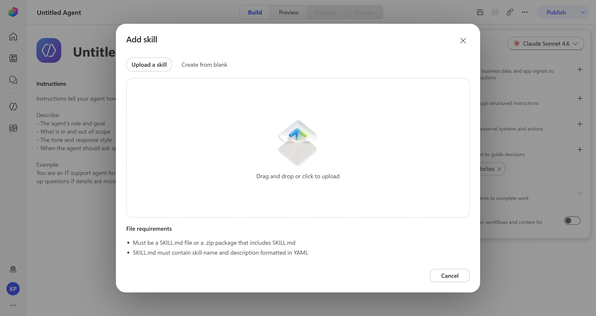
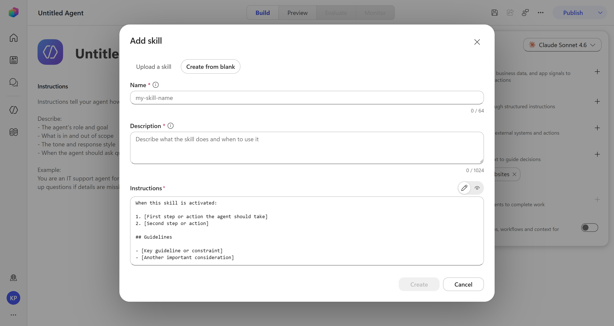
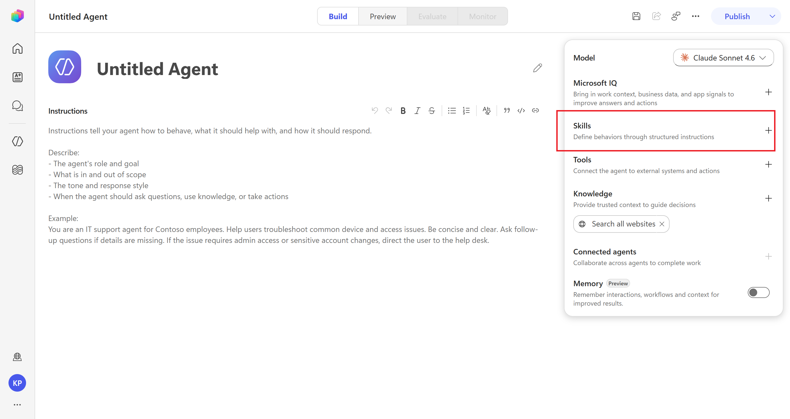

# 01. Creating Your First Skill: A Step-by-Step Walkthrough

## Overview
With prerequisites out of the way, this is the part most makers actually came for: opening the canvas and building a Skill. The mechanics are simple — a handful of clicks and a form to fill in. The judgment calls inside that form are where a Skill turns out either genuinely useful or quietly invisible to the very agent it was built for.

## Prerequisites: What You Need Before Building Your First Skill in Copilot Studio
Before you open the Add Skill panel for the first time, four categories of readiness are worth confirming:
- Environment and Licensing
- Permission and Access
- Platform Dependencies
- Your own conceptual readiness

Miss any one of these and the Skill you build might work perfectly in your hands and fail the moment it's promoted, shared, or handed to someone else to maintain.

### Skills You'll Need as an Author
Beyond the platform's technical requirements, there's a conceptual readiness worth being honest about before you start:
- **Comfort with variables and basic data shapes** — a Skill's inputs and outputs need to be designed deliberately, which means thinking in terms of typed data, not just conversational text.
- **Enough familiarity with prompt and instruction writing** to describe a role, a scope, and a tone clearly — this is closer to writing a specification than writing a chatbot script.
- **A basic mental model of how the orchestrator matches requests to Skills**, covered in Part 1 of this series — without that, it's easy to under-invest in the one field (the description) that determines whether your Skill ever gets used.

## Create your first skill
### 2 Paths: Upload or Create from Blank
There are two ways to create a Skill in Copilot Studio: Upload an existing Skill or Create

#### Upload a Skill
Expects a `SKILL.md` file, or a `.zip` package that contains one, formatted with YAML frontmatter carrying at minimum a name and description. This path is the one you'll use once Skills start getting authored outside the browser — in source control, shared across teams, or generated from a template.

#### Create from Blank
Creates a new Skill from scratch, starting with a blank canvas. This path is the one you'll use when you want to author a Skill directly in the browser, or when you want to start from a template and customize it.

## Step by Step: Building From Blank

#### Step 1: Open the Add Skill Panel
Open the agent you want to add a Skill to, and click the **`Skill`** button. This opens the Add Skill panel.

#### Step 2: Choose "Create from Blank"
This opens the Skill creation panel, where you can choose to create a Skill from blank or upload an existing one. Select **`Create from Blank`**.

#### Step 3: Fill in the Skill Details
- Name: Give your Skill a unique name that describes its purpose. The name should describe the job, not the technology behind it — `password-reset-flow` rather than `flow1` or `skill-a`. Treat it the way you'd treat a function name in code: someone unfamiliar with the implementation should be able to guess roughly what it does from the name alone.
- Description: Provide a brief description of what the Skill does. This is the single highest-leverage field on the form, and it's covered in depth below because it's worth getting right before moving on.
- Instructions: You can add instructions for how to use the Skill. Structure them around four things: the Skill's **role and goal**, what's **in and out of scope**, the **tone and response style**, and **when it should ask a clarifying question** rather than guess.

#### Step 4: Save the Skill
**Save, then open Preview**. Test with several realistic phrasings — not just the one you had in mind while writing it. Try a near-miss too: a request that's adjacent to this Skill's scope but shouldn't trigger it, to confirm the boundary holds.

## Avoiding Common Pitfalls ⚠️
- **Vague names and descriptions** — "Helper Skill" or "General Support" give the orchestrator nothing to match against, no matter how well the instructions underneath are written.
- **Describing the Skill's purpose without describing the trigger** — explaining what the Skill accomplishes, but never mentioning the words or phrasing that should lead to it being selected.
- **Skipping Preview testing** — finding out about a routing miss only after publishing, when a real user's phrasing didn't match what the description implied.
- **Writing instructions before deciding on scope** — starting to write step-by-step behavior before settling what's explicitly out of scope, which tends to produce a Skill that quietly overreaches into territory another Skill should own.

## Common Best Practices ✅
- Write the description last, after the instructions are drafted — by then you know precisely what the Skill does and can describe it specifically rather than aspirationally.
- Include the actual words or phrases a user would type, not just a category label.
- Test with a deliberate near-miss phrasing during Preview, not just the phrasing you expect — confirming a Skill doesn't fire is as important as confirming it does.
- Keep the name and description review as part of your definition of done for any Skill, the same way you'd review a function signature before merging code.

## Key Takeaways
- Building a Skill is mechanically simple — the two paths are Upload and Create from blank, and most first Skills use the latter.
- The real work is in the description and instructions, which define the Skill's scope and how it should behave.
- The description is the single highest-leverage field on the form, and it's worth getting right before moving on to the instructions.
- Instructions should be structured.