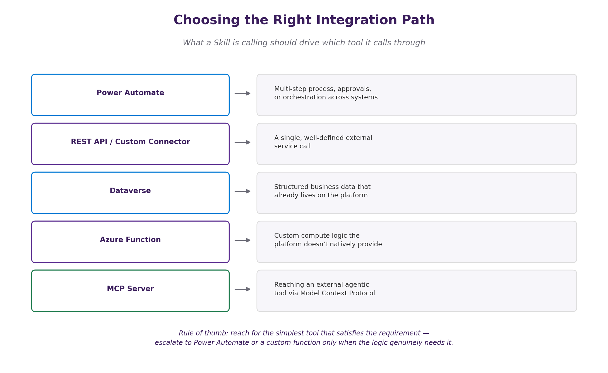
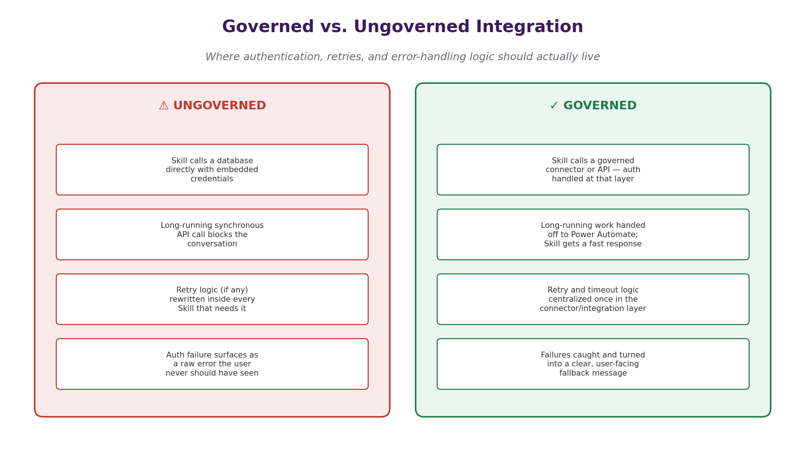

# 03. Integrating Skills With Enterprise Systems

## Overview
Almost no skill is useful in isolation. In order to be effective, skills must be integrated with enterprise systems and workflows. This allows them to access the necessary data, perform actions, and provide value to users in a seamless manner. It calls a flow, a database, an API, or another agentic tool — and the moment it does, the Skill stops being just a conversational design problem and becomes an integration architecture problem.

The architectural point worth internalizing before anything else: a Skill reuses the tools and knowledge sources already attached to its agent — it doesn't need, and shouldn't create, its own separate connection setup. That single principle resolves most of the design decisions covered below.

Few things worth calling out beyond the table above:
- **Power Automate** is the right choice the moment there's more than one step involved, or the call needs to be resilient to being slow — a flow can run asynchronously and hand the Skill a fast acknowledgment rather than making the whole conversation wait.
- **REST APIs** and custom connectors suit a single, well-defined external call where you want the Skill to get a direct, synchronous response.
- **Dataverse** is usually the right home for anything that's genuinely structured business data the organization already governs there — reaching for a custom API to fetch something that's really just a Dataverse table is unnecessary indirection.
- **Azure Functions** are a good choice for any custom logic that needs to run server-side, especially if it needs to be triggered by an event or run on a schedule. They can also serve as a bridge between the Skill and other enterprise systems.
- **MCP Server** is a good choice for any custom logic that needs to run server-side, especially if it needs to be triggered by an event or run on a schedule. They can also serve as a bridge between the Skill and other enterprise systems.

## Ungoverned vs. Governed Integrations
This is where integration architecture and Skill design intersect most directly. The question isn't just "can this Skill reach the system it needs" — it's "where does the responsibility for doing that safely and reliably actually live."

### Ungoverned Integrations
Without governance, each Skill is responsible for its own integration. This can lead to a proliferation of redundant connectors, inconsistent security practices, and a lack of visibility into how integrations are being used across the organization. While this approach may work for small teams or individual projects, it doesn't scale well in larger enterprises.

Ungoverned integrations can also make it difficult to maintain and update connections, as each Skill may have its own unique implementation. This can lead to increased technical debt and a higher risk of integration failures.

### Governed Integrations
With governance, integration responsibilities are centralized. This means that a dedicated team or platform manages the connections to enterprise systems, ensuring that they are secure, reliable, and consistent. Skills can then leverage these managed integrations without needing to handle the complexities themselves. This approach promotes reusability, reduces risk, and provides better oversight of how integrations are utilized across the organization.

Governed integrations can also facilitate easier maintenance and updates, as changes to the integration logic can be made in one place and automatically propagate to all Skills that rely on it.

## Common Best Practices for Integration
When integrating Skills with enterprise systems, consider the following best practices:
- Use a centralized integration platform or service to manage connections and credentials.
- Implement robust error handling and logging to monitor integration performance and troubleshoot issues.
- Ensure that integrations are secure, following best practices for authentication and authorization.

## Conclusion
Integrating Skills with enterprise systems is crucial for their effectiveness and usability. By following best practices and considering governance, organizations can ensure that their Skills are well-integrated, secure, and maintainable. This not only enhances the user experience but also maximizes the value that Skills can provide within the enterprise ecosystem.

#### Key Takeaways
- Skills should leverage existing tools and knowledge sources attached to their agent rather than creating separate connections.
- Governed integrations provide better oversight, security, and maintainability compared to ungoverned integrations.
- Best practices for integration include using centralized platforms, implementing error handling and logging, and ensuring secure authentication and authorization.
- Integrating Skills with enterprise systems is essential for their effectiveness and usability, enabling them to access necessary data, perform actions, and provide value to users seamlessly.
