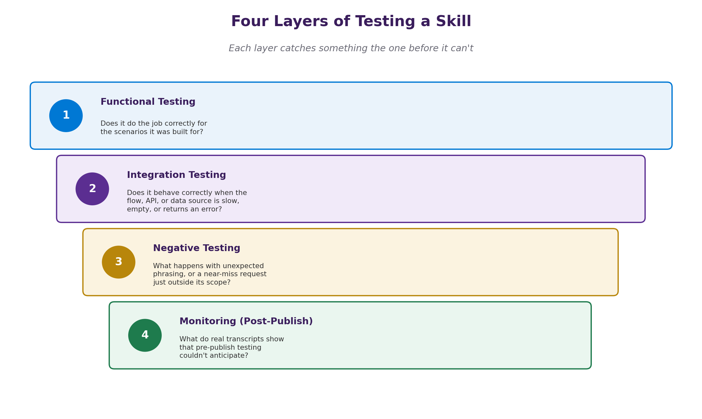
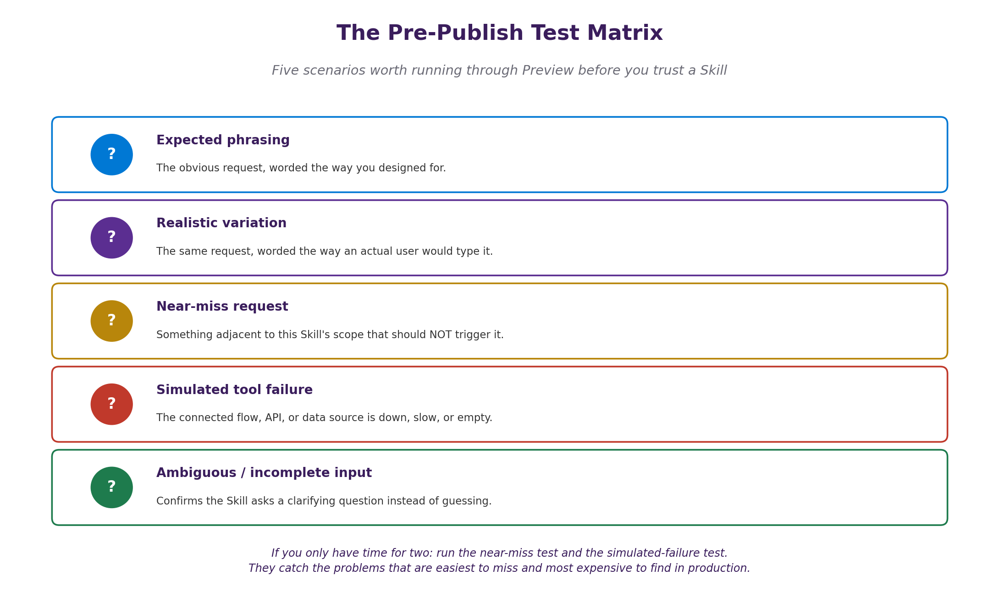

# 04. Testing a Skill Before You Trust It

## Overview
This is the last stop before you can trust your skill. Testing is a critical step in the development process, as it allows you to identify and fix any issues before deploying your skill to users. It's the one most likely to get compressed into "I tried it once in Preview and it worked". That's not really testing - it's confirming the one path you already had in mind. A Skill deserves the same testing discipline as an API: validating a contract across the cases you expected, the cases you didn't, and what happens when something downstream misbehaves.

### Testing Layers
Testing a skill can be broken down into several layers, each focusing on different aspects of the skill's functionality and performance. These layers include:

1. **Functional Testing**: This involves testing the skill's features and functionalities to ensure they work as intended.
2. **Integration Testing**: This focuses on testing how different components of the skill interact with each other and with external systems.
3. **Negative Testing**: This involves testing the skill's behavior when it receives unexpected or invalid inputs to ensure it handles errors gracefully.
4. **Monitoring (Post-Deployment Testing)**: This involves monitoring the skill's performance and behavior after it has been deployed to ensure it continues to function correctly in a live environment.

Apart from these layers, it's also important to consider the following aspects when testing a skill:
- **User Acceptance Testing (UAT):** This involves testing the skill from the perspective of the end-user to ensure it meets their needs and expectations.
- **Performance Testing:** This involves testing the skill's performance under various conditions, such as high traffic or limited resources, to ensure it can handle real-world usage scenarios.
- **Security Testing:** This involves testing the skill for vulnerabilities and ensuring it adheres to security best practices to protect user data and privacy.
- **Accessibility Testing:** This involves testing the skill to ensure it is accessible to users with disabilities and complies with accessibility standards.
- **Compliance Testing:** This involves testing the skill to ensure it complies with relevant regulations and industry standards, such as GDPR or HIPAA.
- **Localization Testing:** This involves testing the skill's functionality and content in different languages and regions to ensure it is suitable for a global audience.
- **Regression Testing:** This involves testing the skill after making changes or updates to ensure that existing functionality has not been negatively impacted.

## The Skill Test Matrix
The Skill Test Matrix is a tool that helps you organize and plan your testing efforts. It allows you to map out the different test cases, scenarios, and expected outcomes for your skill. By using a test matrix, you can ensure that you cover all aspects of your skill's functionality and performance during testing.

In practice, most of this comes down to running a handful of deliberate scenarios through Preview before you trust a Skill enough to publish it.

A few of these are easy to skip because they are obvious, but they are still worth doing. For example, if your skill is a calculator, you should test basic operations like addition and subtraction, as well as edge cases like dividing by zero or handling large numbers. If your skill interacts with external APIs, you should test how it handles API failures or unexpected responses.

- **The near-miss phrasing** is important because it helps you think about the edge cases and potential failure points of your skill. By considering these scenarios, you can identify areas where your skill may need additional error handling or validation to ensure a smooth user experience. 
  - "What happens if the user says something unexpected?"
  - "What happens if the API returns an error?"
  - "What happens if the user provides invalid input?"
  - "What happens if the skill is used in a way that wasn't anticipated?"

- **Simulated tool failure** is another important aspect of testing. By simulating failures in the tools or services your skill relies on, you can observe how your skill responds and ensure it handles these situations gracefully. This can help you identify potential issues and improve the overall reliability of your skill.

- **The clarifying-question approach** is a technique that involves asking questions to clarify the user's intent or to gather additional information. This can help you identify potential misunderstandings or miscommunications that may arise during skill usage. By testing how your skill handles clarifying questions, you can ensure it provides accurate and helpful responses to users.

## Monitoring: Testing doesn't end at publishing
However, testing doesn't end once your skill is published. Monitoring your skill's performance and behavior in a live environment is crucial to ensure it continues to function correctly and meets user expectations. This involves tracking key metrics, such as usage patterns, error rates, and user feedback, to identify any issues or areas for improvement. Treat the first few weeks after publishing a new Skill as an extended test phase: review transcripts specifically looking for near-misses (requests that should have triggered the Skill but didn't, or vice versa) and any point where the Skill's fallback message actually fired in production.

## Common Testing Pitfalls
When testing a skill, it's important to be aware of common pitfalls that can lead to incomplete or ineffective testing. Some of these pitfalls include:
- **Testing only the "happy path"** scenarios and neglecting edge cases or error conditions.
- **Never simulating failures or unexpected inputs**, which can lead to unhandled exceptions or crashes in production.
- **Failing to test the skill under realistic usage scenarios**, which can result in unexpected behavior in a live environment.
- **Treating publishing as the finishing line**, rather than an opportunity to continue testing and improving the skill based on real-world usage and feedback.

## Conclusion
Skill testing is a critical step in the development process that ensures your skill functions correctly, handles errors gracefully, and meets user expectations. By following a structured testing approach, using tools like the Skill Test Matrix, and monitoring your skill's performance post-deployment, you can build trust in your skill and provide a positive user experience. Remember to test thoroughly, consider edge cases, and continuously improve your skill based on feedback and real-world usage.

#### Key Takeaways
- Use a structured testing approach, such as the Skill Test Matrix, to organize and plan your testing efforts. 
- Test your skill across different layers, including functional, integration, negative, and post-deployment testing.
- Consider edge cases, simulate failures, and monitor your skill's performance after publishing to ensure it continues to function correctly and meets user expectations.