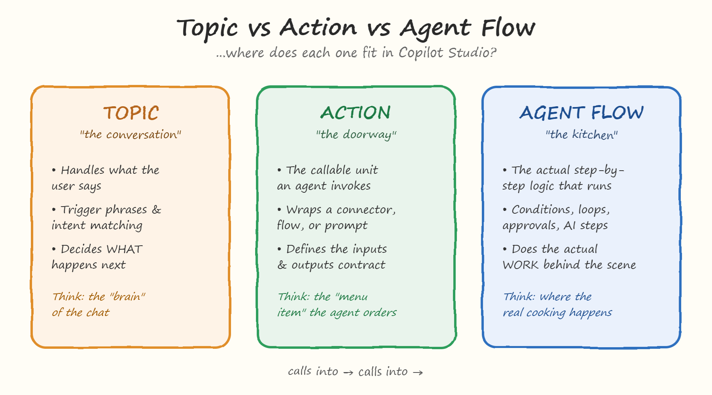
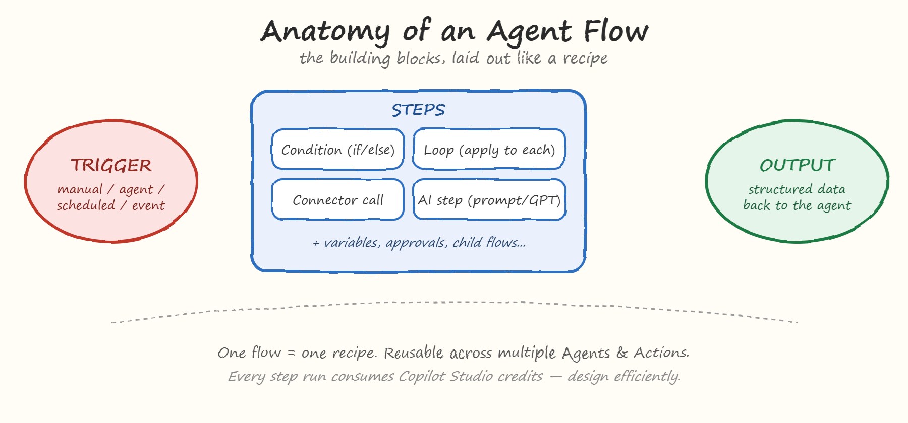
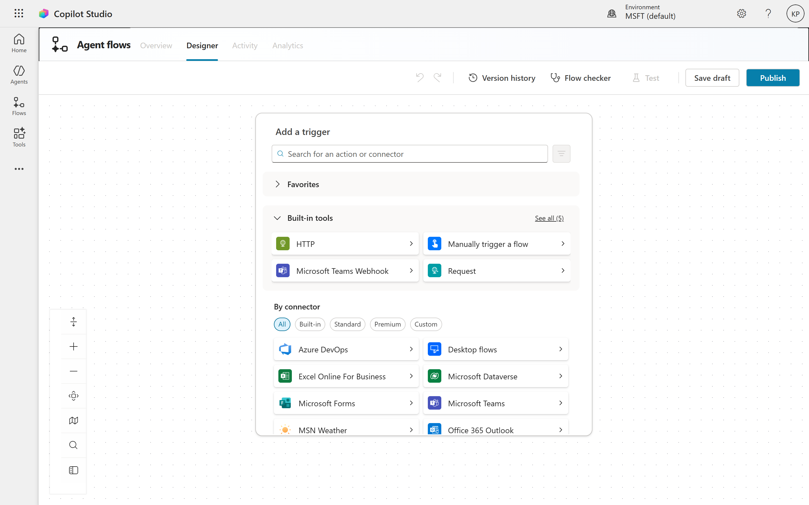
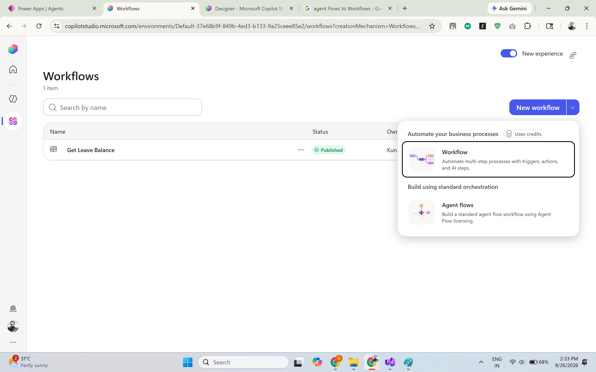

# 01. What Are Agent Flows? (The Foundation)

## Overview
If you've been following along with this series, you already know how to build a chatbot, design conversations, connect data sources, and even orchestrate multiple agents together. But there's one piece of the puzzle that quietly powers almost everything you've built so far: **Agent Flows**.

**Agent Flows** are a powerful feature in Copilot Studio that allow you to create complex, multi-step interactions with your users. They enable you to define a sequence of actions and responses that guide users through a process, making it easier for them to achieve their goals.

If **Topics** are the "brain" that decides what should happen in a conversation, and **Actions** are the "menu" of things an agent can do, **Agent Flows** are the kitchen where the actual work gets cooked.

### So, what exactly is an Agent Flow?
An Agent Flow is Copilot Studio's built-in, low-code automation engine. It shares its DNA with Power Automate, but it's been redesigned to live natively inside Copilot Studio and work hand-in-hand with your agents - no need to jump between two separate tools.
In plain terms: an Agent Flow is where you define step-by-step logic - conditions, loops, approvals, connector calls, and even AI-powered steps - that your agent can trigger to actually get something done, instead of just talking about it.

### How Agent Flows Differ from Things You Already Know?
This is the part that trips up a lot of citizen developers, so let's be precise:

| Concept | What it actully does|
|---------|--------------------|
| Topics | Decide what should happen in a conversation. |
| Actions | Define the menu of things an agent can do. |
| Agent Flows | Define the step-by-step logic that your agent can trigger to actually get something done. |

In short, a **Topic** decides what should happen → an **Action** is the request → an **Agent Flow** is what actually does the work.

### Why this matters for Business Users?
If you've only worked with Topics and simple Actions so far, this is the natural next step in your Copilot Studio journey. Agent Flows are what let you move from "an agent that answers questions" to "an agent that actually processes a request, updates a record, sends a notification, or makes a decision based on business logic."

This is also where a lot of real ROI shows up - because this is the layer where actual business processes (approvals, data updates, notifications) get automated, not just conversations.

## The Core Building Blocks of Agent Flows
Every Agent Flow is made up of a few core building blocks that you can combine to create powerful automations. Let's break them down:

- **Triggers:** These are the events that start your Agent Flow. A trigger could be a user asking a question, a specific action being called, or even an external event like a new record being created in a connected system.
- **Steps:** These are the individual actions that your Agent Flow will perform. Steps can include things like calling an API, sending an email, updating a database, or even invoking another Agent Flow.
- **AI-Specific steps:** These are steps that leverage AI capabilities, such as generating text, analyzing sentiment, or making predictions based on data. AI steps can be used to enhance the intelligence of your Agent Flow and provide more personalized experiences for users.

## When Should You Use an Agent Flow vs. a Topic vs. a Plain Action?
A simple rule of thumb:
- Use a **Topic** when you just need to manage conversation flow and decide what the user is asking for.
- Use a plain **Action** when you need to perform a simple task without any complex logic.
- Use an **Agent Flow** when you need to orchestrate multiple steps, handle conditional logic, or integrate with external systems.

## Where do Agent Flows live?
Agent Flows live in the **Agent Flows** section of Copilot Studio. You can access this section from the main navigation menu, and it provides a visual interface for designing and managing your flows. From here, you can create new flows, edit existing ones, and monitor their execution.

If you look at your Copilot Studio solution structure (the same Solution Explorer view you've been using throughout this series), Agent Flows show up as their own component type alongside Topics and Actions — reusable, versionable, and callable from more than one agent if you build them that way.

That reusability is a big deal: a well-designed Agent Flow isn't a one-off script buried inside a single chatbot. It's a modular building block you can call from multiple agents across your organization.

## Meet Workflows - A New Layer of Orchestration
Here's something worth knowing as you get comfortable with **Agent Flows:** Microsoft recently introduced a second, newer automation experience inside Copilot Studio, simply called **Workflows** (currently in public preview). If you open the "New workflow" menu today, you'll actually see both options side by side - **"Workflow"** and **"Agent flows"** - and it's easy to assume they're the same thing wearing different labels. They're not.

**Workflows** are built on a redesigned visual canvas, powered by what Microsoft calls the GitHub Copilot harness. The headline differences from classic Agent Flows:
- **Native AI actions and agent handoffs** are built into the canvas itself, rather than added as individual steps
- **Node-level testing**, so you can test one step of the automation at a time instead of running the whole flow
- A different **billing model** — Workflows consume Copilot Credits (usage-based), while classic Agent Flows consume Copilot Studio capacity
- Workflows can call **an agent directly as a node** mid-process — meaning you can build a mostly deterministic, rule-based process that "hands off" to an agent's reasoning only at the exact moment AI judgment is needed, then continues automatically

In other words, Microsoft's own framing is that **agents bring reasoning and adaptability, while workflows bring structure and consistency** - and the newest evolution is about making it easy to blend the two in a single process, rather than forcing an either/or choice.

**Should you use it yet?** Since Workflows are still in public preview, classic Agent Flows remain the stable, production-ready choice for most business processes today — and everything in this series will continue to use them. But it's worth keeping an eye on Workflows as they mature, especially if your use case involves handing off from a rule-based process to an AI agent partway through (think: a refund process that validates business rules automatically, then loops in an agent only if a judgment call is needed).

|  | Agent Flows (classic) | Workflows (preview) |
|----------------|--------------------|--------------------|
| Status | Stable, production-ready | Public preview / General Availibility |
| Canvas | Original Flow Designer | Redesigned visual canvas |
| AI Integration | AI steps added as individual steps | Native AI actions and agent handoffs built into the canvas |
| Testing | Full-Flow testing | Node-level testing |

## Final Thoughts
Agent Flows are the backbone of Copilot Studio's automation capabilities. They allow you to orchestrate complex processes, integrate with external systems, and leverage AI to enhance user experiences. By understanding when and how to use Agent Flows, Topics, and Actions, you can build more powerful and efficient agents that truly deliver value to your users.
Workflows are a newer evolution of this concept, offering a more structured and AI-integrated approach to automation. As you continue to explore Copilot Studio, keep an eye on how these tools can complement each other to create even more sophisticated solutions.