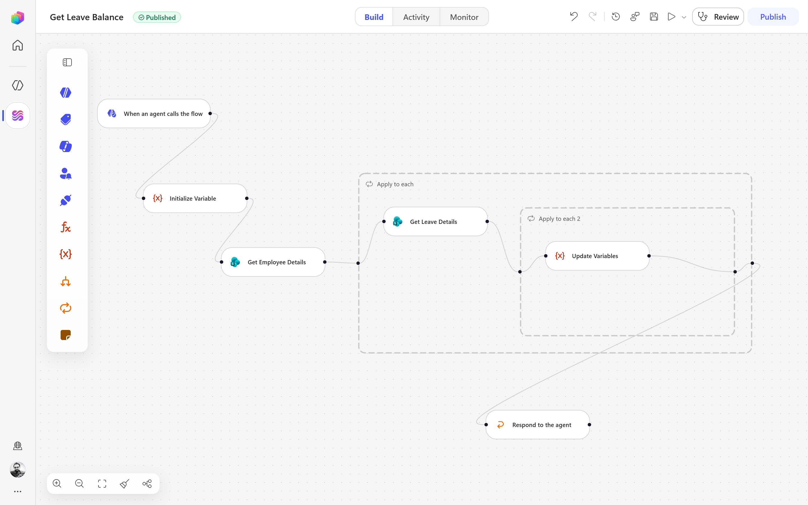

# 02. Core Components & How to Build Your First Agent Flow

## Overview
Earlier, we covered the foundation: what Agent Flows are, how they differ from Topics and Actions, and how the newer Workflows experience (public preview) fits alongside them. Now it's time to open the designer and actually build something.

Now that you understand the core concepts, let's dive into the **core components** of Agent Flows and walk through the process of building your first flow.

#### A Quick Recap: Two Ways to Build
Before we dive in, a quick refresher since this matters for the rest of the article:
- **Agent Flows (classic)** — the established, generally available designer, billed through Copilot Studio capacity
- **Workflows (preview)** — the newer, redesigned canvas with native AI actions and in-canvas agent handoffs, billed through Copilot Credits

The good part is: **the core components below are conceptually the same in both**. A trigger is still a trigger, a condition is still a condition. What changes is the canvas you build them in, and a few AI-native conveniences that Workflows adds on top. We'll call out the differences where they matter.

## Core Component
Every flow - classic or new - is assembled from the same handful of building blocks.
#### 1. Triggers - What starts the flow
Triggers are the starting point of any flow. They define the event or condition that initiates the flow's execution. In both Agent Flows and Workflows, triggers can be based on various events such as user actions, system events, or scheduled times.
- **Manual:** you (or maker) click "Run" on demand, useful for testing or ad-hoc execution.
- **Agent-Invoked:** the flow is triggered by an agent action, such as a user request or a specific command.
- **Scheduled:** the flow runs at predefined intervals or specific times, useful for recurring tasks.
- **Event-based:** the flow is triggered by specific events, such as a new message, a data update, or an external API call.

#### 2. Steps - The building blocks of the flow (what happens in the flow)
Steps are the individual actions or operations that occur within a flow. Each step represents a specific task or decision point in the process. Steps can include:
- **Conditions:** logical checks that determine the flow's path based on certain criteria.
- **Loop:** repeating a set of actions until a condition is met.
- **Variables:** storing and manipulating data within the flow.
- **Approvals:** requesting and managing approvals from users or systems.
- **Connectors:** integrating with external services or APIs to perform actions or retrieve data.

#### 3. AI-Specific Steps - Leveraging AI capabilities
AI-specific steps are designed to harness the power of artificial intelligence within your flows. These steps can include:
- **Build Prompts:** creating and managing prompts for AI models to generate responses or perform tasks.
- **Extracting data:** using AI to analyze and extract relevant information from unstructured data sources.
- **Create text with AI:** generating text content based on specific inputs or requirements.

In the newer **Workflows** experience, AI-specific steps are more seamlessly integrated, allowing for more advanced AI interactions and capabilities.

#### 4. Input/Output - Managing data flow
This is the part where you define what data goes into the flow and what comes out. Input and output management is crucial for ensuring that your flow can interact with other systems and processes effectively. In both Agent Flows and Workflows, you can define:
- **Input:** the data that the flow requires to execute, which can come from user input, external systems, or previous steps in the flow.
- **Output:** the data that the flow produces, which can be used by other systems, displayed to users, or passed to subsequent steps in the flow.

When an agent flow is triggered, it can receive input parameters that influence its behavior. Similarly, the flow can produce output parameters that can be consumed by other flows or systems.

## Let's Build Your First Agent Flow ("Get Leave Balance" - Step by Step)
Rather than a hypothetical, let's break down an actual, production-shaped example built on the new Workflows canvas: an HR self-service flow that an agent calls whenever an employee asks "What's my leave balance?" — and the flow does the calculation and hands a clean answer straight back.

#### Step 1: Define the Trigger
When an employee asks 'What's my leave balance?' in agent then it will trigger the flow. In Workflows, you can set this up as an **"When an agent calls the flow"** trigger, specifying the exact phrase or command that will initiate the flow.

#### Step 2: Set Up Input Parameters
Input parameters are essential for the flow to function correctly. In this case, you might need the employee's ID or username to look up their leave balance. Define these input parameters in the flow designer, ensuring they are clearly labeled and easy to understand.

#### Step 3: Initialize variables (optional, but recommended for better organization)
Before proceeding with the main logic, you can initialize variables to store intermediate data, such as the employee's leave balance or any other relevant information. This helps keep your flow organized and makes it easier to manage data throughout the process.

#### Step 4: Add Steps to Retrieve Leave Balance
A connector step can be added to call an external HR system or database to retrieve the employee's leave balance based on the provided input parameters. This step will involve configuring the connector with the necessary authentication and query details.

#### Step 5: Process the Retrieved Data
Process the data retrieved from the HR system. This may involve checking if the data is valid, formatting it for display, or performing any necessary calculations. You can use conditions and variables to manage this logic effectively.

#### Step 6: Generate the Response
Once the leave balance is retrieved and processed, you can use an AI-specific step to generate a natural language response. This step can take the processed data and create a user-friendly message that clearly communicates the employee's leave balance.

### Building this on new Canvas
This particular flow is built on the new Workflows canvas, which allows for a more streamlined and intuitive design experience. The AI-specific steps are integrated directly into the flow, enabling seamless interactions with AI models and enhancing the overall functionality of the flow.
- Each node can be tested in isolation, and the flow can be debugged step by step to ensure that it behaves as expected.
- The nested actions are collapsible, making it easier to manage complex flows with multiple steps and conditions.

## Testing and Debugging
Regardless of whether you're using the classic Agent Flows or the new Workflows canvas, testing and debugging are crucial steps in ensuring your flow works as intended. Both platforms provide tools to simulate flow execution, allowing you to identify and fix issues before deploying the flow to production.
- **Test in designer first:** Use the built-in testing features to run your flow with sample input data and verify that it behaves as expected.
- **Test nested loops with small, known dataset:** When testing loops, use a small dataset to ensure that the loop logic is functioning correctly and that it produces the expected results.
- **Use node-level testing to isolate issues:** If you encounter problems, test individual nodes or steps in isolation to pinpoint the source of the issue and make necessary adjustments.
- **Watch the AI steps closely:** When using AI-specific steps, monitor the input and output closely to ensure that the AI model is generating the desired responses and that any prompts are correctly formatted.

## Final Thoughts
What we've covered here is just the tip of the iceberg. Agent Flows and Workflows offer a wide range of capabilities that can be leveraged to create powerful, automated processes. As you become more familiar with the core components and how to build flows, you'll be able to create increasingly complex and sophisticated solutions that enhance productivity and streamline operations.