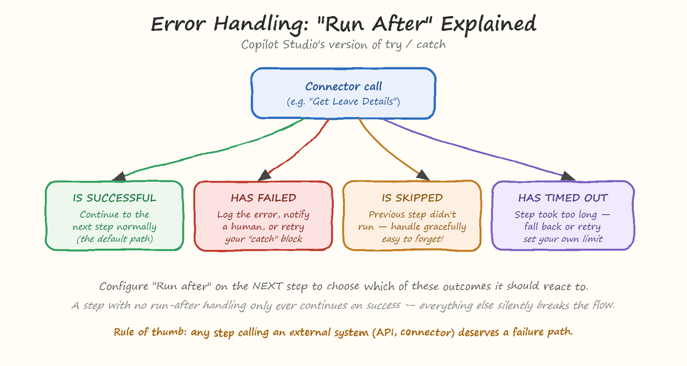
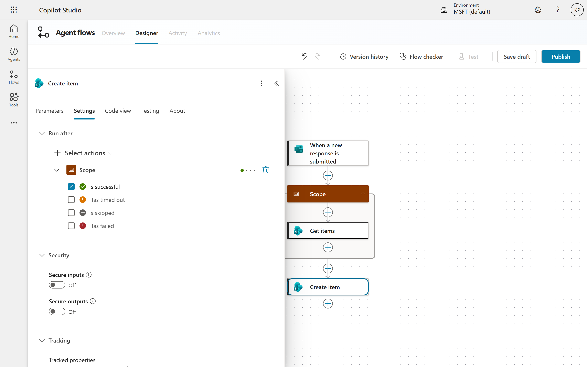
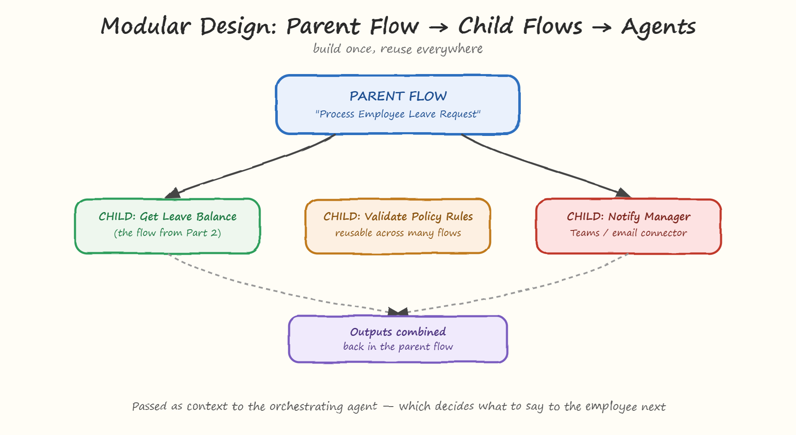

# 03. Advanced Patterns - Error Handling, Loops & Orchestration

We built a simple agent flow in the previous section. In this section, we will explore some advanced patterns that can help you build more robust and flexible agent flows. We will cover error handling, loops, and orchestration.

Real business processes aren't that forgiving. APIs go down, records go missing, and loops run into edge cases you didn't plan for. This section covers the patterns that turn a flow that works in the demo into one that's actually safe to run in production: error handling, working with loops and arrays at scale, calling child flows from a parent flow, and how flows fit into multi-agent orchestration.

## Error Handling
### Try/Catch, Copilot Studio Style: "Run After"
Most programming languages give you a `try/catch` block. Agent Flows give you something conceptually similar, called Run After - and it's the single most important production-readiness setting most citizen developers never touch.

Every step in a flow can finish in one of four ways:
- **Is Successful**: The step completed successfully and returned a result.
- **Is Skipped**: The step was skipped because a previous step failed or was skipped.
- **Has Failed**: The step failed to complete successfully.
- **Has Timed Out**: The step took too long to complete and was terminated.

By default, the next step in a flow will only run if the previous step was successful. But you can change that behavior by configuring the Run After settings for each step. For example, you can configure a step to run even if the previous step failed or was skipped. This allows you to handle errors gracefully and continue processing.

#### How to use this in practice?
- Select the **step** you want to configure.
- Open **Run After** settings.
- Configure it to also run when the previous step has failed (this becomes your "catch" block)
- Inside that path, add steps like: log the error, send a Teams/email alert to an admin, or set a fallback variable so the flow can gracefully tell the agent "I couldn't retrieve that right now" instead of failing with no explanation

<pre>
<b>Rule of thumb:</b> any step that calls an external system — a connector, a REST API, a database — deserves a failure path. If your flow only ever handles the success case, it's not production-ready yet, no matter how well it worked in testing.
</pre>

## Working with Loops and Arrays at Scale
Loops are a common pattern in programming, and they are also useful in agent flows. You can use loops to iterate over arrays of data, such as a list of records from a database or a collection of items from an API response.

The Get Leave Balance flow we built in the previous section is a good example of a flow that can benefit from loops. In that flow, we retrieved a list of leave balances for an employee and then iterated over that list to find the balance for a specific leave type. While working with small arrays is straightforward, you may encounter performance issues when working with large arrays. To handle this, you can use the "Apply to each" action in Copilot Studio, which allows you to process each item in an array individually.

For production scenarios, you may also want to consider using pagination or batching techniques to process large datasets in smaller chunks. This can help prevent timeouts and improve the overall performance of your flow. In production, loops need a bit more care:
- **Watch for empty arrays**. If "Get Leave Details" returns zero records for an employee with no leave history yet, your loop should handle that gracefully rather than erroring out. Add a condition before the loop to check if the array has items.
- **Be mindful of loop size and performance**. Looping over 5 leave types is trivial; looping over 5,000 rows from a connector call is not. Where possible, filter or query data before it enters the loop (e.g., filter by employee ID at the connector level) rather than pulling everything and filtering inside the loop.
- **Nested loops multiply run count**. A flow with an outer loop of 10 items and an inner loop of 10 items each performs 100 iterations, not 20. This matters both for performance and for how many times you're calling connectors — which ties directly into consumption and credits.

## Parent/Child Flows
As your Agent Flow library grows, you'll start noticing the same steps repeated across multiple flows - the same "get employee details" lookup, the same approval pattern, the same notification logic. Instead of copying and pasting steps everywhere, Copilot Studio lets you build a child flow once and call it from a parent flow, the same way a function gets called from other code. Parent/child flows are a powerful pattern that allows you to break down complex processes into smaller, reusable components. A parent flow can call one or more child flows, passing data between them as needed. This modular approach makes it easier to manage and maintain your flows, as well as promoting reusability.

### Why this matters?
- **Build once, reuse everywhere**. A "Validate Policy Rules" child flow can be called from a leave-request flow, an expense-approval flow, and an onboarding flow — update the logic in one place, and every parent flow benefits.
- **Easier to maintain**. A parent flow that calls three clearly-named child flows is far easier to read and troubleshoot than one giant flow with 40 steps crammed together.
- **Cleaner testing**. You can test each child flow in isolation — confirm "Get Leave Balance" works correctly on its own before wiring it into a larger "Process Leave Request" parent flow.

A practical parent/child example: a "Process Employee Leave Request" parent flow could call the Get Leave Balance child flow (ealrier example) to check eligibility, a Validate Policy Rules child flow to confirm the request is allowed, and a Notify Manager child flow to send the approval request - combining all three outputs before responding back to the orchestrating agent.

## Combining Agent Flows with Connectors and REST APIs
You've already used connector calls throughout this series, but it's worth being explicit about how this scales in advanced flows:
- Prebuilt connectors are the easiest way to integrate with common systems like Microsoft 365, Salesforce, or ServiceNow. They handle authentication and data formatting for you, so you can focus on the business logic of your flow.
- If a connector doesn't exist for your system, you can use the HTTP action to call REST APIs directly. This gives you more flexibility but requires you to handle authentication, request formatting, and response parsing yourself.
- Combine multiple connectors and REST API calls in a single flow to orchestrate complex business processes. For example, you might retrieve data from a database using a connector, process that data in your flow, and then send the results to an external system via a REST API call.
- When calling multiple connectors or APIs, consider the order of operations and error handling. If one step fails, you may need to handle that failure gracefully and decide whether to continue with the next steps or abort the flow.
- Be mindful of rate limits and throttling when calling external systems. If you're making a large number of requests, you may need to implement retry logic or batch your requests to avoid hitting limits.

The key advanced-pattern habit: wrap every REST/API call in the same error-handling discipline as connector calls — timeouts and failures are more likely with custom API calls, not less.

## Performance and Governance Considerations
When building advanced agent flows, it's important to consider performance and governance. Here are some best practices to keep in mind:
- **Timeouts:** Set appropriate timeout values for your steps, especially when calling external systems. This helps prevent your flow from hanging indefinitely if a system is unresponsive.
- **Retry Logic:** Implement retry logic for steps that may fail due to transient issues, such as network errors or temporary unavailability of external systems. This can help improve the reliability of your flows.
- **Logging and Monitoring:** Implement logging and monitoring for your flows to track their performance and identify any issues. This can help you proactively address problems before they impact users.
- **Throttling and Rate Limits:** Be aware of any throttling or rate limits imposed by external systems and design your flows accordingly. This may involve implementing delays, batching requests, or using other techniques to avoid hitting limits.
- **Credits and Capacity:** Keep an eye on your flow's consumption of credits and capacity, especially if you're calling multiple connectors or APIs. This can help you avoid unexpected costs or service disruptions.

## Conclusion
In this section, we explored advanced patterns for building robust and flexible agent flows in Copilot Studio. We covered error handling using the Run After settings, working with loops and arrays at scale, parent/child flows for modularity and reusability, combining agent flows with connectors and REST APIs, and performance and governance considerations.

Advanced patterns are essential for building production-ready flows that can handle real-world scenarios. By implementing these patterns, you can create flows that are more resilient, maintainable, and scalable, ultimately leading to better user experiences and more efficient business processes.