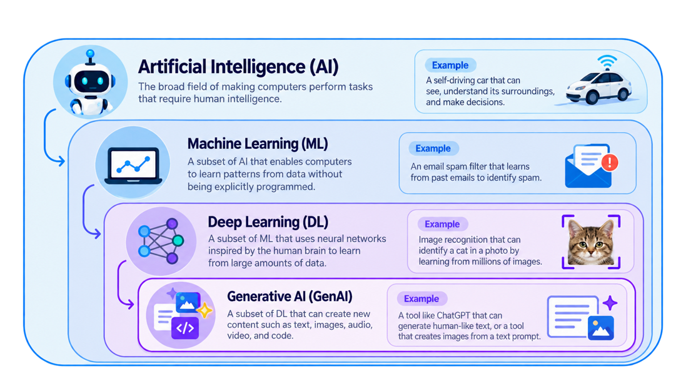
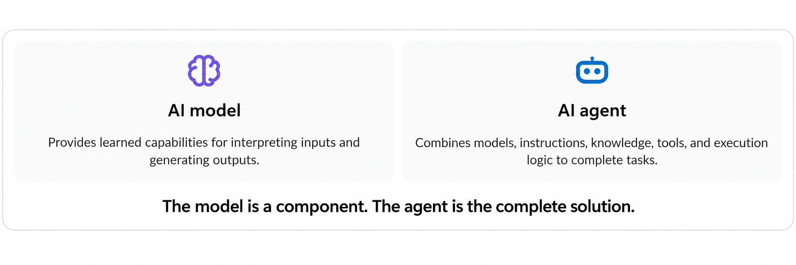
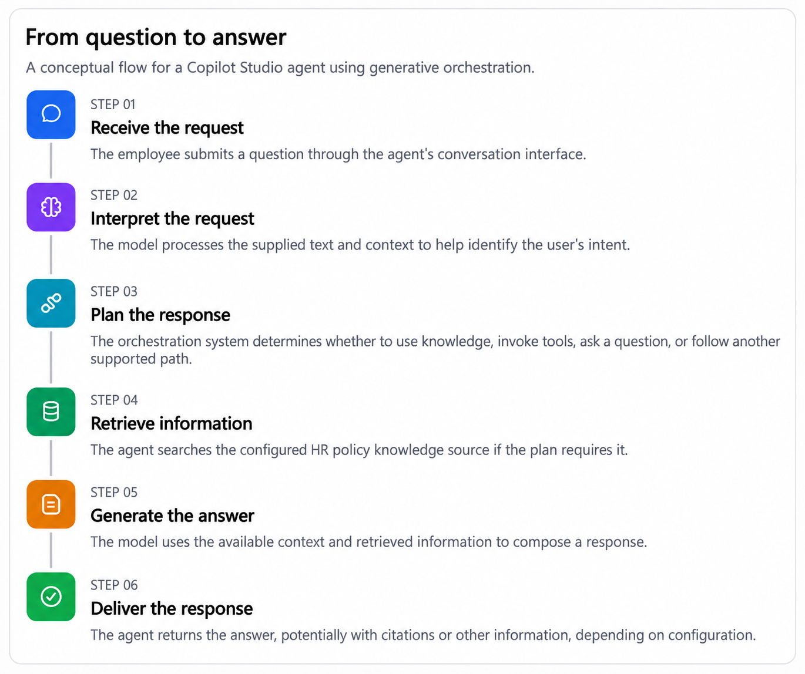
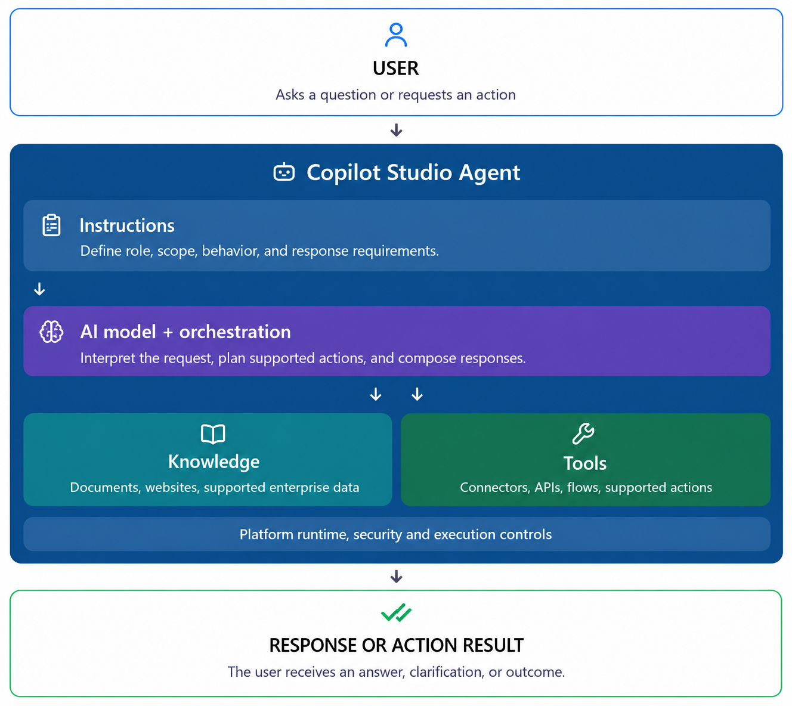

# 01. Introduction to AI Model - Understanding the intelligence behid your agent

## Introduction
AI model is a mathematical representation of a real-world process or system that is designed to perform specific tasks, such as recognizing patterns, making predictions, or generating content. In the context of Copilot Studio Agent, AI models are the core components that enable the agent to understand and respond to user inputs intelligently.

Think of an AI model as the brain of your agent. Just like how our brains process information and make decisions, AI models process data and generate outputs based on learned patterns and knowledge. These models are trained on large datasets, allowing them to learn from examples and improve their performance over time.

Imagine you have just joined a growing organization. It's your first week, and you have two questions.

The first is simple:
<pre>
"How many annual leave days am I entitled to?"
</pre>

The second is more complex:
<pre>
"I joined in April, have eight unused leave days, and plan to resign in December. Can I carry forward my leave, or will it be encashed? Please explain based on the company's policy."
</pre>

Traditionally, you might contact HR, search through policy documents, or wait for someone to respond. But your organization has introduced an AI-powered HR assistant. You ask the first question. The agent retrieves the relevant policy and answers. You ask the second question. The agent needs to consider multiple policy conditions, retrieve relevant information, and explain the outcome without inventing rules.

Both questions are handled by an AI agent.

But do they require the same level of reasoning? Should we evaluate their model requirements in exactly the same way?

Not necessarily.

This brings us to an important concept in agent development: **AI model selection**.

Before exploring which models are available in Copilot Studio and how to select them, we need to understand what an AI model actually is and how it fits into the architecture of an agent.

That's exactly what we will explore in this edition.

## What is an AI Model?
An AI Model is a mathematical construct that enables machines to perform tasks that typically require human intelligence. These tasks can include understanding natural language, recognizing images, making decisions, and more. AI models are built using algorithms that learn from data, allowing them to identify patterns and make predictions or decisions based on new inputs. During training, the model adjusts its parameters to minimize errors and improve accuracy. Once trained, the model can be deployed to perform tasks in real-world scenarios.

Let's start something familiar. Imagine of na experienced chef. The chef has spent years learning recipes, techniques, and flavor combinations. When presented with a new ingredient or dish, the chef can draw upon this knowledge to create something delicious. Similarly, an AI model learns from data and can apply that knowledge to new situations.

You give the chef a new request:
<pre>
"Create a dessert using chocolate and strawberries."
</pre>
The chef draws upon their experience and knowledge of flavors to create a new dessert that combines chocolate and strawberries in a delightful way. The chef's ability to understand the properties of the ingredients and how they interact allows them to make informed decisions and create something unique.

In the same way, an AI model can take in new data and generate outputs based on its learned knowledge. For example, if you provide an AI model with a dataset of customer reviews, it can learn to identify positive and negative sentiments and generate insights about customer satisfaction.

However, an AI model does not inherently know your organization's current HR policies, live customer records, or internal business processes.

Those capabilities require additional information and integrations.

## AI Vs ML Vs LLM Vs Agent
We have heard terms such as Artificial Intelligence, Machine Learning, Large Language Models, Generative AI, and AI Agents. They are related, but they are not interchangeable.

### Where does Generative AI fit in?
Generative AI refers to AI systems that generate new content, including text, images, audio, and code.

Large language models, or LLMs, are a major category of generative models focused primarily on language and related tasks. Some modern models are multimodal and can process additional input types.

An AI agent is different: it is a system that uses models alongside instructions, information, tools, and execution logic to accomplish goals.

#### An important distinction

## In reality: Building an agent is like running a restaurant
Let's return to our chef analogy. Imagine you are running a restaurant. The chef (AI model) is responsible for preparing dishes based on recipes and ingredients. However, the restaurant also has waitstaff, a menu, a reservation system, and customer service protocols. The chef alone cannot run the restaurant; they need the support of the entire team and systems in place.

A successful restaurant requires a combination of skilled chefs, efficient waitstaff, a well-designed menu, and effective management. Similarly, an AI agent requires a combination of AI models, instructions, information, tools, and execution logic to function effectively.

Similary, a busines agent requires a combination of AI models, instructions, information, tools, and execution logic to function effectively. The AI model is just one component of the agent's overall architecture, and it works in conjunction with other elements to achieve the desired outcomes.

| Restaurant Component | AI Agent Component |
|----------------------|------------------|
| Customer (provides input) | User (provides input) |
| Chef (prepares dishes) | AI Model (processes data and generates outputs) |
| Waitstaff (takes orders and serves food) | Instructions (guides the AI model on how to respond) |
| Recipes (guides the chef) | Information (provides context and knowledge for the AI model) |
| Kitchen tools (used by the chef) | Tools (used by the AI model to perform tasks) |
| Head Chef (oversees the kitchen) | Orchestration (manages the overall flow and coordination of the agent) |
| Meal (final output) | Output (final response or action taken by the agent) |

Imagine asking the chef to prepare a specific dish. If the ingredients are missing, the chef cannot reliably prepare it. If the restaurant has no oven, asking the chef to bake a cake does not magically create one.

Similarly, telling a Copilot Studio agent to retrieve a customer record does not give it access to your CRM. You must configure an appropriate tool or knowledge source and provide the necessary permissions.

<pre>
<b>Note:</b> Agent instructions cannot make an agent use resources that have not been configured.
</pre>

## How does an AI model process a user request?
Now let's follow the actual conversation between a user and an AI agent. The user asks a question, and the agent processes the request using its AI model, instructions, information, tools, and execution logic.

An employee asks the agent:
<pre>
"How many annual leave days can I carry forward?"
</pre>

What happen's behind the scenes?

This is a logical explanation, not a claim that Copilot Studio makes exactly one model call per step. The actual execution can involve multiple model invocations, retrieval operations, tool calls, and platform-managed processing.

### A closer look: How does an LLM generate text?
A language model does not retrieve a complete answer from a fixed database of memorized responses.

Instead, the input is represented as tokens, which are units of text.

The model processes those tokens and predicts a probability distribution over possible next tokens. During generation, tokens are selected iteratively to produce the response.

Its output depends on factors such as the supplied context, learned parameters, decoding configuration, and other model or platform settings.

This is why two responses to the same question may differ in wording, even when the underlying information is similar.

It also explains why fluent language is not proof of factual correctness.

A model can produce a convincing answer that is incomplete or incorrect.

For business applications, that makes grounding, testing, and appropriate controls essential.

## Understanding the architecture of an AI agent
We know that an AI agent is more than just an AI model. It is a system that combines multiple components to achieve its goals. Let's break down the architecture of an AI agent:

Let's connect them.

## Why does model selection matter?
Model selection is a critical step in the development of an AI agent. Different models have different strengths, weaknesses, and capabilities. Choosing the right model for your agent can significantly impact its performance, accuracy, and ability to handle specific tasks.

it identifies differences among models, such as their training data, architecture, and intended use cases. For example, some models may excel at understanding natural language, while others may be better suited for image recognition or data analysis. Model selection is therefore a design decision rather than simply a configuration preference.

We will explore model selection in more detail in the sub-sequent sections, including how to evaluate models based on your agent's requirements and the trade-offs involved in choosing one model over another.

## Final thoughts
AI Models are the core components that enable AI agents to understand and respond to user inputs intelligently. They are trained on large datasets, allowing them to learn from examples and improve their performance over time. However, an AI model alone is not sufficient to create a functional agent. It must be combined with instructions, information, tools, and execution logic to achieve the desired outcomes.

Remember, building an AI agent is like running a restaurant.

A great restaurant is not created by hiring a great chef alone.

It requires the right ingredients, equipment, instructions, and coordination.

The same applies to Copilot Studio.

A capable AI model is important, but it is only one component of a successful enterprise agent.

The real objective is not simply to choose the most powerful model.

It is to build an agent whose model, knowledge, instructions, tools, and orchestration work together to meet the business requirements.