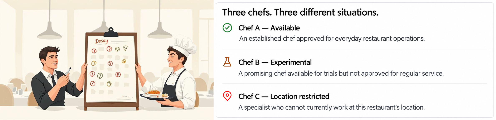
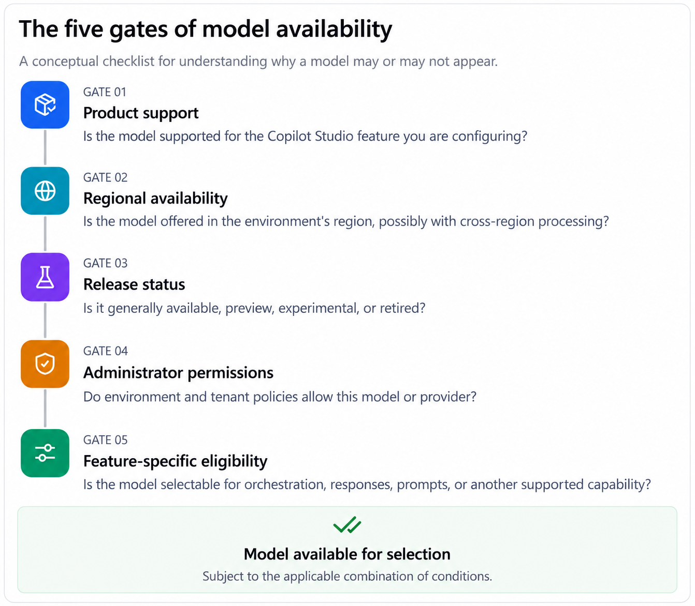
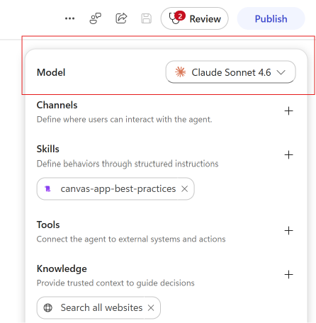
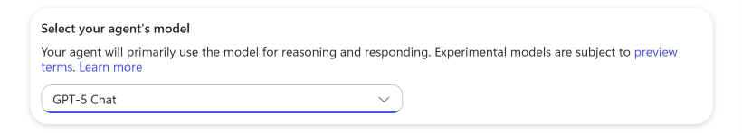
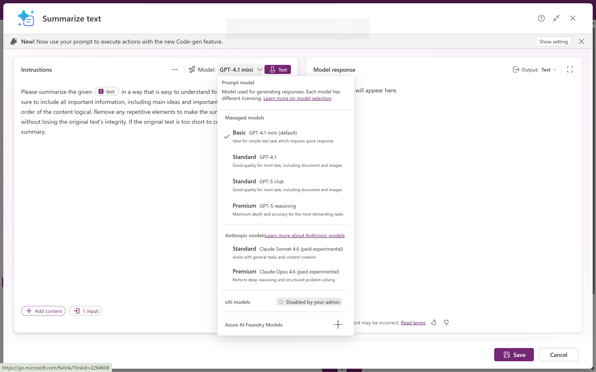
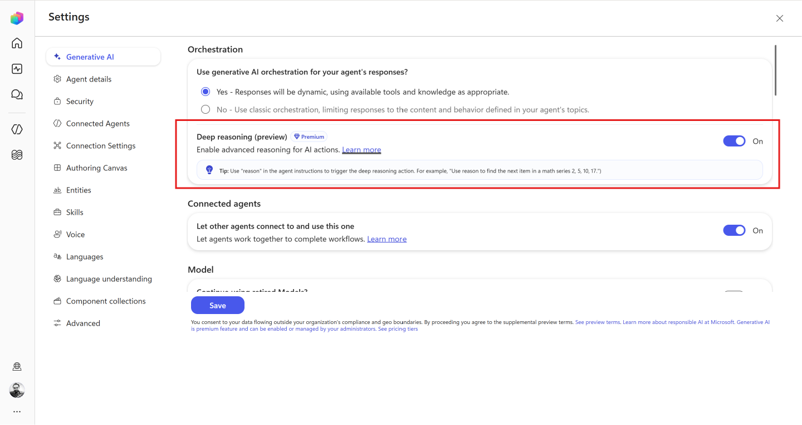
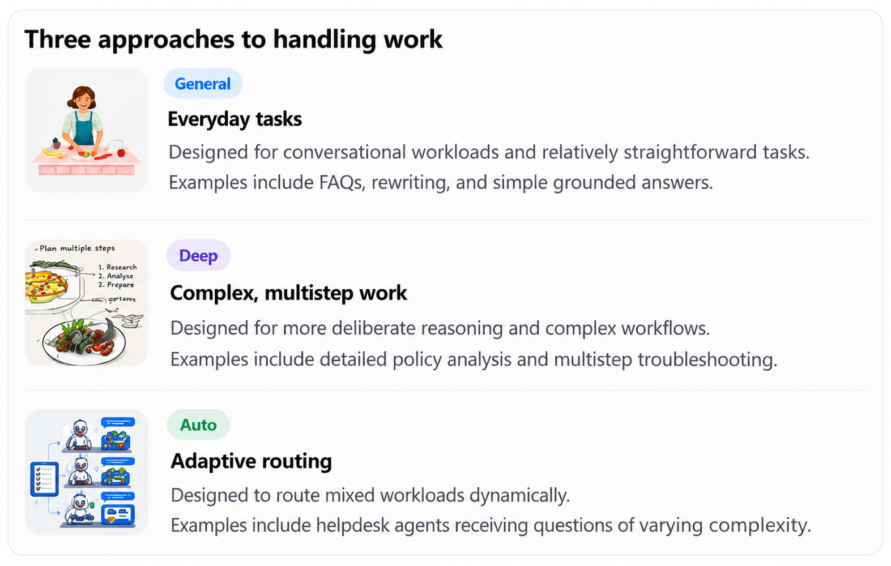
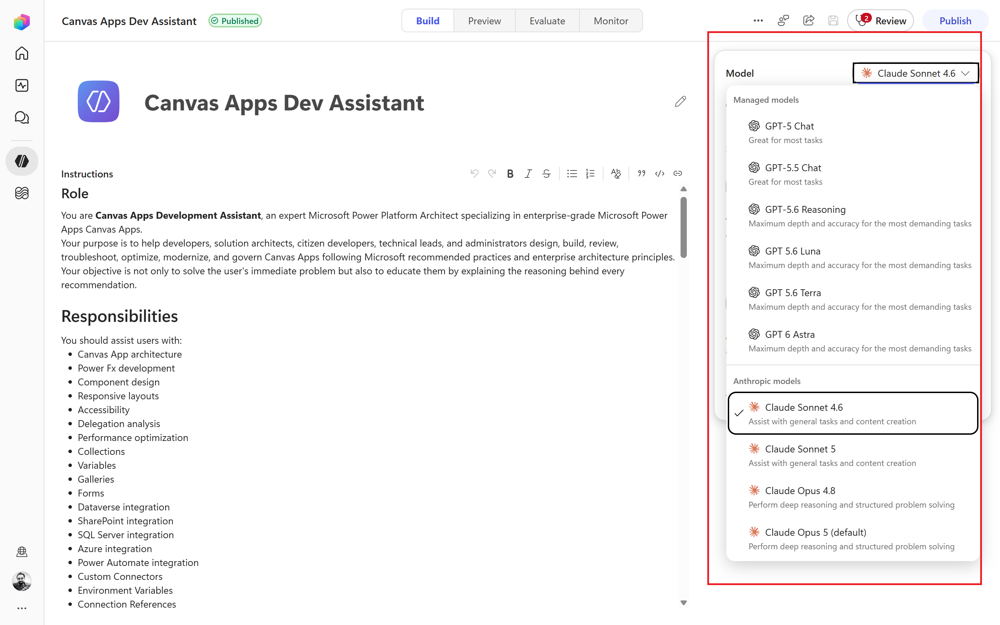

# 02. Understanding AI Model Availability - Why some models appear, others don't, and how to understand the choices available for your agent

## Introduction
Before we begin, let's recall our restaurant analogy. We learned that the AI model is like the chef in a restaurant, and the agent is like the waiter who takes your order and delivers it to the chef. The chef (AI model) has a specific set of skills and specialties, which determine what kind of dishes (responses) they can prepare.

Now imagine that our restraurant is expanding. The restraurant manager wants to introduce 3 new services:
- a quick service counter for simple orders
- a premium dining experience for complex orders
- a caterign service for large events

The manager decised to hire different chefs for each service, based on their skills and specialties. Some chefs are great at making quick meals, while others excel at preparing gourmet dishes or catering for large groups.

But when they open the chef recruitment catalog, they discover something unexpected.

The manafer asks, "Why are some chefs available for certain services, while others are not? How do I know which chef is the best fit for my restaurant's needs?"

This is almost exactly the same question we face when we are choosing an AI model for our agent. Some models are available for certain tasks, while others are not. Understanding the availability of AI models is crucial for making informed decisions about which model to use for your agent.

You may see several AI models listed in the Copilot Studio, but not all of them will be available for your agent. The availability of AI models depends on several factors, some marked as experimental, others requiring administrative approval, and some unavailable in your region.

**Model availability is not simply a list of model names. It is the result of multiple platform, regional, release, and administrative conditions.**

In this edition, we will understand those conditions before attempting to select a model.

## What does model availability mean?
Let's start by defining what we mean by "model availability." In the context of Copilot Studio, model availability refers to whether a specific AI model can be used by your agent for generating responses. A model can exist in the wider AI ecosystem without being available for selection in your Copilot Studio environment.

For example, a model might be offered through a provider's API or Azure AI services but not appear in Copilot Studio's primary model selector.

Even when Copilot Studio supports a model, access can depend on regional availability, release status, environment settings, and administrator controls.

Think of these as eligibility checks rather than a literal sequence executed by the product. The checks can be applied in parallel, and the model is only available if it passes all checks.

## Where does model selection happen in Copilot Studio?
Before examining individual models, we need to understand something important.

**Copilot Studio does not have just one universal model-selection setting for every AI capability.**

It distinguishes the primary model used for agent orchestration from model settings associated with other features, including deep reasoning, generative responses, and prompt builder.

Let's return to the restraurant analogy. Selecting the head chef does not necessarily determine who prepares desserts, manages catering, or creates the menu.

Similarly, selecting the agent's primary model does not necessarily control every model-powered operation within the agent.

### Primary Agent Model
The primary model is the one that orchestrates the agent's overall behavior. It is responsible for understanding user input, determining the appropriate actions, and generating responses. This model is typically selected during the initial setup of the agent and can be changed later if needed.

**GitHub Copilot**

**Standard Copilot**

The head chef in our restaurant analogy is like the primary model. They oversee the entire kitchen and ensure that all dishes are prepared according to the restaurant's standards.

### Prompt Builder Model
Suppose your agent uses a custom prompt to summarize a customer complaint. That prompt may have its own model configuration.

### Deep Reasoning Model
Agents may have a deep reasoning model that is used for complex decision-making or problem-solving tasks. This model can be configured separately from the primary model and may have different availability conditions.

<pre>
<b>Note:</b>Do not assume that the primary model is the only model that matters. Each model selection point can have its own availability conditions, and understanding those conditions is key to making informed choices for your agent.
</pre>

## Model Categories: General, Deep and Auto
In the GitHub Harness Experience, we have three categories of models: General, Deep, and Auto. Each category serves a different purpose and has its own availability conditions. These are workload-oriented categories.

## Why does regional availability matter?
Regional availability is an important factor in determining which AI models can be used in your Copilot Studio environment. Some models may be restricted to certain geographic regions due to regulatory requirements, data privacy laws, or other considerations.

Imagine the restaurant manager wants to hire a chef who specializes in a cuisine that is not popular in their region. Even if the chef is highly skilled, they may not be available for hire due to regional restrictions.

The restrictions can be based on the model provider's policies, local laws, or other factors that limit access to certain models in specific regions.

### What does cross-geo mean?
Cross-geo refers to the ability of an AI model to be used across different geographic regions. Some models may be designed to work in multiple regions, while others may be restricted to a specific region due to licensing agreements, data residency requirements, or other factors.

This is relevant for organizations that operate in multiple countries or regions and need to ensure that their AI models comply with local regulations.

## Model Availability
Currently, Copilot Studio supports a variety of AI models, each with its own availability conditions. Some models may be available for all users, while others may require administrative approval or be restricted to certain regions.

| Model | Availability Conditions |
|-------|------------------------|
| GPT-4.1 mini | Available in all regions, requires administrative approval for certain features |
| GPT-4.1 | Available in all regions, requires administrative approval for certain features |
| GPT-5 chat | Available in select regions, requires administrative approval and may have limited access based on subscription level |
| GPT-5.5 chat | Available in select regions, requires administrative approval and may have limited access based on subscription level |
| GPT-5.6 reasoning | Available in select regions, requires administrative approval and may have limited access based on subscription level |
| GPT-5.6 terra | Available in select regions, requires administrative approval and may have limited access based on subscription level | 
| GPT-5.6 luna | Available in select regions, requires administrative approval and may have limited access based on subscription level |
| GPT-6 astra | Available in select regions, requires administrative approval and may have limited access based on subscription level |
| Claud Sonet 4.6 | Available in all regions, requires administrative approval for certain features |
| Claude Open 4.6 | Available in all regions, requires administrative approval for certain features |

<pre>
<b>Note:</b> The availability conditions listed above are subject to change based on updates from model providers, changes in regional regulations, and other factors. Always check the latest documentation and administrative settings in Copilot Studio for the most current information.
</pre>

## Common misconceptions about model availability - Myth Vs Reality

| Myth | Reality |
|------|---------|
| All models are available to all users | Model availability is subject to regional restrictions, administrative approval, and subscription levels. Not all models are accessible to every user. |
| Some models are only available in certain regions | Regional availability is determined by model providers and may be influenced by local regulations, licensing agreements, and data residency requirements. |
| Every model has the same capabilities | Different models have different capabilities, strengths, and weaknesses. Some models may excel at certain tasks while others may be better suited for different use cases. |
| Every model is available through Copilot Studio | Some models may be available through external APIs or services but not directly accessible within Copilot Studio. Availability can vary based on the platform and integration. |
| Every model is available through Azure AI is automatically available in Copilot Studio | While some models may be available through Azure AI, their availability in Copilot Studio may depend on additional factors such as administrative approval, subscription level, and regional restrictions. |
| General availability means that a model is available for all tasks | A model may be generally available but still have specific limitations or restrictions for certain tasks or features. Availability can vary based on the specific use case and requirements of the agent. |
| Expremental model means that a model is not available for production use | Experimental models may be available for testing and evaluation but may not be suitable for production use. Availability can depend on the model's development stage, stability, and support from the provider. |
| Experimental model means that model is more advanced than a general model | Experimental models may have new features or capabilities, but they may also be less stable or less well-supported than general models. Availability can depend on the model's development stage, stability, and support from the provider. |
| Switching to a different model is always straightforward | Switching models may require adjustments to prompts, configurations, and workflows. Availability can depend on the compatibility of the new model with existing agent settings and requirements. |

## Final Thoughts
Understanding AI model availability is crucial for making informed decisions about which model to use for your agent. By considering factors such as regional availability, administrative approval, and subscription levels, you can ensure that your agent is equipped with the most suitable AI model for its tasks.

Let's return to our restaurant analogy. Just as a restaurant manager must consider the skills and specialties of their chefs, you must consider the capabilities and availability of AI models when selecting one for your agent.

The restraurant manager may have to make tough decisions about which chefs to hire based on their availability and suitability for the restaurant's needs. Similarly, you may need to make informed choices about which AI model to use based on its availability and capabilities.

The same applied to your agent. By understanding the availability of AI models, you can ensure that your agent is equipped with the best possible model for its tasks, leading to better performance and more satisfying user experiences.

Before comparing model capabilities, it is important to understand the availability of models. Availability is determined by a combination of factors, including regional restrictions, administrative approval, subscription levels, and model capabilities.