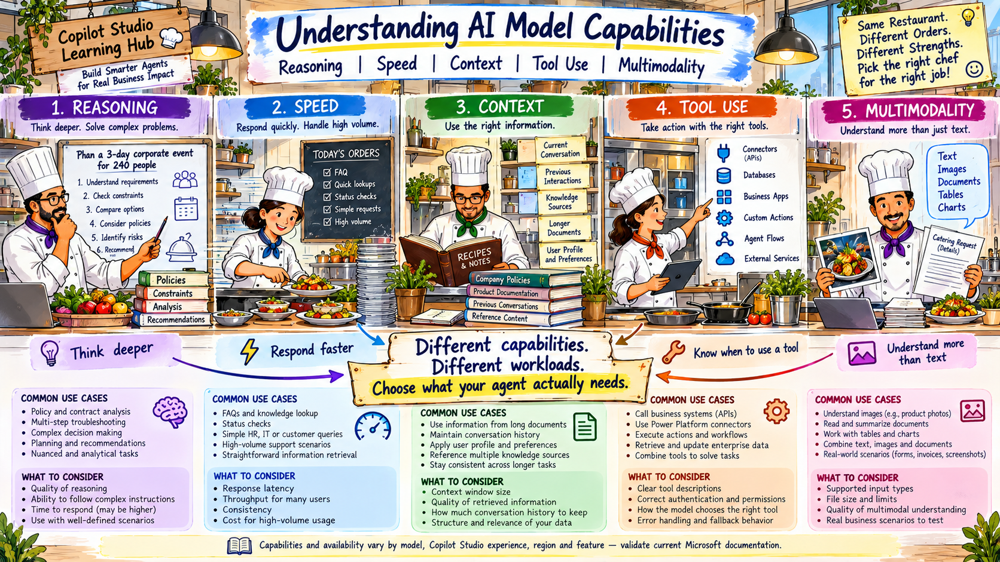
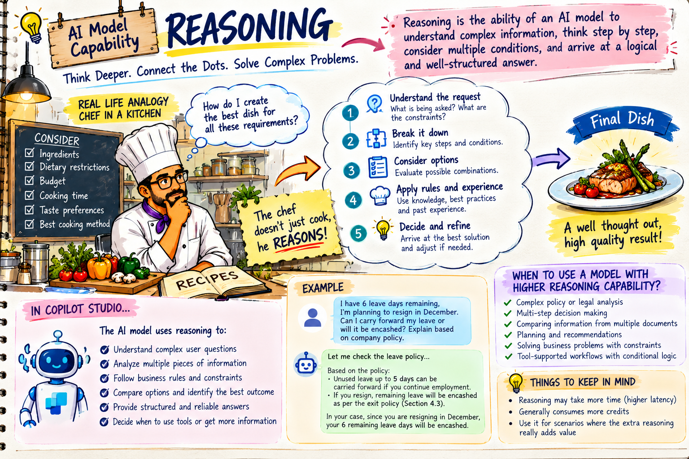
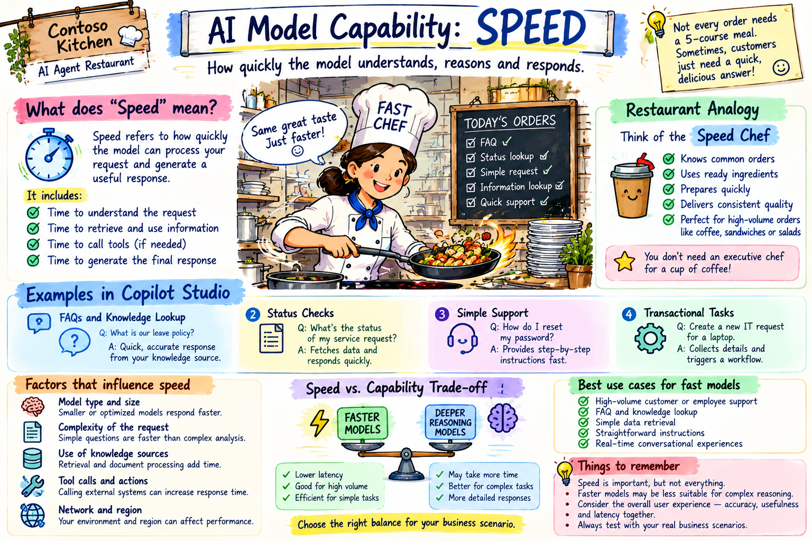
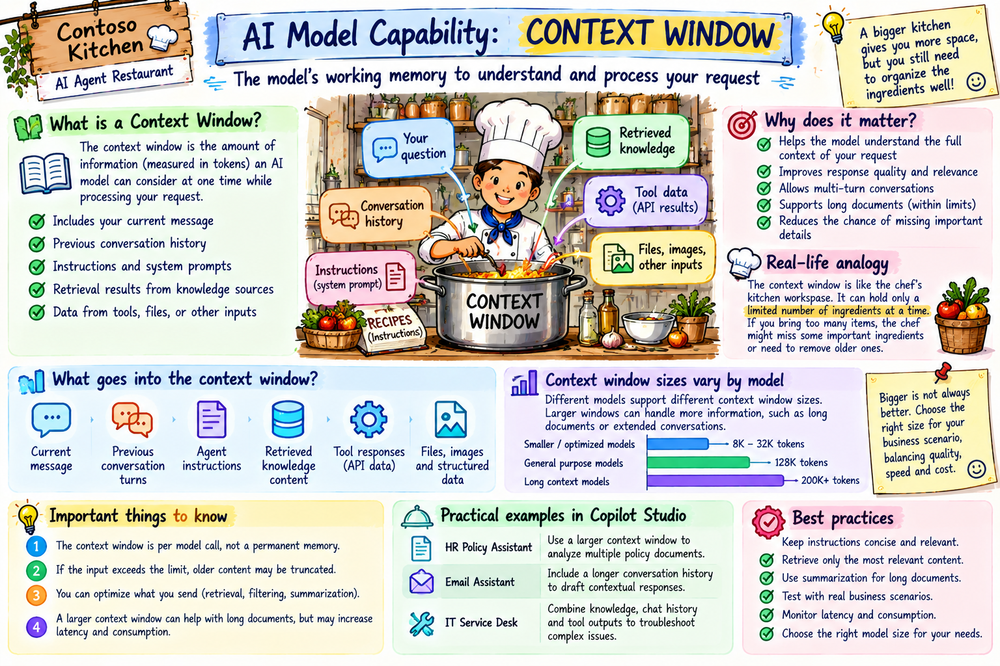
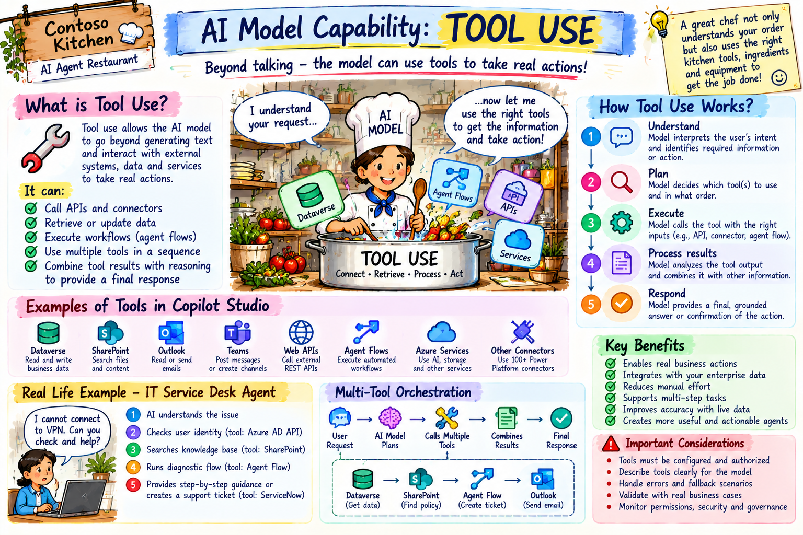
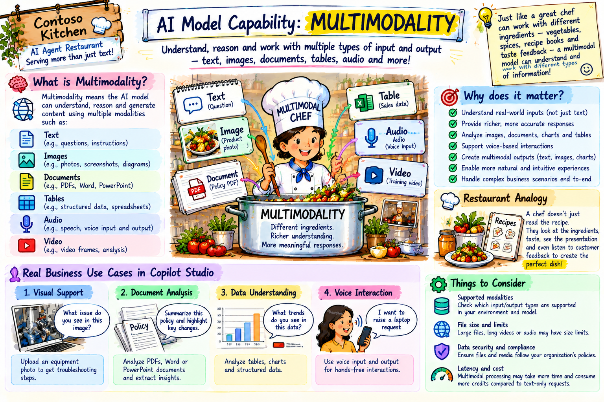

# 03. Understanding AI Model Capabilities: Reasoning, Speed, Context, Tool Use & Multimodality

## Overview
In Copilot Studio, model choice can affect reasoning capability, response quality, and performance. The platform also separates the primary orchestration model from some feature-specific model settings, so model capability should be evaluated in the context of the exact feature and agent experience you are using.

AI Model capabilities can be evaluated in terms of reasoning, speed, context handling, tool use, and multimodality. This guide will help you understand these capabilities and how they impact your experience with AI models in Copilot Studio.

In continueation to our restraurant analogy, we can think of AI models as different types of chefs in a kitchen. Each chef has their own strengths and weaknesses, and the choice of chef can greatly affect the quality of the meal (or response) you receive.

### A busy evening at restraunt
Imagine it's a busy evening at a restaurant. The restaurant is full, and five very different orders arrive within a few minutes.
- one table orders 2 coffees and a slice of cake
- one table wants chef to plan 3-course meal for 4 people
- once table hands over a complex recipe and asks the chef to prepare it
- one table asks for a quick snack for a child
- one table wants a detailed explanation of the ingredients and cooking techniques used in a dish

All requests evolve around the same kitchen, but each requires different skills and capabilities from the chef. Some orders require quick thinking and speed, while others demand deep reasoning and context understanding. Some may even require the chef to use specific tools or ingredients that are not commonly used. The chef must be able to adapt to each order and deliver a high-quality meal in a timely manner.

The useful way to think about AI model capabilities: not as a leaderboard, but as a set of strengths that must match the work your agent actually performs.

## 5 Capabilities of AI Models

### 1. Reasoning
Imagine a customer asking the chef to create a new dish based on a combination of ingredients they have on hand. The chef must use reasoning to determine how to combine the ingredients in a way that will result in a delicious dish. Similarly, AI models use reasoning to understand the context of a request and generate appropriate responses.

The second request, where a table wants the chef to plan a 3-course meal for 4 people, requires the chef to use reasoning to create a balanced and cohesive menu. The chef must consider factors such as flavor profiles, dietary restrictions, and presentation when planning the meal. In the same way, AI models use reasoning to generate responses that are relevant and appropriate to the user's request.

In above requests, the chef must also use reasoning to determine how to prepare a complex recipe. The chef must understand the steps involved in the recipe and how to execute them in a way that will result in a successful dish. Similarly, AI models use reasoning to understand complex requests and generate responses that are accurate and helpful.

AI models with strong reasoning capabilities can understand complex requests, generate relevant responses, and provide helpful information. They can also adapt to new situations and learn from previous interactions, making them more effective in providing assistance to users.

#### Example of Reasoning in AI Models
- Policy and Contract Analysis: AI models can analyze complex legal documents and contracts, identifying key clauses, potential risks, and suggesting improvements or alternatives.
- Multi-Step troubleshooting across the systems.
- Comparing alternatives and explaining the rationale behind the choice.
- Complex problem solving, such as optimizing supply chain logistics or resource allocation in a business context.

### 2. Speed - Intelligence still has to be fast
A customer at a quick-service counter experiences a ten-second delay very differently from an analyst who has asked for a careful comparison of several policies. The acceptable response time depends on the job.

In practice, perceived latency can also come from much more than the model: knowledge retrieval, tool calls, document processing, multiple planner iterations, network dependencies and downstream systems can all contribute.

Think in terms of latency

Instead of asking "how fast is this model?" ask "how fast is this model for the work I need it to do?" The answer will depend on the complexity of the request, the amount of context needed, and the specific capabilities of the model being used.

- FAQ or conversational support - users generarlly expect responses in a few seconds.
- Status lookup - Complex analysis or reasoning tasks may take longer, and users may be willing to wait for a more accurate or detailed response.
- Document Comparison - Users may expect a response within a few seconds, but may be willing to wait longer for a more thorough analysis.

A fast model may be able to provide quick responses for simple requests, but may struggle with more complex tasks that require deeper reasoning or context understanding. Conversely, a slower model may be able to provide more accurate and detailed responses for complex requests, but may not be suitable for time-sensitive tasks.

### 3. Context - what the model can work with right now
Back in the kitchen, imagine the chef receives a twelve-page event brief. Page 2 says the event is vegetarian. Page 7 says one guest has a severe peanut allergy. Page 11 changes the serving time. If the chef ignores one of those details, the final plan may be wrong.

For an AI model, context is the information available to a particular model call: instructions, conversation content, retrieved passages, tool outputs, prompt inputs and other supplied material. Microsoft documents the context window as a per-model-call limit. A single Copilot Studio conversational turn can involve multiple model calls—for example planner iterations, retrieval, generative answers or tool summarization—so the total tokens used by a turn are not the same thing as one model's context window.

This distinction is important. A large context window does not mean the agent automatically sees every document in your organization. Knowledge still has to be retrieved or otherwise supplied to the relevant operation.

| Context Window | Knowledge |
|----------------|----------------|
|Information suplied to the model in a single call, including instructions, conversation content, retrieved passages, tool outputs, prompt inputs and other supplied material.|Information that is available to the model through retrieval or other means. Knowledge may be stored in external sources such as databases, documents, or APIs.|
| Finite and limited by the model's architecture and design. | Potentially vast and can be updated or expanded over time. |
| More context does not necessarily mean better performance. The model's ability to reason and generate relevant responses depends on the quality and relevance of the context provided. | Knowledge can be structured, unstructured, or semi-structured, and may require additional processing or interpretation by the model to be useful. |

### 4.Tool Use - knowing when to stop talking and start doing
Suppose a diner asks, “Do you have tiramisu?” The chef can answer from the menu. But if the diner asks, “Reserve the last tiramisu for my table,” information alone is not enough. Someone must perform an action.

That is the role of tools in an agent. Tools are external systems or services that the agent can interact with to perform specific actions or retrieve information. AI models can use tools to extend their capabilities beyond generating text responses, allowing them to perform tasks such as making reservations, sending emails, or retrieving data from external sources.

This capability is particularly important for agents that need to interact with external systems or perform actions on behalf of users. By leveraging tools, AI models can provide more comprehensive and useful assistance to users, going beyond simple text-based responses.

#### A simple tools-use journey
- understand the request contains both a lookup and conditional access.
- if cancellation is allowed, call the cancellation tool and return the confirmation.

Copilot Studio's generative orchestration can compose tools, knowledge, topics and other agents into multi-step plans. But tools should still be deterministic, permissioned and tested. A stronger model is not a substitute for a reliable API or correctly configured authorization.

### 5. Multimodality - working with more than just text
Our final customer does not describe the banquet setup. They show the chef a photograph and hand over the event brief.

That is multimodality: working with more than one kind of input. In Copilot Studio, the exact multimodal capability depends on the feature you are using. Microsoft currently documents prompt inputs that can combine text with images or documents, and user file-input experiences that support several document and image formats. These capabilities are subject to feature, region, file-type and size limitations.

#### Where multimodality can be useful
- Image recognition and analysis: AI models can analyze images to identify objects, text, or patterns, enabling applications such as visual search, content moderation, and medical imaging analysis.
- Document understanding: AI models can process and understand documents in various formats, such as PDFs, Word documents, and scanned images, allowing for tasks like information extraction, summarization, and classification.
- Speech and audio processing: AI models can analyze and generate speech or audio content, enabling applications such as voice assistants, transcription services, and audio-based sentiment analysis.

## Putting it all together
When evaluating AI model capabilities, it's important to consider the specific requirements of your use case and the strengths and weaknesses of different models. By understanding the reasoning, speed, context handling, tool use, and multimodality capabilities of AI models, you can make informed decisions about which model to use for your agent and how to optimize its performance.

| Request | Reasoning | Speed | Context | Tool Use | Multimodality |
|---------|-----------|-------|---------|----------|---------------|
| Simple FAQ | Low | High | Low | Low | Low |
| Complex Policy Analysis | High | Medium | High | Medium | Low |
| Multi-Step Troubleshooting | High | Medium | High | High | Low |
| Document Comparison | Medium | Medium | High | Low | Medium |
| Multimodal Content Analysis | Medium | Medium | Medium | Low | High |
| Image Recognition and Analysis | Medium | Medium | Medium | Low | High |
| Speech and Audio Processing | Medium | Medium | Medium | Low | High |

## Final Thoughts
AI model capabilities are not one-size-fits-all. The choice of model should be guided by the specific needs of your application, the complexity of the tasks, and the desired user experience. By carefully considering the reasoning, speed, context handling, tool use, and multimodality capabilities of AI models, you can ensure that your agents are well-equipped to meet user expectations and deliver high-quality responses.

Model capabilities can be thought of as a set of strengths that must match the work your agent actually performs. By understanding these capabilities and how they impact your experience with AI models in Copilot Studio, you can make informed decisions about which model to use for your agent and how to optimize its performance.

A simple framework to remember:
- Reasoning: How hard can the model think?
- Speed: How fast can the model respond?
- Context: How much can the model remember and use?
- Tool Use: How well can the model interact with external systems?
- Multimodality: How well can the model work with different types of input?

The best model for your agent will depend on the specific requirements of your use case and the strengths and weaknesses of different models. By carefully evaluating these capabilities, you can ensure that your agents are well-equipped to meet user expectations and deliver high-quality responses.
